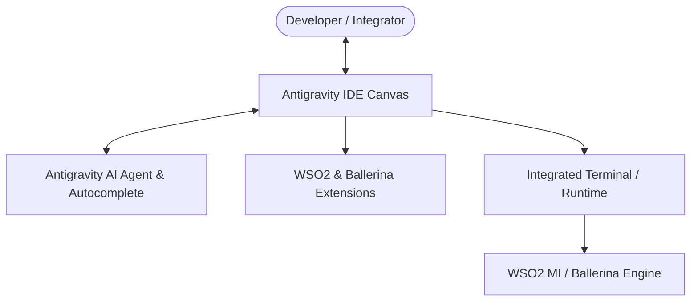

# Modul 1: Dasar & Setup Lingkungan Kerja Integrasi di Antigravity IDE

---

## 1. Pengenalan Antigravity IDE untuk Developer Integrasi

**Antigravity IDE** adalah *AI-First Integrated Development Environment* modern (berbasis VS Code) yang menggabungkan seluruh ekosistem ekstensi pengembangan (seperti WSO2 Micro Integrator & Ballerina) dengan kapabilitas **AI Agentic Coding**.

Dengan Antigravity IDE, pengembangan integrasi sistem menjadi jauh lebih cepat dan minim kesalahan berkat fitur-fitur utama:
- **AI Sidebar Agent & Planning Mode**: Membantu merancang arsitektur integrasi, mendiagnosis pesan error runtime, dan membuat konfigurasi otomatis.
- **Instructive Inline Edit (`Ctrl + I` / `Cmd + I`)**: Menghasilkan mediator Synapse XML, PayloadFactory template, atau fungsi Ballerina secara instan di baris kode aktif.
- **Antigravity Tab (Smart Autocomplete)**: Memprediksi konfigurasi XML/Ballerina berikutnya, auto-import module, dan perpindahan kursor pintar.
- **Integrated Terminal & Diagnostic Auto-Fix**: Langsung mendeteksi kesalahan sintaksis atau kegagalan build dan memperbaikinya dalam satu klik.



---

## 2. Persyaratan Sistem (Prerequisites)

Sebelum memulai pembuatan proyek di Antigravity IDE, pastikan beberapa komponen berikut telah terpasang di komputer Anda:

1. **Java Development Kit (JDK)**:
   - WSO2 Micro Integrator membutuhkan **OpenJDK 11** atau **OpenJDK 17**.
   - Cek instalasi via terminal Antigravity IDE (`Ctrl + \``):
     ```bash
     java -version
     ```
   - Pastikan Environment Variable `JAVA_HOME` sudah terkonfigurasi pada sistem operasi Anda.

2. **Ballerina Swan Lake (Opsional / Direkomendasikan untuk Modern WSO2 Integration)**:
   - Unduh dari [ballerina.io/downloads](https://ballerina.io/downloads/) jika menggunakan pendekatan Code-First.
   - Cek instalasi:
     ```bash
     bal version
     ```

3. **Antigravity IDE**:
   - Pastikan Antigravity IDE telah terpasang dan terbuka di workspace Anda.

4. **Ekstensi Pendukung di Antigravity IDE**:
   - Buka menu Extensions (`Ctrl + Shift + X`).
   - Cari dan pasang:
     - **WSO2 Micro Integrator** (untuk integrasi berbasis Synapse XML / ESB).
     - **Ballerina** (untuk integrasi berbasis Ballerina Swan Lake dengan visual Sequence Diagram).

---

## 3. Anatomi Struktur Proyek di Antigravity IDE

Tergantung pendekatan yang Anda pilih (Config-First Synapse atau Code-First Ballerina), Antigravity IDE mengelola struktur proyek integrasi sebagai berikut:

### A. Struktur Proyek WSO2 MI (Synapse Maven Multi-Module)
```text
HelloWorldProject/
├── pom.xml                               # Root POM file
├── HelloWorldProjectConfigs/             # Modul Konfigurasi Integrasi
│   ├── pom.xml
│   ├── artifact.xml                      # Daftar artefak terdaftar
│   └── src/
│       └── main/
│           └── synapse-config/           # Sumber kode XML Synapse
│               ├── api/                  # REST API definitions (e.g. HelloAPI.xml)
│               ├── sequences/            # Reusable sequence mediator
│               ├── endpoints/            # Target service endpoints
│               └── proxy-services/       # SOAP / Proxy Services
└── HelloWorldProjectCompositeExporter/   # Modul Packaging Carbon App (.CAR)
    ├── pom.xml
    └── artifact.xml
```

### B. Struktur Proyek Modern WSO2 / Ballerina Workspace
```text
helloworldproject/
├── .wso2/
│   └── context.yaml                      # Konteks proyek WSO2 Enterprise
├── Ballerina.toml                        # Workspace root configuration
└── hello/                                # Package integrasi
    ├── Ballerina.toml                    # Package metadata & dependencies
    ├── main.bal                          # Entry point HTTP Service / API
    ├── types.bal                         # Data types & Record models
    ├── connections.bal                   # Endpoint & Client connectors
    └── data_mappings.bal                 # Logic transformasi data
```

---

## 4. Hands-on: Membuat Proyek "Hello World API" di Antigravity IDE

Berikut adalah dua metode pembuatan project Hello World yang dapat Anda jalankan langsung di dalam Antigravity IDE:

### Metode 1: Menggunakan Ballerina HTTP Service (Code-First)

Metode ini menggunakan pendekatan modern WSO2 yang menghasilkan kode bersih, type-safe, dan memiliki visualisasi sequence diagram otomatis.

#### Langkah 1: Buat Package di Terminal Antigravity IDE
Buka terminal terintegrasi (`Ctrl + \``) dan jalankan:
```bash
bal new hello -t service
```
*(Atau gunakan struktur package `hello/main.bal` yang sudah ada di workspace Anda).*

#### Langkah 2: Tulis Kode Layanan pada `main.bal`
Buka file `helloworldproject/hello/main.bal` di Antigravity editor dan masukkan kode berikut:

```ballerina
import ballerina/http;
import ballerina/time;

// Listener HTTP berjalan pada port 9090
service /hello on new http:Listener(9090) {

    // Resource method GET yang menerima path parameter /{name}
    resource function get [string name]() returns json {
        // Ambil waktu server saat ini
        string currentTime = time:utcToString(time:utcNow());

        // Mengembalikan format response JSON terstruktur
        return {
            "status": "SUCCESS",
            "message": string `Halo, ${name}! Selamat datang di Antigravity IDE WSO2 Integration.`,
            "ide": "Antigravity IDE (AI-First)",
            "server_time": currentTime
        };
    }
}
```

> [!TIP]
> **Manfaatkan Antigravity Inline AI (`Ctrl + I`)**:
> Anda bisa menekan `Ctrl + I` di dalam file `.bal` lalu mengetikkan prompt:
> *"Tambahkan resource POST untuk menerima body JSON dan mengembalikan validasi data"* untuk men-generate endpoint baru secara otomatis!

---

### Metode 2: Menggunakan WSO2 Micro Integrator Synapse XML (Config-First)

Jika Anda membangun REST API berbasis mediator XML Synapse WSO2 MI:

#### Langkah 1: Buat REST API Definition
Buat file `HelloAPI.xml` di dalam folder `src/main/synapse-config/api/`:

```xml
<?xml version="1.0" encoding="UTF-8"?>
<api xmlns="http://ws.apache.org/ns/synapse" name="HelloAPI" context="/hello">
    <resource methods="GET" uri-template="/{name}">
        <inSequence>
            <!-- 1. Logging Request yang Masuk -->
            <log level="custom">
                <property name="INFO" value="[Antigravity IDE] Menerima request Hello API"/>
                <property name="TargetName" expression="get-property('uri.var.name')"/>
            </log>

            <!-- 2. Bentuk Response Payload JSON -->
            <payloadFactory media-type="json">
                <format>
                    {
                        "status": "SUCCESS",
                        "message": "Halo, $1! Selamat datang di Antigravity IDE WSO2 Micro Integrator.",
                        "ide": "Antigravity IDE",
                        "server_time": "$2"
                    }
                </format>
                <args>
                    <arg evaluator="xml" expression="get-property('uri.var.name')"/>
                    <arg evaluator="xml" expression="get-property('SYSTEM_DATE', 'yyyy-MM-dd HH:mm:ss')"/>
                </args>
            </payloadFactory>

            <!-- 3. Set HTTP Header 200 OK -->
            <property name="HTTP_SC" value="200" scope="axis2"/>

            <!-- 4. Kembalikan Response ke Client -->
            <respond/>
        </inSequence>

        <faultSequence>
            <payloadFactory media-type="json">
                <format>
                    {
                        "status": "ERROR",
                        "message": "Terjadi kesalahan internal pada pemrosesan pesan."
                    }
                </format>
                <args/>
            </payloadFactory>
            <property name="HTTP_SC" value="500" scope="axis2"/>
            <respond/>
        </faultSequence>
    </resource>
</api>
```

---

## 5. Menjalankan & Menguji API di Antigravity IDE

### Cara Menjalankan Layanan:

#### 1. Menjalankan Ballerina Service:
Di terminal Antigravity IDE, masuk ke folder package dan jalankan:
```bash
cd helloworldproject/hello
bal run
```
Output log terminal akan menunjukkan:
```text
Compiling source
        eksad/hello:0.1.0

Running executable
[ballerina/http] started HTTP/WS listener 0.0.0.0:9090
```

#### 2. Menjalankan WSO2 Micro Integrator Runtime:
- Klik tombol **Run / Debug** pada panel WSO2 Micro Integrator di sidebar Antigravity IDE, atau jalankan micro-integrator runtime via terminal standalone (`micro-integrator.bat`).

---

### Cara Menguji API (Testing):

Buka terminal baru di Antigravity IDE atau gunakan cURL / Postman / Browser:

#### Request Test:
```bash
curl -X GET http://localhost:9090/hello/Jovan
```
*(Atau port `8290` jika menggunakan WSO2 MI Synapse runtime: `http://localhost:8290/hello/Jovan`)*

#### Expected Response JSON:
```json
{
  "status": "SUCCESS",
  "message": "Halo, Jovan! Selamat datang di Antigravity IDE WSO2 Integration.",
  "ide": "Antigravity IDE (AI-First)",
  "server_time": "2026-09-01T16:15:00.000Z"
}
```

---

## 6. Tips Produktivitas dengan Antigravity AI Agent

Ketika mengembangkan integrasi di Antigravity IDE, Anda dapat berkolaborasi langsung dengan AI Agent:

1. **Meminta Bantuan Pembuatan Mediator / Sequence**:
   - Di chat Antigravity, ketik: `Buatkan Sequence Mediator untuk routing order berdasarkan header Authorization`.
2. **Debugging Pesan Error Runtime**:
   - Jika terminal menampilkan error (misal: XML parsing error, connection refused, tipe data mismatch), gunakan fitur **Diagnostic Auto-Fix** atau tanyakan langsung pada agent di panel chat.
3. **Mengubah Flow Integrasi**:
   - Highlight baris kode di editor, tekan `Ctrl + I`, dan perintahkan AI untuk menambahkan filter, transform, atau call ke backend REST eksternal.

---

## 7. Ringkasan & Checklist Modul 1

- [x] Mengonfigurasi Antigravity IDE sebagai lingkungan pengembangan integrasi utama.
- [x] Memahami arsitektur proyek WSO2 MI (Synapse XML) dan Modern Ballerina Workspace.
- [x] Berhasil menulis dan mengonfigurasi layanan REST API Hello World (`/hello/{name}`).
- [x] Menjalankan layanan secara lokal melalui Terminal Antigravity IDE.
- [x] Menguji endpoint dan menerima respons JSON status `200 OK`.
- [x] Memahami cara memanfaatkan Antigravity AI (Inline Edit `Ctrl + I`, Tab Autocomplete, dan Sidebar Agent) untuk mempercepat alur kerja integrasi.
