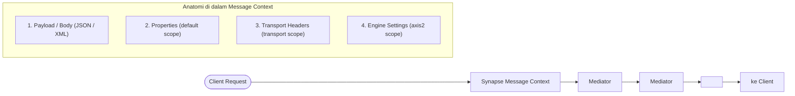

# Modul 2: Core Mediators & Manipulasi Konteks (Context Manipulation)

---

## 1. Konsep Synapse Message Context & Scope

### A. Apa itu Synapse Message Context?
Secara sederhana, **Synapse Message Context (`MessageContext` / `MC`)** adalah **wadah atau amplop data** yang mewakili satu siklus hidup (*lifecycle*) pesan selama diproses di dalam WSO2 Micro Integrator / ESB.

#### Analogi Sederhana: "Baki / Amplop Berjalan"
Bayangkan ketika seorang client mengirim request HTTP ke WSO2 MI:
- WSO2 MI akan membuat sebuah **baki berjalan (Message Context)**.
- Di atas baki tersebut diletakkan:
  1. **Isi Surat (Payload / Body)**: Data JSON atau XML yang dikirim oleh client.
  2. **Catatan Tempel (Properties / Variables)**: Variabel lokal yang Anda buat selama alur integrasi.
  3. **Label Pengiriman (Transport Headers)**: Header HTTP seperti `Authorization`, `Content-Type`, `User-Agent`.
  4. **Instruksi Mesin (Axis2 / Engine Properties)**: HTTP Status Code (`200`, `400`, `500`), timeout koneksi, format serializer data.

Baki ini berjalan melewati mediator satu per satu: `<log>` membaca isinya, `<property>` menempelkan variabel baru, `<payloadFactory>` mengubah isi suratnya, dan `<respond>` mengirimkannya kembali ke client.



---

### B. Studi Kasus Nyata: Bedah Interaksi Message Context pada `HelloAPI.xml`

Mari kita lihat bagaimana `HelloAPI.xml` yang kita buat di Modul 1 memanipulasi Message Context:

```xml
<api xmlns="http://ws.apache.org/ns/synapse" name="HelloAPI" context="/hello">
    <resource methods="GET" uri-template="/{name}">
        <inSequence>
            <!-- 1. Membaca properti URI parameter dari Message Context -->
            <log level="custom">
                <property name="INFO" value="Menerima request Hello API"/>
                <property name="TargetName" expression="get-property('uri.var.name')"/>
            </log>

            <!-- 2. Mengubah Payload/Body di dalam Message Context menjadi JSON baru -->
            <payloadFactory media-type="json">
                <format>
                    {
                        "status": "SUCCESS",
                        "message": "Halo, $1! Selamat datang di WSO2 Micro Integrator.",
                        "server_time": "$2"
                    }
                </format>
                <args>
                    <arg evaluator="xml" expression="get-property('uri.var.name')"/>
                    <arg evaluator="xml" expression="get-property('SYSTEM_DATE', 'yyyy-MM-dd HH:mm:ss')"/>
                </args>
            </payloadFactory>

            <!-- 3. Menyimpan HTTP Status Code ke dalam Axis2 Scope di Message Context -->
            <property name="HTTP_SC" value="200" scope="axis2"/>

            <!-- 4. Mengembalikan seluruh isi Message Context saat ini ke Client -->
            <respond/>
        </inSequence>
    </resource>
</api>
```

#### Alur Manipulasi Data:
1. Saat request `GET /hello/Jovan` masuk, WSO2 otomatis menyimpan nilai `Jovan` ke dalam variabel context berlabel `uri.var.name`.
2. Mediator `<log>` mengambil nilai `uri.var.name` dari context untuk dicetak di terminal.
3. Mediator `<payloadFactory>` **menimpa isi Body/Payload** di dalam Message Context dengan format JSON baru menggunakan argumen yang ditarik dari context (`$1` = `uri.var.name` dan `$2` = `SYSTEM_DATE`).
4. Mediator `<property>` menuliskan `HTTP_SC = 200` pada **scope `axis2`** di Message Context agar transport layer mengirimkan header response `HTTP/1.1 200 OK`.
5. Mediator `<respond/>` menghentikan alur mediasi dan langsung mengirimkan isi Message Context terkini kembali ke pemanggil.

---

### C. Penjelasan Scopes Variabel di Message Context

Data dan variabel dapat disimpan dan diakses pada tingkatan (*scopes*) yang berbeda:

| Scope | Fungsi & Penggunaan | Cara Mengakses (XPath / Synapse Expression) | Prefix Ringkas |
| :--- | :--- | :--- | :--- |
| **`default`** | Variabel lokal selama pemrosesan alur Synapse. Hilang setelah response terkirim. | `get-property('myVar')` | `$ctx:myVar` |
| **`transport`** | HTTP Headers dari request masuk atau yang akan dikirim keluar (misal `Authorization`). | `get-property('transport', 'Authorization')` | `$trp:Authorization` |
| **`axis2`** | Properti engine transport tingkat bawah (misal status HTTP `HTTP_SC`, format output `messageType`). | `get-property('axis2', 'HTTP_SC')` | `$axis2:HTTP_SC` |
| **`axis2-client`** | Konfigurasi koneksi saat memanggil backend eksternal (misal `HTTP_METHOD`, `REST_URL_POSTFIX`). | `get-property('axis2-client', 'HTTP_METHOD')` | - |
| **`registry`** | Mengambil file / konfigurasi statis dari WSO2 Governance Registry. | `get-property('gov:/conf/myConfig.xml')` | - |

---

## 2. Mediators Utama yang Wajib Dikuasai

### 1. Property Mediator
Digunakan untuk membuat, mengubah, atau menghapus variabel dalam konteks pesan.

```xml
<!-- Menyimpan nilai statis -->
<property name="serviceName" value="PaymentService" scope="default" type="STRING"/>

<!-- Mengambil nilai dari JSON body request (menggunakan json-eval) -->
<property name="userId" expression="json-eval($.user.id)" scope="default" type="STRING"/>

<!-- Mengambil nilai dari Query Parameter / Path Parameter -->
<property name="queryCategory" expression="get-property('query.param.category')" scope="default" type="STRING"/>

<!-- Menghapus properti -->
<property name="tempToken" action="remove" scope="default"/>
```

---

### 2. Log Mediator
Digunakan untuk mencetak informasi ke dalam terminal/log file (`wso2carbon.log`).

```xml
<!-- Log Level Custom (Hanya mencetak properti yang didefinisikan) -->
<log level="custom">
    <property name="EVENT" value="INCOMING_TRANSACTION"/>
    <property name="USER_ID" expression="get-property('userId')"/>
    <property name="TOTAL_AMOUNT" expression="json-eval($.amount)"/>
</log>

<!-- Log Level Full (Mencetak seluruh payload dan seluruh header HTTP) -->
<log level="full"/>
```

---

### 3. PayloadFactory Mediator
Mediator terpenting untuk memanipulasi, menyusun, dan mengubah format data request/response.

```xml
<payloadFactory media-type="json">
    <format>
        {
            "transaction_id": "$1",
            "account_number": "$2",
            "details": {
                "amount": $3,
                "currency": "IDR",
                "status": "PENDING"
            }
        }
    </format>
    <args>
        <arg evaluator="xml" expression="get-property('txId')"/>
        <arg evaluator="json" expression="$.accountNo"/>
        <arg evaluator="json" expression="$.totalPay"/>
    </args>
</payloadFactory>
```

> [!TIP]
> Perhatikan tanda kutip pada argumen `$1` (string) dan `$3` (number/numeric). Di JSON, jika nilai berupa angka, jangan gunakan tanda petik ganda (`"$3"` akan menjadi string `"50000"`, sedangkan `$3` akan menjadi angka `50000`).

---

### 4. Header Mediator
Digunakan untuk membaca, menambahkan, atau menghapus HTTP Transport Headers.

```xml
<!-- Menambahkan HTTP Header Authorization ke backend -->
<header name="Authorization" expression="fn:concat('Bearer ', get-property('jwtToken'))" scope="transport"/>

<!-- Menambahkan Custom Header -->
<header name="X-Correlation-ID" expression="get-property('MESSAGE_ID')" scope="transport"/>

<!-- Menghapus HTTP Header tertentu sebelum dikirim -->
<header name="Cookie" action="remove" scope="transport"/>
```

---

### 5. Filter Mediator (Percabangan If-Else)
Mengevaluasi kondisi berdasarkan regex atau ekspresi boolean XPath/JSONPath.

```xml
<!-- Contoh Filter dengan Regex pada Properti -->
<filter source="get-property('userId')" regex="^VIP.*">
    <then>
        <!-- Blok IF: User VIP -->
        <log level="custom">
            <property name="ROUTE" value="Direct to High Priority Queue"/>
        </log>
    </then>
    <else>
        <!-- Blok ELSE: User Regular -->
        <log level="custom">
            <property name="ROUTE" value="Direct to Standard Queue"/>
        </log>
    </else>
</filter>
```

---

### 6. Switch Mediator (Percabangan Multi-Kondisi)
Mirip struktur `switch-case` dalam bahasa pemrograman.

```xml
<switch source="json-eval($.paymentMethod)">
    <case regex="BANK_TRANSFER">
        <property name="fee" value="4000" scope="default"/>
    </case>
    <case regex="E_WALLET">
        <property name="fee" value="1500" scope="default"/>
    </case>
    <case regex="CREDIT_CARD">
        <property name="fee" value="2.5%" scope="default"/>
    </case>
    <default>
        <property name="fee" value="0" scope="default"/>
    </default>
</switch>
```

---

### 7. Call vs Send vs Respond vs Drop

| Mediator | Karakteristik & Perbedaan |
| :--- | :--- |
| `<call>` | **Synchronous / Blocking**: Mengirim pesan ke endpoint dan **menunggu response** di tempat sebelum melanjutkan ke mediator berikutnya dalam urutan yang sama. |
| `<send>` | **Asynchronous / Non-Blocking**: Meneruskan pesan ke endpoint dan mengarahkan response yang kembali ke `outSequence`. |
| `<respond>` | Menghentikan alur mediasi saat itu juga dan **langsung mengembalikan pesan saat ini sebagai HTTP Response** ke client. |
| `<drop>` | Menghentikan alur pemrosesan pesan dan **membuang pesan** (tidak mengembalikan apa-apa ke client). |

---

## 3. Hands-on: Menggabungkan Core Mediators

Berikut contoh API `/order/process` yang memvalidasi input, melakukan pengkondisian, dan merespon dengan payload terstruktur:

```xml
<?xml version="1.0" encoding="UTF-8"?>
<api xmlns="http://ws.apache.org/ns/synapse" name="OrderProcessAPI" context="/order">
    <resource methods="POST" uri-template="/process">
        <inSequence>
            <!-- 1. Ekstrak data JSON request -->
            <property name="itemPrice" expression="json-eval($.price)" type="DOUBLE"/>
            <property name="itemQty" expression="json-eval($.quantity)" type="INTEGER"/>
            <property name="voucherCode" expression="json-eval($.voucher)"/>

            <!-- 2. Validasi input -->
            <filter xpath="get-property('itemQty') <= 0 or get-property('itemPrice') <= 0">
                <then>
                    <property name="HTTP_SC" value="400" scope="axis2"/>
                    <payloadFactory media-type="json">
                        <format>{"status": "FAIL", "message": "Quantity dan Price harus lebih besar dari 0"}</format>
                        <args/>
                    </payloadFactory>
                    <respond/>
                </then>
                <else/>
            </filter>

            <!-- 3. Hitung Diskon Berdasarkan Switch Case -->
            <switch source="get-property('voucherCode')">
                <case regex="DISKON50">
                    <property name="discountPercent" value="50"/>
                </case>
                <case regex="DISKON10">
                    <property name="discountPercent" value="10"/>
                </case>
                <default>
                    <property name="discountPercent" value="0"/>
                </default>
            </switch>

            <!-- 4. Format Output Response -->
            <payloadFactory media-type="json">
                <format>
                    {
                        "status": "SUCCESS",
                        "summary": {
                            "unit_price": $1,
                            "quantity": $2,
                            "voucher_applied": "$3",
                            "discount_percent": "$4%"
                        }
                    }
                </format>
                <args>
                    <arg evaluator="xml" expression="get-property('itemPrice')"/>
                    <arg evaluator="xml" expression="get-property('itemQty')"/>
                    <arg evaluator="xml" expression="get-property('voucherCode')"/>
                    <arg evaluator="xml" expression="get-property('discountPercent')"/>
                </args>
            </payloadFactory>

            <respond/>
        </inSequence>
    </resource>
</api>
```

---

## 4. Ringkasan & Checklist Modul 2

- [x] Paham 3 Scope utama: `default`, `axis2`, dan `transport`.
- [x] Menguasai `<property>` dengan nilai statis maupun dinamis (`json-eval` & `get-property`).
- [x] Menguasai perancangan payload JSON dinamis dengan `<payloadFactory>`.
- [x] Menguasai alur percabangan dengan `<filter>` dan `<switch>`.
- [x] Memahami perbedaan `<call>`, `<send>`, `<respond>`, dan `<drop>`.
