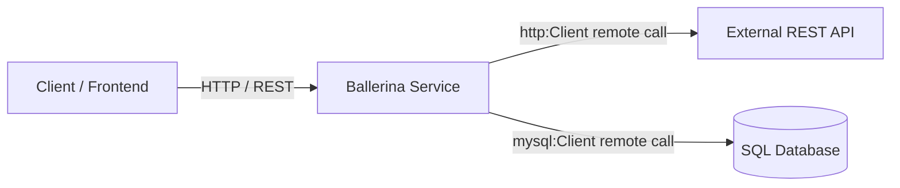

# Modul 1: Dasar & Sintaks Inti Bahasa Ballerina

---

## 1. Pengenalan & Filosofi Ballerina

**Ballerina** adalah bahasa pemrograman *open-source*, *cloud-native*, dan *statically typed* yang dikembangkan oleh **WSO2**. 

Berbeda dengan bahasa pemrograman tradisional (Java, Python, Go) yang memperlakukan jaringan sebagai pustaka (*library*) eksternal, Ballerina memperlakukan **komunikasi jaringan, format data (JSON/XML), dan protokol sebagai fitur bawaan kelas satu (*first-class citizens*)**.



### Keunggulan Utama:
1. **Dual Representation**: Kode teks Ballerina secara otomatis merepresentasikan **Sequence Diagram** dua arah di editor (VS Code / Antigravity IDE).
2. **Type Safety & Cloud Native**: Compiler bawaan yang menghasilkan runtime ringan dan container-ready.

---

## 2. Variabel & Mutabilitas

Di Ballerina, deklarasi variabel dapat menggunakan tipe eksplisit atau inferensi tipe `var`:

### 1. Deklarasi Biasa (Mutable)
```ballerina
int count = 10;
count = 20; // Boleh diubah nilainya
```

### 2. Konstanta & Readonly (`final` & `const`)
- `const`: Nilai konstan waktu kompilasi (*compile-time constant*).
- `final`: Variabel yang nilainya hanya dapat diisi sekali pada saat runtime.

```ballerina
const int MAX_RETRY = 3;
const string BASE_CURRENCY = "IDR";

final string serverStartTime = "2026-09-02T10:00:00Z";
```

### 3. Type Inference (`var`)
```ballerina
var serviceName = "PaymentService"; // Otomatis bertipe string
var portNumber = 9090;             // Otomatis bertipe int
```

---

## 3. Tipe Data Primitif & Dasar

| Tipe Data | Deskripsi | Contoh Penulisan |
| :--- | :--- | :--- |
| `int` | Bilangan bulat 64-bit | `int total = 1500;` |
| `float` | Bilangan desimal floating-point 64-bit IEEE 754 | `float ratio = 3.14159;` |
| `decimal` | Bilangan desimal presisi tinggi 128-bit (**Wajib untuk Finansial/Uang**) | `decimal price = 250000.50d;` |
| `string` | Teks karakter Unicode UTF-8 | `string name = "Jovan";` |
| `boolean` | Nilai kebenaran | `boolean isActive = true;` |
| `byte` | Nilai 8-bit tak bertanda (0 - 255) | `byte flags = 0xFF;` |
| `()` (*nil*) | Merepresentasikan ketiadaan nilai (mirip `null`/`void`) | `()` |

> [!IMPORTANT]
> **Gunakan `decimal` untuk Nilai Keuangan / Uang**:
> Selalu gunakan tipe `decimal` dengan akhiran huruf `d` (misal: `15000.0d`) untuk menghindari kesalahan pembulatan floating-point pada kalkulasi moneter.

---

## 4. Tipe Opsional (*Nilable Types*)

Jika sebuah variabel boleh tidak bernilai (*null/nil*), tambahkan tanda tanya `?` di belakang tipe datanya:

```ballerina
string? promoCode = (); // Bernilai nil

// Mengisi nilai baru
promoCode = "DISKON50";

// Pengecekan nil menggunakan type guard 'is'
if promoCode is () {
    // Jalankan jika nil
} else {
    // Di dalam blok ini, promoCode otomatis berstatus tipe 'string' murni
    string code = promoCode; 
}
```

---

## 5. String Template & Interpolasi

Ballerina mendukung pembuatan string dinamis yang sangat bersih menggunakan *backtick* (``` `...` ```) dan interpolasi `${variable}`:

```ballerina
string customer = "Jovan";
decimal price = 50000.0d;
int qty = 2;

// String template
string summary = string `Pelanggan ${customer} memesan ${qty} item dengan total Rp ${price * <decimal>qty}`;
```

---

## 6. Contoh Kode Hands-on Mandiri

Simpan kode berikut sebagai `basic_demo.bal` dan jalankan dengan `bal run basic_demo.bal`:

```ballerina
import ballerina/io;

public function main() {
    string appName = "Antigravity Integration Engine";
    decimal basePrice = 1000000.0d;
    decimal taxRate = 0.11d; // PPN 11%
    decimal discount = 0.10d; // Diskon 10%

    // Kalkulasi matematis
    decimal discountAmount = basePrice * discount;
    decimal netPrice = basePrice - discountAmount;
    decimal taxAmount = netPrice * taxRate;
    decimal grandTotal = netPrice + taxAmount;

    io:println("=== " + appName + " ===");
    io:println(string `Harga Dasar     : Rp ${basePrice}`);
    io:println(string `Diskon (10%)    : Rp ${discountAmount}`);
    io:println(string `PPN (11%)       : Rp ${taxAmount}`);
    io:println(string `Total Akhir     : Rp ${grandTotal}`);
}
```

---

## 7. Checklist Pemahaman Modul 1
- [x] Paham perbedaan Ballerina (Code-First) vs WSO2 MI (Config-First).
- [x] Paham deklarasi variabel `int`, `string`, `boolean`, dan `decimal` (keuangan).
- [x] Paham tipe data opsional `string?` dan nilai kosong `()`.
- [x] Paham cara merangkai teks dengan String Interpolation ``` string `Hello ${name}` ```.
