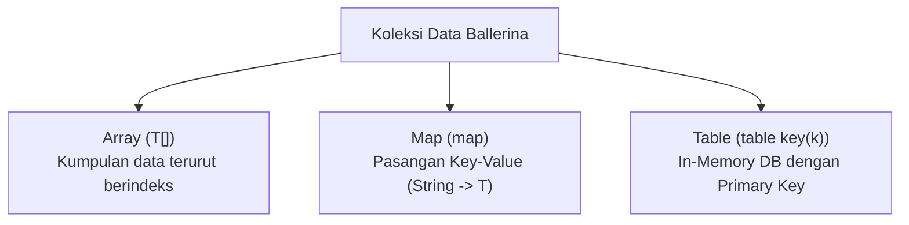
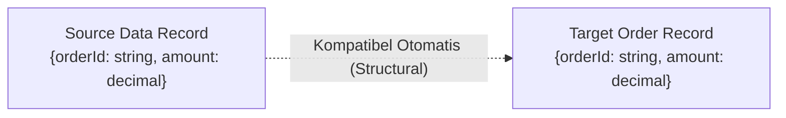

# Modul 2: Data Types, Koleksi, & Structural Typing di Ballerina

---

## 1. Filosofi Sistem Tipe Data Ballerina: Cloud-Native & Integration-First

Di bahasa pemrograman konvensional seperti Java, C#, atau C++, tipe data dirancang berorientasi pada **eksekusi memori lokal** (tipe primitif vs object/class). Jika aplikasi ingin berkomunikasi melalui jaringan (misal pertukaran data JSON atau XML), Anda harus mengimpor pustaka pihak ketiga (seperti Jackson, Gson, atau XML DOM Parser) untuk melakukan serialisasi dan deserialisasi string.

**Ballerina dirancang secara fundamental untuk integrasi jaringan**. Oleh karena itu:
- Format payload jaringan (`json` dan `xml`) dijadikan **tipe data bawaan kelas satu (*first-class citizens*)**.
- Sistem tipenya menganut **Structural Typing** (bukan Nominal Typing), memungkinkan data yang memiliki struktur cocok untuk langsung saling berinteraksi secara mulus tanpa manual converter.

---

## 2. Format Data Jaringan Asli: JSON & XML

### A. Tipe Data `json`

#### 1. Definisi
`json` di Ballerina adalah tipe data union bawaan yang merepresentasikan spesifikasi JSON murni, mencakup:
* Nilai primitif: `string`, `int`, `float`, `decimal`, `boolean`, dan `() (null)`.
* Nilai terstruktur: array JSON (`json[]`) dan map JSON (`map<json>`).

#### 2. Cara Kerja
* Literal JSON ditulis langsung dalam kode tanpa tanda petik pembungkus dokumen.
* Ballerina memproses field secara dinamis pada saat runtime, mendukung akses dot-notation (`transaction.id`) maupun index-notation (`transaction["id"]`).
* Konversi ke format teks string untuk dikirim via jaringan cukup dengan memanggil method bawaan `.toJsonString()`.

#### 3. Fungsi & Penggunaan di Dunia Nyata
* **Payload REST API**: Sangat fleksibel untuk menangkap request body dari klien web atau mobile yang formatnya dinamis atau sering bertambah field baru.
* **Payload Passthrough / Reverse Proxy**: Meneruskan pesan dari satu microservice ke microservice lain tanpa harus membuat definisi struct DTO yang kaku.

```ballerina
import ballerina/io;

public function main() {
    // Definisi objek JSON langsung secara native
    json transaction = {
        "id": "TRX-9901",
        "amount": 250000.0,
        "currency": "IDR",
        "items": ["Laptop Stand", "USB Hub"],
        "isPaid": true
    };

    // Mengakses field JSON langsung
    io:println("ID Transaksi: ", transaction.id);
    io:println("JSON String: ", transaction.toJsonString());
}
```

---

### B. Tipe Data `xml`

#### 1. Definisi
`xml` adalah tipe data bawaan kelas satu untuk memanipulasi dokumen, elemen, teks, komentar, dan instruksi pemrosesan XML.

#### 2. Cara Kerja
* Menggunakan sintaks **XML Literal** (``` xml `<tag>...</tag>` ```), sehingga Anda menulis tag XML secara alami di dalam kode Ballerina tanpa tanda petik string.
* Mendukung **interpolasi ekspresi** `${variabel}` langsung di dalam tag maupun nilai atribut.
* Dilengkapi dengan validasi sintaksis saat waktu kompilasi (*compile-time syntax check*). Jika tag XML tidak ditutup dengan benar, program akan langsung gagal build.

#### 3. Fungsi & Penggunaan di Dunia Nyata
* **Integrasi Perbankan & Core Banking (SOAP Services)**: Menyusun SOAP Envelope XML untuk transaksi perbankan legacy.
* **B2B Document Exchange**: Membentuk format e-Faktur, e-Invoice, atau standar pesan finansial berbasis XML seperti ISO-20022.

```ballerina
import ballerina/io;

public function main() {
    string invoiceId = "INV-2026-001";
    decimal totalAmount = 500000.0d;

    // XML literal dengan interpolasi variabel dinamis
    xml invoiceXml = xml `<invoice id="${invoiceId}">
        <customer>Jovan Pratama</customer>
        <total currency="IDR">${totalAmount}</total>
    </invoice>`;

    io:println("XML Payload: ", invoiceXml);
}
```

---

## 3. Koleksi Data: Arrays, Maps, dan Tables

Ballerina menyediakan tiga struktur data koleksi utama dengan karakteristik dan tujuan spesifik:



---

### A. Array (`T[]`)

* **Definisi**: Kumpulan elemen data terurut (*ordered collection*) dengan indeks numerik berbasis nol (0, 1, 2, ...).
* **Cara Kerja**: Ukuran array bersifat dinamis. Anda dapat menambahkan data baru secara efisien di akhir array menggunakan method `.push()`.
* **Fungsi di Dunia Nyata**: Menyimpan daftar item pesanan transaksi, riwayat mutasi rekening, atau log aktivitas berurutan.

```ballerina
string[] categories = ["ELECTRONICS", "FASHION", "BOOKS"];
categories.push("AUTOMOTIVE"); // Menambah data baru

int length = categories.length(); // 4
string firstCategory = categories[0];
```

---

### B. Map (`map<T>`)

* **Definisi**: Struktur asosiatif pasangan kunci-nilai (*key-value pairs*) di mana kuncinya selalu berupa tipe `string` dan nilainya bertipe seragam `T`.
* **Cara Kerja**:
  * Pencarian data berdasarkan key dilakukan dengan algoritma hash-lookup cepat.
  * Ketika Anda mengakses nilai dengan key (`rates["JABODETABEK"]`), Ballerina selalu mengembalikan **tipe opsional (`T?`)** untuk menjamin keamanan dari error *Null Pointer Exception* jika key yang dicari tidak ditemukan.
* **Fungsi di Dunia Nyata**: Lookup konfigurasi sederhana (misal tabel ongkos kirim per zona wilayah, mapping status transaksi, atau kamus header HTTP).

```ballerina
map<decimal> shippingRates = {
    "JABODETABEK": 10000.0d,
    "JAWA_BARAT": 15000.0d,
    "LUAR_JAWA": 35000.0d
};

// Mengambil nilai mengembalikan tipe optional decimal? (bisa decimal atau nil ())
decimal? ongkir = shippingRates["JABODETABEK"]; // 10000.0d
```

---

### C. Table dengan Primary Key (`table<Record> key(k)`)

* **Definisi**: Struktur data tabular mirip tabel database relasional di dalam memori RAM, yang memiliki skema tipe data `Record` dan penegakan keunikan kunci primer (*primary key constraint*).
* **Cara Kerja**:
  * **O(1) Direct Key Access**: Baris data dapat diambil langsung menggunakan nilai primary key: `productTable["PRD-01"]`.
  * **Integritas Data Terjamin**: Jika program mencoba menambahkan record baru dengan primary key yang sudah ada, Ballerina akan membatalkan operasi dan melempar error duplikasi.
  * Field primary key wajib diberi modifier `readonly` untuk menjamin immutabilitas identitas record.
* **Fungsi di Dunia Nyata**:
  * **In-Memory Cache & Master Data**: Menyimpan katalog produk, daftar mata uang aktif, atau session token nasabah tanpa perlu memanggil database eksternal berulang kali.
  * **ETL & Agregasi**: Menampung data mentah sebelum diproses dan difilter menggunakan query expression.

```ballerina
import ballerina/io;

public type Product record {| 
    readonly string id;
    string name;
    decimal price;
    int stock;
|};

// Inisialisasi table dengan primary key 'id'
table<Product> key(id) productTable = table [
    {id: "PRD-01", name: "Mouse Gaming", price: 250000.0d, stock: 10},
    {id: "PRD-02", name: "Keyboard Mechanical", price: 850000.0d, stock: 20}
];

public function main() {
    // Menambah produk baru ke table
    productTable.add({id: "PRD-03", name: "Monitor 4K", price: 5000000.0d, stock: 5});

    // Mengambil data berdasarkan Primary Key dalam waktu O(1)
    Product? mouse = productTable["PRD-01"];
    if mouse is Product {
        io:println("Produk Ditemukan: ", mouse.name, " | Harga: Rp ", mouse.price);
    }
}
```

---

## 4. Records & Structural Typing

### Apa itu Structural Typing?
Dalam bahasa seperti Java, C#, atau TypeScript pada umumnya:
* **Nominal Typing (Java/C#)**: Dua class dengan field dan tipe yang sama persis tetap dianggap **berbeda** hanya karena nama kelasnya berbeda (`Class A != Class B`).
* **Structural Typing (Ballerina)**: Kesamaan tipe didasarkan pada **bentuk struktur dan field datanya**, bukan nama tipenya!



> **Manfaat Besar di Dunia Integrasi:**  
> Anda tidak perlu lagi menulis kode mapper boilerplate yang melelahkan hanya untuk memindahkan field dari DTO API Inbound ke Entitas Service Internal jika keduanya memiliki bentuk field yang sama!

---

### Perbedaan Closed Record vs Open Record

| Fitur / Karakteristik | Closed Record (`record {| ... |}`) | Open Record (`record { ... }`) |
| :--- | :--- | :--- |
| **Sintaks Penulisan** | Menggunakan bar penutup: `{| ... |}` | Menggunakan kurung kurawal biasa: `{ ... }` |
| **Sifat Skema** | **Ketat (Strict / Sealed)** | **Terbuka / Fleksibel (Extensible)** |
| **Field Tambahan** | **Dilarang keras**. Jika ada field di luar definisi, kompilasi/eksekusi akan error. | **Diizinkan**. Nilai field tambahan dapat disisipkan secara dinamis pada saat runtime. |
| **Penggunaan di Dunia Nyata** | **API Contract & DTO**: Sangat dianjurkan untuk request/response payload API agar tidak terjadi penyelundupan field ilegal (*security hardening*). | **Log Context & Metadata**: Cocok untuk data audit/tracing di mana setiap event dapat membawa metadata tambahan yang bervariasi. |

#### 1. Contoh Closed Record (`record {| ... |}`)
```ballerina
public type CheckoutRequest record {| 
    string customerId;
    string productId;
    int quantity;
    string? note; // Nilai opsional (bisa bernilai string atau nil ())
|};
```

#### 2. Contoh Open Record (`record { ... }`)
```ballerina
public type MetadataRecord record {
    string traceId;
    // Field lain bebas ditambahkan kapan saja pada saat runtime
};
```

---

## 5. Matriks Keputusan: Kapan Menggunakan Setiap Tipe Data?

| Kebutuhan Integrasi Anda | Rekomendasi Tipe Data | Alasan Teknis |
| :--- | :--- | :--- |
| Menerima payload REST API yang formatnya sangat dinamis | `json` | Tidak perlu membuat struct terlebih dahulu, akses instan field. |
| Integrasi backend perbankan / SOAP legacy | `xml` | Dukungan native XML literal dengan interpolasi `${}` dan validasi compile-time. |
| Perhitungan nominal uang, suku bunga, atau pajak (PPN) | `decimal` | Menghindari floating-point error biner (akurasi 128-bit IEEE 754-2008). |
| Menyimpan daftar antrean item pesanan | `T[]` (Array) | Urutan data terjaga dan penambahan elemen efisien via `.push()`. |
| Kamus konfigurasi atau lookup data sederhana | `map<T>` | Pengambilan cepat berdasarkan string key dengan keamanan tipe optional (`T?`). |
| In-memory caching data master dengan primary key | `table<T> key(k)` | Akses cepat $O(1)$ berdasarkan key dan pencegahan duplikasi data otomatis. |
| Validasi payload request API agar ketat dan aman | `record {| ... |}` | Mencegah parameter tak dikenal (*strict contract enforcement*). |

---

## 6. Contoh Hands-on Terpadu: Manajemen Inventaris Toko

Simpan kode berikut sebagai `inventory_demo.bal` dan jalankan via terminal dengan perintah `bal run inventory_demo.bal`:

```ballerina
import ballerina/io;

# Skema Produk Toko (Closed Record dengan Primary Key Readonly)
public type InventoryItem record {| 
    readonly string sku;
    string title;
    string category;
    decimal unitPrice;
    int quantity;
|};

public function main() {
    // Membuat Table Penyimpanan di Memori
    table<InventoryItem> key(sku) inventory = table [
        {sku: "SKU-001", title: "Laptop ROG", category: "TECH", unitPrice: 20000000.0d, quantity: 5},
        {sku: "SKU-002", title: "Headphone BT", category: "AUDIO", unitPrice: 1500000.0d, quantity: 12}
    ];

    // Iterasi koleksi table untuk kalkulasi aset
    io:println("=== DAFTAR STOK GUDANG ===");
    foreach InventoryItem item in inventory {
        decimal assetValue = item.unitPrice * <decimal>item.quantity;
        io:println(string `[${item.sku}] ${item.title} - Stok: ${item.quantity} - Total Nilai: Rp ${assetValue}`);
    }
}
```

---

## 7. Checklist Pemahaman Modul 2

- [x] Memahami alasan `json` dan `xml` menjadi *first-class citizens* di Ballerina.
- [x] Menguasai sintaks XML Literal dan interpolasi variabel `${}`.
- [x] Memahami penggunaan dan perbedaan Array, Map, serta Table ber-primary key.
- [x] Memahami konsep keunggulan **Structural Typing** dibandingkan Nominal Typing.
- [x] Menguasai perbedaan dan skenario penggunaan **Closed Record** (`{| |}`) vs **Open Record** (`{ }`).
- [x] Mampu memilih tipe data yang tepat berdasarkan kebutuhan integrasi di dunia nyata.
