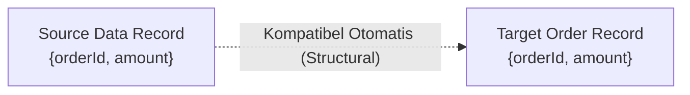

# Modul 2: Data Types, Koleksi, & Structural Typing di Ballerina

---

## 1. Format Data Jaringan Asli: JSON & XML

Di Ballerina, `json` dan `xml` bukan tipe string atau kelas dari library luar, melainkan **tipe data bawaan kelas satu (*first-class citizens*)**.

### 1. Tipe Data `json`
Nilai `json` di Ballerina mencakup tipe primitif (string, number, boolean, null) serta map JSON dan array JSON:

```ballerina
import ballerina/io;

public function main() {
    // Definisi objek JSON langsung
    json transaction = {
        "id": "TRX-9901",
        "amount": 250000.0,
        "currency": "IDR",
        "items": ["Laptop Stand", "USB Hub"],
        "isPaid": true
    };

    // Mengakses field JSON
    io:println("ID Transaksi: ", transaction.id);
    io:println("JSON String: ", transaction.toJsonString());
}
```

### 2. Tipe Data `xml`
XML ditulis langsung menggunakan sintaks XML literal (``` xml `<tag>...</tag>` ```):

```ballerina
import ballerina/io;

public function main() {
    string invoiceId = "INV-2026-001";
    decimal totalAmount = 500000.0d;

    // XML literal dengan interpolasi variabel
    xml invoiceXml = xml `<invoice id="${invoiceId}">
        <customer>Jovan Pratama</customer>
        <total currency="IDR">${totalAmount}</total>
    </invoice>`;

    io:println("XML Payload: ", invoiceXml);
}
```

---

## 2. Koleksi Data: Arrays, Maps, dan Tables

### 1. Array (`T[]`)
```ballerina
string[] categories = ["ELECTRONICS", "FASHION", "BOOKS"];
categories.push("AUTOMOTIVE"); // Menambah data

int length = categories.length(); // 4
string firstCategory = categories[0];
```

### 2. Map (`map<T>`)
Map adalah struktur key-value asosiatif:
```ballerina
map<decimal> shippingRates = {
    "JABODETABEK": 10000.0d,
    "JAWA_BARAT": 15000.0d,
    "LUAR_JAWA": 35000.0d
};

// Mengambil nilai
decimal? ongkir = shippingRates["JABODETABEK"]; // 10000.0d
```

### 3. Table dengan Primary Key (`table<T> key(k)`)
Table adalah koleksi data mirip tabel database di dalam memori, lengkap dengan penegakan keunikan primary key (*read-only key field*):

```ballerina
import ballerina/io;

public type Product record {| 
    readonly string id;
    string name;
    decimal price;
    int stock;
|};

// Inisialisasi table dengan primary key 'id'
table<Product> key(id) productTable = table [
    {id: "PRD-01", name: "Mouse Gaming", price: 250000.0d, stock: 10},
    {id: "PRD-02", name: "Keyboard Mechanical", price: 850000.0d, stock: 20}
];

public function main() {
    // Menambah produk baru ke table
    productTable.add({id: "PRD-03", name: "Monitor 4K", price: 5000000.0d, stock: 5});

    // Mengambil data berdasarkan Primary Key langsung dalam O(1)
    Product? mouse = productTable["PRD-01"];
    if mouse is Product {
        io:println("Produk: ", mouse.name, " | Harga: Rp ", mouse.price);
    }
}
```

---

## 3. Records & Structural Typing

### Apa itu Structural Typing?
Dalam bahasa seperti Java/C#, kesamaan tipe didasarkan pada **nama kelas (Nominal Typing)**. Di Ballerina, kesamaan tipe didasarkan pada **struktur field dan isinya (Structural Typing)**.



### 1. Closed Record (`record {| ... |}`)
Closed record **hanya mengizinkan** field-field yang telah didefinisikan secara eksplisit. Sangat dianjurkan untuk request DTO/API contract:

```ballerina
public type CheckoutRequest record {| 
    string customerId;
    string productId;
    int quantity;
    string? note; // Optional field
|};
```

### 2. Open Record (`record { ... }`)
Open record mengizinkan field dinamis tambahan di luar skema dasar:

```ballerina
public type MetadataRecord record {
    string traceId;
    // Field lain boleh ditambahkan secara bebas pada runtime
};
```

---

## 4. Contoh Hands-on: Manajemen Inventaris Toko

Simpan kode berikut sebagai `inventory_demo.bal` dan jalankan dengan `bal run inventory_demo.bal`:

```ballerina
import ballerina/io;

# Skema Produk Toko
public type InventoryItem record {| 
    readonly string sku;
    string title;
    string category;
    decimal unitPrice;
    int quantity;
|};

public function main() {
    // Membuat Table Penyimpanan
    table<InventoryItem> key(sku) inventory = table [
        {sku: "SKU-001", title: "Laptop ROG", category: "TECH", unitPrice: 20000000.0d, quantity: 5},
        {sku: "SKU-002", title: "Headphone BT", category: "AUDIO", unitPrice: 1500000.0d, quantity: 12}
    ];

    // Iterasi koleksi table
    io:println("=== DAFTAR STOK GUDANG ===");
    foreach InventoryItem item in inventory {
        decimal assetValue = item.unitPrice * <decimal>item.quantity;
        io:println(string `[${item.sku}] ${item.title} - Stok: ${item.quantity} - Total Nilai: Rp ${assetValue}`);
    }
}
```

---

## 5. Checklist Pemahaman Modul 2
- [x] Paham penulisan format data native `json` dan `xml`.
- [x] Paham penggunaan Array, Map, dan Table ber-primary key (`table<Record> key(id)`).
- [x] Paham perbedaan Closed Record (`{| |}`) vs Open Record (`{ }`).
- [x] Paham konsep Structural Typing di Ballerina.
