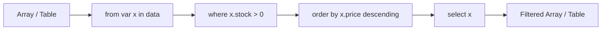
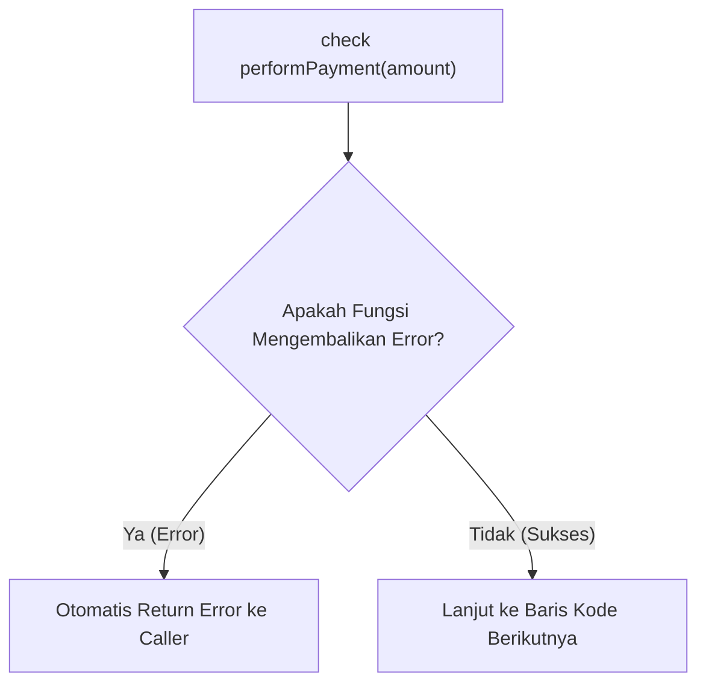

# Modul 3: Control Flow, Query Expressions, & Error Handling di Ballerina

---

## 1. Percabangan: `if-else` & Pattern Matching (`match`)

### 1. Struktur `if-else`
```ballerina
int stock = 5;

if stock <= 0 {
    // Stok habis
} else if stock < 10 {
    // Stok menipis
} else {
    // Stok aman
}
```

### 2. Pattern Matching Menggunakan `match`
`match` statement di Ballerina adalah struktur percabangan yang sangat kuat untuk mencocokkan nilai atau tipe:

```ballerina
string membershipTier = "VIP";
decimal discountRate = 0.0d;

match membershipTier {
    "VIP" => {
        discountRate = 0.15d; // 15%
    }
    "GOLD" => {
        discountRate = 0.10d; // 10%
    }
    "SILVER"|"BRONZE" => {
        discountRate = 0.05d; // 5%
    }
    _ => {
        discountRate = 0.0d;  // Default
    }
}
```

---

## 2. Looping: `foreach` & `while`

### 1. `foreach` Loop
Digunakan untuk mengiterasi array, map, table, atau string:

```ballerina
string[] items = ["Buku", "Pulpen", "Penggaris"];

foreach string item in items {
    // Proses item
}

// Dengan index
foreach int i in 0 ..< items.length() {
    // items[i]
}
```

### 2. `while` Loop
```ballerina
int retryCount = 0;
while retryCount < 3 {
    // Coba koneksi ulang
    retryCount += 1;
}
```

---

## 3. Query Expressions (`from ... in ... select`)

Salah satu fitur paling elegan di Ballerina adalah **Query Expression**, yang memungkinkan Anda memfilter, mengurutkan, dan mentransformasi data koleksi menggunakan sintaks mirip SQL langsung di dalam kode:



#### Contoh Sintaks:
```ballerina
import ballerina/io;

type Product record {| 
    string name;
    string category;
    decimal price;
    int stock;
|};

Product[] catalog = [
    {name: "Laptop ROG", category: "TECH", price: 20000000.0d, stock: 5},
    {name: "Mouse Wireless", category: "TECH", price: 300000.0d, stock: 0},
    {name: "Kemeja Flanel", category: "FASHION", price: 250000.0d, stock: 12},
    {name: "Monitor 4K", category: "TECH", price: 6000000.0d, stock: 3}
];

public function main() {
    // Ambil hanya produk TECH yang ada stoknya dan harganya di bawah 10jt
    Product[] affordableTech = from var p in catalog
        where p.category == "TECH" && p.stock > 0 && p.price < 10000000.0d
        order by p.price ascending
        select p;

    io:println("Produk Terfilter: ", affordableTech);
}
```

---

## 4. Penanganan Error Eksplisit (*Explicit Error Handling*)

Di Ballerina:
1. **Tidak Ada Unchecked Exception**: Error tidak akan meledak tiba-tiba di runtime sebagai crash.
2. **Error adalah Tipe Data**: Fungsi mendeklarasikan kembalian error secara terbuka: `returns Type|error`.
3. **Keyword `check`**: Jika fungsi mengembalikan error, `check` otomatis menghentikan alur dan me-return error tersebut ke pemanggil fungsi.



#### Contoh Penggunaan:
```ballerina
import ballerina/io;

# Validasi kuota pesanan
function validateOrder(int quantity, int availableStock) returns error? {
    if quantity <= 0 {
        return error("Quantity pemesanan harus lebih besar dari 0");
    }
    if quantity > availableStock {
        return error(string `Stok tidak cukup. Tersisa: ${availableStock}, Diminta: ${quantity}`);
    }
    return (); // Berhasil tanpa error
}

public function main() returns error? {
    int stock = 10;
    int requestQty = 3;

    // Jika gagal, operator check langsung me-return error
    check validateOrder(requestQty, stock);
    io:println("Validasi Berhasil! Melanjutkan checkout...");
}
```

---

## 5. Contoh Hands-on: Kalkulator Diskon & Filter Transaksi

Simpan kode berikut sebagai `control_demo.bal` dan jalankan dengan `bal run control_demo.bal`:

```ballerina
import ballerina/io;

type Order record {| 
    string orderId;
    string tier;
    decimal subtotal;
|};

# Hitung diskon berdasarkan tier
function calculateDiscount(Order order) returns decimal|error {
    if order.subtotal <= 0.0d {
        return error("Subtotal tidak boleh 0 atau negatif");
    }

    decimal discountRate = match order.tier {
        "VIP" => 0.20d,
        "GOLD" => 0.10d,
        "REGULAR" => 0.0d,
        _ => return error("Tier membership tidak valid")
    };

    return order.subtotal * (1.0d - discountRate);
}

public function main() returns error? {
    Order[] orders = [
        {orderId: "ORD-01", tier: "VIP", subtotal: 1000000.0d},
        {orderId: "ORD-02", tier: "GOLD", subtotal: 500000.0d},
        {orderId: "ORD-03", tier: "REGULAR", subtotal: 200000.0d}
    ];

    foreach Order ord in orders {
        decimal netAmount = check calculateDiscount(ord);
        io:println(string `[${ord.orderId}] Tier: ${ord.tier} -> Total Bayar: Rp ${netAmount}`);
    }
}
```

---

## 6. Checklist Pemahaman Modul 3
- [x] Menguasai percabangan `if-else` dan Pattern Matching `match`.
- [x] Menguasai Query Expression (`from ... where ... order by ... select`).
- [x] Paham penanganan error eksplisit (`returns Type|error`) dan operator `check`.
