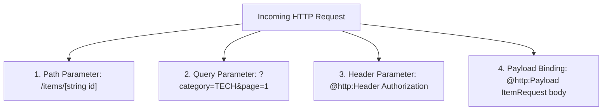

# Modul 4: HTTP Services, Parameter Binding, & API Integration di Ballerina

---

## 1. Anatomi HTTP Service di Ballerina

Di Ballerina, pembuatan REST API tidak membutuhkan konfigurasi controller atau routing yang terpisah. Layanan HTTP didefinisikan langsung menggunakan keyword **`service /context on listener`**:

```ballerina
import ballerina/http;

// Listener berjalan di port 9090
listener http:Listener ep = new (9090);

service /api on ep {

    // Resource method GET pada sub-path /hello
    resource function get hello() returns json {
        return {
            "status": "SUCCESS",
            "message": "Halo dari Ballerina HTTP Service!"
        };
    }
}
```

---

## 2. Parameter Binding: Path, Query, Header, & Payload

Ballerina secara otomatis mengurai (*binding*) bagian-bagian request HTTP ke dalam parameter fungsi resource:



### 1. Path Parameter `[string id]`
Didefinisikan di dalam kurung siku pada signature resource:
```ballerina
resource function get items/[string id]() returns json {
    return {"itemId": id};
}
```

### 2. Query Parameter
Didefinisikan sebagai parameter fungsi biasa. Bisa bertipe opsional (`string?`) atau memiliki nilai bawaan (*default value*):
```ballerina
resource function get search(string? keyword, int page = 1, int 'limit = 10) returns json {
    return {
        "keyword": keyword is () ? "ALL" : keyword,
        "page": page,
        "limit": 'limit
    };
}
```

### 3. Header Binding (`@http:Header`)
Mengambil nilai header HTTP tertentu:
```ballerina
resource function get profile(@http:Header {name: "Authorization"} string authHeader) returns json {
    return {"token": authHeader};
}
```

### 4. JSON Payload Binding (`@http:Payload`)
Mengurai body JSON request langsung ke tipe Record terstruktur (*type-safe*):
```ballerina
type CreateUserRequest record {| 
    string username;
    string email;
|};

resource function post users(@http:Payload CreateUserRequest request) returns http:Created {
    return <http:Created>{
        body: {
            "status": "CREATED",
            "user": request
        }
    };
}
```

---

## 3. Respon Status HTTP Standar

Ballerina menyediakan tipe data respon HTTP standar yang sangat bersih untuk merepresentasikan kode status HTTP:

| Tipe Respon | HTTP Status Code | Contoh Penggunaan |
| :--- | :--- | :--- |
| `http:Ok` (atau tipe payload langsung) | `200 OK` | Respon data normal |
| `http:Created` | `201 Created` | Data berhasil dibuat / checkout sukses |
| `http:BadRequest` | `400 Bad Request` | Validasi input gagal / quantity <= 0 |
| `http:Unauthorized` | `401 Unauthorized` | Token salah / header auth tidak ada |
| `http:NotFound` | `404 Not Found` | Data / ID tidak ditemukan |
| `http:InternalServerError` | `500 Internal Error` | Terjadi kegagalan sistem internal |

#### Contoh Pengembalian Respon Bersyarat:
```ballerina
resource function get users/[int id]() returns json|http:NotFound {
    if id == 100 {
        return {"id": 100, "name": "Jovan"};
    } else {
        return <http:NotFound>{
            body: {"error": "User tidak ditemukan"}
        };
    }
}
```

---

## 4. Memanggil External REST API (`http:Client`)

Untuk memanggil service/API lain, Ballerina menggunakan `http:Client` dengan operator panah (*remote call* `->`):

```ballerina
import ballerina/http;
import ballerina/io;

// Inisialisasi client menuju backend eksternal
final http:Client userApi = check new ("https://jsonplaceholder.typicode.com");

public function main() returns error? {
    // Remote call GET
    json userJson = check userApi->get("/users/1");
    io:println("Nama User: ", userJson.name);

    // Remote call POST dengan payload
    json newPost = {"title": "Integrasi Ballerina", "body": "Contoh Post", "userId": 1};
    json postResponse = check userApi->post("/posts", newPost);
    io:println("Respon Create Post: ", postResponse);
}
```

---

## 5. Contoh Hands-on: API Gateway Validasi & Proxy

Simpan kode berikut sebagai `service_demo.bal` dan jalankan dengan `bal run service_demo.bal`:

```ballerina
import ballerina/http;

public type Customer record {| 
    string id;
    string name;
    string membership;
|};

service /gateway on new http:Listener(9090) {

    resource function post validate(
        @http:Header {name: "X-Api-Key"} string? apiKey,
        @http:Payload Customer customer
    ) returns http:Ok|http:Unauthorized|http:BadRequest {

        // 1. Validasi API Key
        if apiKey is () || apiKey != "SECRET_KEY_123" {
            return <http:Unauthorized>{
                body: {"status": "UNAUTHORIZED", "message": "API Key tidak valid"}
            };
        }

        // 2. Validasi data
        if customer.name.trim().length() == 0 {
            return <http:BadRequest>{
                body: {"status": "BAD_REQUEST", "message": "Nama tidak boleh kosong"}
            };
        }

        return <http:Ok>{
            body: {
                "status": "VALID",
                "message": string `Pelanggan ${customer.name} terverifikasi`,
                "tier": customer.membership
            }
        };
    }
}
```

---

## 6. Checklist Pemahaman Modul 4
- [x] Paham struktur `service /context on new http:Listener(port)`.
- [x] Menguasai binding Path, Query, Header (`@http:Header`), dan Body (`@http:Payload`).
- [x] Paham cara mengembalikan kode status HTTP standar (`http:Created`, `http:NotFound`, dll).
- [x] Menguasai pemanggilan backend eksternal dengan `http:Client` dan operator `->`.
