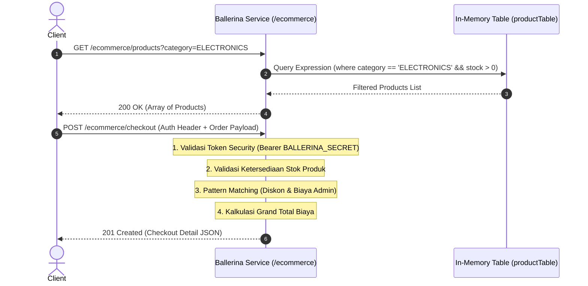

# Modul 5: Hands-on Komprehensif E-Commerce & Checkout Microservice

---

## 1. Deskripsi Proyek & Arsitektur

Pada modul ini, kita menggabungkan **seluruh konsep Ballerina (Modul 1 s.d Modul 4)** ke dalam sebuah microservice bisnis nyata bernama **`E-Commerce & Checkout Microservice`** (`/ecommerce`).

### Fitur-Fitur Layanan:
1. **In-Memory Catalog Storage**: Menyimpan data produk menggunakan `table<Product> key(id)`.
2. **Katalog & Filter Produk (`GET /ecommerce/products`)**: Filter produk berbasis kategori dan status ketersediaan stok menggunakan **Query Expression**.
3. **Detail Produk (`GET /ecommerce/products/[string id]`)**: Mengambil data produk berdasarkan ID unik dengan respon data atau status `404 Not Found`.
4. **Transaksi Checkout (`POST /ecommerce/checkout`)**:
   - Memvalidasi token autentikasi pada Header HTTP (`Authorization: Bearer BALLERINA_SECRET`).
   - Menerima payload JSON pesanan (`@http:Payload CheckoutRequest`).
   - Memvalidasi ketersediaan stok dan kuantitas input.
   - Menghitung diskon keanggotaan (`VIP`: 15%, `GOLD`: 10%, `REGULAR`: 0%) menggunakan **Pattern Matching `match`**.
   - Menghitung biaya admin metode pembayaran (`BANK_TRANSFER`, `EWALLET`, `CREDIT_CARD`).
   - Merangkai dan mengembalikan respon sukses dengan status `201 Created`.



---

## 2. Kode Lengkap Proyek (`hello/main.bal`)

File ini sudah siap dieksekusi di dalam folder `hello/main.bal`:

```ballerina
import ballerina/http;
import ballerina/time;

// ============================================================================
// 1. DEFINISI TIPE DATA & RECORD (STRUCTURAL TYPING)
// ============================================================================

# Model data produk dalam katalog
#
# + id - ID unik produk
# + name - Nama produk
# + category - Kategori produk
# + price - Harga produk
# + stock - Jumlah stok tersedia
public type Product record {| 
    readonly string id;
    string name;
    string category;
    decimal price;
    int stock;
|};

# Model data input untuk checkout pesanan
#
# + customerId - ID pelanggan
# + customerName - Nama pelanggan
# + membershipTier - Tingkat keanggotaan (VIP, GOLD, REGULAR)
# + productId - ID produk yang dibeli
# + quantity - Jumlah item yang dipesan
# + paymentMethod - Metode pembayaran (BANK_TRANSFER, EWALLET, CREDIT_CARD)
public type CheckoutRequest record {| 
    string customerId;
    string customerName;
    string membershipTier; 
    string productId;
    int quantity;
    string paymentMethod;  
|};

# Model data rincian pembayaran
#
# + subtotal - Total harga kotor
# + discountAmount - Nominal potongan diskon
# + adminFee - Biaya admin transaksi
# + grandTotal - Total biaya akhir yang harus dibayar
public type PaymentDetail record {| 
    decimal subtotal;
    decimal discountAmount;
    decimal adminFee;
    decimal grandTotal;
|};

# Model data respons checkout akhir
#
# + status - Status transaksi (SUCCESS)
# + orderId - Kode pesanan unik
# + customerName - Nama pelanggan
# + productName - Nama produk yang dibeli
# + quantity - Jumlah barang
# + payment - Rincian kalkulasi pembayaran
# + channel - Kanal pemesanan (e.g. MOBILE_APP, WEB_PORTAL)
# + processedAt - Waktu transaksi diproses
public type CheckoutResponse record {| 
    string status;
    string orderId;
    string customerName;
    string productName;
    int quantity;
    PaymentDetail payment;
    string channel;
    string processedAt;
|};

// ============================================================================
// 2. IN-MEMORY DATA STORAGE (TABLE DENGAN PRIMARY KEY)
// ============================================================================

final table<Product> key(id) productTable = table [
    {id: "PRD-001", name: "Laptop ASUS ROG", category: "ELECTRONICS", price: 20000000.0d, stock: 10},
    {id: "PRD-002", name: "Keyboard Mechanical RGB", category: "ACCESSORIES", price: 850000.0d, stock: 25},
    {id: "PRD-003", name: "Monitor 4K 144Hz", category: "ELECTRONICS", price: 5500000.0d, stock: 5},
    {id: "PRD-004", name: "Mouse Gaming Wireless", category: "ACCESSORIES", price: 450000.0d, stock: 0}
];

// ============================================================================
// 3. HTTP SERVICE & REST RESOURCES (GABUNGAN SEMUA MATERI)
// ============================================================================

service /ecommerce on new http:Listener(9090) {

    // ------------------------------------------------------------------------
    // RESOURCE 1: GET /ecommerce/products (Query Expression & Filtering)
    // ------------------------------------------------------------------------
    resource function get products(string? category, boolean inStockOnly = true) returns Product[] {
        // Query Expression untuk memfilter data layaknya SQL di dalam kode
        Product[] filtered = from var p in productTable
            where (!inStockOnly || p.stock > 0) &&
                  (category is () || p.category == category)
            select p;
        return filtered;
    }

    // ------------------------------------------------------------------------
    // RESOURCE 2: GET /ecommerce/products/[string id] (Path Parameter & Error)
    // ------------------------------------------------------------------------
    resource function get products/[string id]() returns Product|http:NotFound {
        Product? product = productTable[id];
        if product is () {
            return <http:NotFound>{
                body: {
                    status: "NOT_FOUND",
                    message: string `Produk dengan ID ${id} tidak ditemukan.`,
                    timestamp: time:utcToString(time:utcNow())
                }
            };
        }
        return product;
    }

    // ------------------------------------------------------------------------
    // RESOURCE 3: POST /ecommerce/checkout (Header, Payload, Pattern Matching)
    // ------------------------------------------------------------------------
    resource function post checkout(
        @http:Payload CheckoutRequest request,
        @http:Header {name: "Authorization"} string? authHeader,
        @http:Header {name: "X-Channel"} string channel = "WEB_PORTAL"
    ) returns http:Created|http:Unauthorized|http:BadRequest {

        string currentTime = time:utcToString(time:utcNow());

        // 1. Validasi Keamanan Token (Security Filter)
        if authHeader is () || authHeader != "Bearer BALLERINA_SECRET" {
            return <http:Unauthorized>{
                body: {
                    status: "UNAUTHORIZED",
                    message: "Header Authorization tidak valid atau tidak disertakan.",
                    timestamp: currentTime
                }
            };
        }

        // 2. Validasi Ketersediaan Produk & Stok
        Product? product = productTable[request.productId];
        if product is () {
            return <http:BadRequest>{
                body: {
                    status: "BAD_REQUEST",
                    message: string `Produk ${request.productId} tidak terdaftar.`,
                    timestamp: currentTime
                }
            };
        }

        if request.quantity <= 0 {
            return <http:BadRequest>{
                body: {
                    status: "BAD_REQUEST",
                    message: "Quantity harus lebih besar dari 0.",
                    timestamp: currentTime
                }
            };
        }

        if product.stock < request.quantity {
            return <http:BadRequest>{
                body: {
                    status: "BAD_REQUEST",
                    message: string `Stok tidak mencukupi. Tersisa: ${product.stock}, Diminta: ${request.quantity}`,
                    timestamp: currentTime
                }
            };
        }

        // 3. Perhitungan Diskon Menggunakan Match Statement (Pattern Matching)
        decimal discountPercentage = 0.0d;
        match request.membershipTier.toUpperAscii() {
            "VIP" => {
                discountPercentage = 0.15d; // Diskon 15%
            }
            "GOLD" => {
                discountPercentage = 0.10d; // Diskon 10%
            }
            _ => {
                discountPercentage = 0.0d;  // Regular
            }
        }

        // 4. Perhitungan Biaya Admin Pembayaran
        decimal adminFee = 0.0d;
        match request.paymentMethod.toUpperAscii() {
            "BANK_TRANSFER" => {
                adminFee = 4000.0d;
            }
            "EWALLET" => {
                adminFee = 1500.0d;
            }
            "CREDIT_CARD" => {
                adminFee = 25000.0d;
            }
            _ => {
                adminFee = 0.0d;
            }
        }

        // 5. Kalkulasi Total Biaya
        decimal subtotal = product.price * <decimal>request.quantity;
        decimal discountAmount = subtotal * discountPercentage;
        decimal grandTotal = (subtotal - discountAmount) + adminFee;

        // 6. Generate ID Pesanan Unik
        string orderId = string `ORD-${time:utcNow()[0]}-${request.customerId}`;

        // 7. Merangkai Response Terstruktur (Structural Typing)
        CheckoutResponse response = {
            status: "SUCCESS",
            orderId: orderId,
            customerName: request.customerName,
            productName: product.name,
            quantity: request.quantity,
            payment: {
                subtotal: subtotal,
                discountAmount: discountAmount,
                adminFee: adminFee,
                grandTotal: grandTotal
            },
            channel: channel,
            processedAt: currentTime
        };

        return <http:Created>{
            body: response
        };
    }
}
```

---

## 3. Bedah Detail Setiap Baris Kode (Line-by-Line Breakdown)

1. **Definisi Record (Baris 7 - 65)**:
   - `Product`, `CheckoutRequest`, `PaymentDetail`, dan `CheckoutResponse` didefinisikan sebagai *Closed Record* (`{| |}`) untuk menjamin validitas kontrak data secara type-safe.
   - Field `price`, `subtotal`, `discountAmount`, `adminFee`, dan `grandTotal` bertipe `decimal` untuk presisi keuangan.
2. **In-Memory Table Storage (Baris 69 - 76)**:
   - `table<Product> key(id)` membuat tabel berindeks kunci primer `id` dengan akses $O(1)$.
3. **HTTP Service Listener (Baris 80)**:
   - Menjalankan endpoint pada port `9090` dengan base path `/ecommerce`.
4. **Query Expression Filtering (Baris 85 - 94)**:
   - `from var p in productTable where ... select p`: Memfilter produk langsung di memori secara deklaratif.
5. **Path Parameter Binding & 404 Response (Baris 97 - 110)**:
   - `products/[string id]`: Mengambil nilai ID dari URL dan mengembalikan `<http:NotFound>` jika item tidak ada.
6. **Header, Payload Binding & Security (Baris 113 - 134)**:
   - Mengambil token auth via `@http:Header` dan body JSON via `@http:Payload`.
   - Mengembalikan `<http:Unauthorized>` jika token bukan `"Bearer BALLERINA_SECRET"`.
7. **Business & Stock Validation (Baris 136 - 165)**:
   - Memeriksa batas kuantitas dan ketersediaan stok produk, mengembalikan `<http:BadRequest>` jika gagal.
8. **Pattern Matching Diskon & Biaya Admin (Baris 167 - 195)**:
   - Menggunakan statement `match` untuk menentukan persentase potongan diskon dan tarif transaksi.
9. **Kalkulasi & Respon 201 Created (Baris 197 - 227)**:
   - Mengkalkulasi subtotal, diskon, biaya admin, dan grand total, lalu membungkusnya ke dalam tipe `<http:Created>` (HTTP 201).

---

## 4. Panduan Menjalankan & Menguji Step-by-Step

### Langkah 1: Jalankan Microservice di Terminal
```powershell
cd C:\Users\eksad\OneDrive\Documents\assa\selfLearning\hello
bal run
```

---

### Langkah 2: Skenario Pengujian

#### Skenario 1: Ambil Katalog Produk Elektronik (Query Filter)
```powershell
Invoke-RestMethod -Uri "http://localhost:9090/ecommerce/products?category=ELECTRONICS" -Method Get | ConvertTo-Json
```

---

#### Skenario 2: Ambil Detail Produk Tertentu (Path Parameter)
```powershell
Invoke-RestMethod -Uri "http://localhost:9090/ecommerce/products/PRD-001" -Method Get | ConvertTo-Json
```

---

#### Skenario 3: Transaksi Checkout Sukses (201 Created)
```powershell
$headers = @{
    "Authorization" = "Bearer BALLERINA_SECRET"
    "X-Channel"     = "MOBILE_APP"
    "Content-Type"  = "application/json"
}

$body = @{
    customerId     = "CUST-007"
    customerName   = "Jovan Pratama"
    membershipTier = "VIP"
    productId      = "PRD-001"
    quantity       = 1
    paymentMethod  = "BANK_TRANSFER"
} | ConvertTo-Json

Invoke-RestMethod -Uri "http://localhost:9090/ecommerce/checkout" -Method Post -Headers $headers -Body $body | ConvertTo-Json
```

**Expected Response (201 Created):**
```json
{
  "status": "SUCCESS",
  "orderId": "ORD-1772600000-CUST-007",
  "customerName": "Jovan Pratama",
  "productName": "Laptop ASUS ROG",
  "quantity": 1,
  "payment": {
    "subtotal": 20000000,
    "discountAmount": 3000000,
    "adminFee": 4000,
    "grandTotal": 17004000
  },
  "channel": "MOBILE_APP",
  "processedAt": "2026-09-02T11:45:00.000Z"
}
```

---

#### Skenario 4: Uji Validasi Keamanan Token Salah (401 Unauthorized)
```powershell
$headers = @{
    "Authorization" = "Bearer WRONG_TOKEN"
    "Content-Type"  = "application/json"
}
$body = @{ customerId="CUST-001"; productId="PRD-001"; quantity=1; membershipTier="REGULAR"; paymentMethod="EWALLET"; customerName="Test" } | ConvertTo-Json

Invoke-RestMethod -Uri "http://localhost:9090/ecommerce/checkout" -Method Post -Headers $headers -Body $body
```

---

#### Skenario 5: Uji Validasi Stok Melebihi Batas (400 Bad Request)
```powershell
$headers = @{
    "Authorization" = "Bearer BALLERINA_SECRET"
    "Content-Type"  = "application/json"
}
$body = @{ customerId="CUST-001"; productId="PRD-001"; quantity=999; membershipTier="REGULAR"; paymentMethod="EWALLET"; customerName="Test" } | ConvertTo-Json

Invoke-RestMethod -Uri "http://localhost:9090/ecommerce/checkout" -Method Post -Headers $headers -Body $body
```

---

## 5. Ringkasan & Checklist Akhir

- [x] Menguasai arsitektur dan sintaks bahasa Ballerina.
- [x] Menguasai pembuatan microservices REST API lengkap di port `9090`.
- [x] Menguasai validasi header security, body payload, dan ketersediaan stok.
- [x] Menguasai komputasi finansial dengan presisi tipe `decimal`.
- [x] Berhasil mengeksekusi dan menguji 5 skenario integrasi secara end-to-end.
