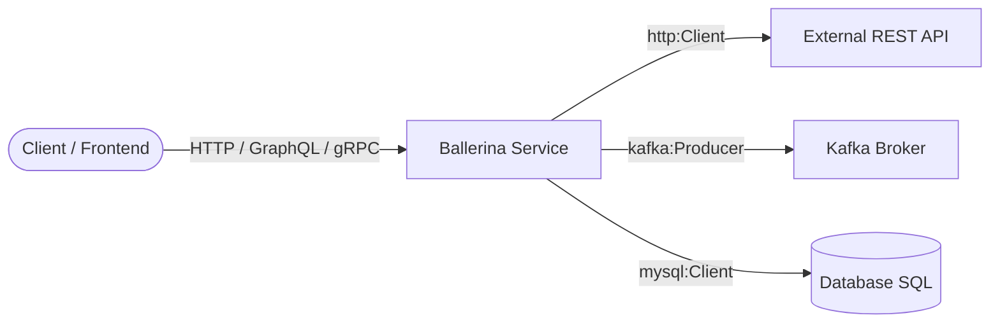
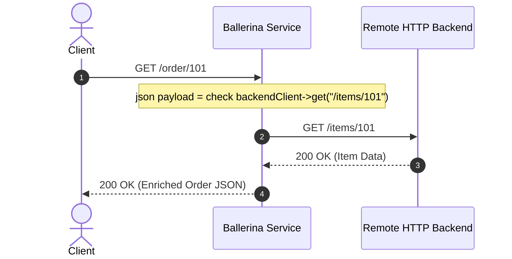

# Panduan & Materi Pengenalan: Bahasa Pemrograman Ballerina

---

## 1. Apa itu Ballerina?

**Ballerina** adalah bahasa pemrograman *open-source*, *cloud-native*, dan *statically typed* yang dikembangkan oleh **WSO2** dan dirancang khusus untuk mempermudah **integrasi sistem, pengembangan microservices, dan komunikasi jaringan (network-aware)**.

Berbeda dengan bahasa pemrograman umum (seperti Java, Python, Go) yang memperlakukan jaringan/HTTP sebagai library pihak ketiga, **Ballerina memperlakukan jaringan, format data (JSON, XML), dan layanan web sebagai fitur bawaan kelas satu (*first-class citizens*)** di dalam sintaksis bahasanya.



---

## 2. Mengapa Ballerina Diciptakan? (Kelebihan Utama)

### 1. Dual Representation: Kode = Sequence Diagram
Salah satu fitur paling revolusioner dari Ballerina adalah **setiap baris kode Ballerina dapat langsung divisualisasikan sebagai Sequence Diagram** secara otomatis di VS Code, dan sebaliknya!
- Pemanggilan fungsi lokal menggunakan tanda titik (`.`): `calculator.add(a, b)`
- Pemanggilan jaringan eksternal menggunakan panah aksi (*remote call* `->`): `httpClient->get("/users")`



---

### 2. Network-Aware Data Types (JSON & XML Asli)
Di bahasa lain, Anda perlu parser eksternal (seperti Jackson di Java) untuk menangani JSON/XML. Di Ballerina, `json` dan `xml` adalah tipe data bawaan bahasa:

```ballerina
// JSON langsung tanpa parsing rumit
json user = {
    name: "Jovan",
    role: "Integration Engineer",
    skills: ["WSO2", "Ballerina", "Docker"]
};

// XML langsung sebagai literal
xml greeting = xml `<message>Selamat Datang di Ballerina!</message>`;
```

---

### 3. Structural Type System
Tipe data di Ballerina bersifat **structural** (berdasarkan bentuk/isi data), bukan *nominal* (berdasarkan nama kelas). Jika dua record memiliki struktur field yang kompatibel, mereka dianggap kompatibel secara otomatis.

---

### 4. Explicit & Robust Error Handling
Ballerina tidak memiliki runtime *unchecked exception* (seperti `NullPointerException` yang sering membuat crash aplikasi). Error diperlakukan sebagai tipe data biasa, dan ditangani menggunakan keyword **`check`**:

```ballerina
// Jika pemanggilan gagal, fungsi otomatis return error secara elegan
json response = check httpClient->get("/api/data");
```

---

### 5. Cloud-Native & Container Ready
Ballerina memiliki compiler bawaan yang dapat langsung men-generate file **Dockerfile**, artefak **Kubernetes (Deployment, Service, HPA)**, dan Cloud Native Buildpacks tanpa konfigurasi manual yang rumit.

---

## 3. Perbandingan: WSO2 Micro Integrator (MI) vs Ballerina

Keduanya adalah produk andalan WSO2 untuk integrasi enterprise:

| Aspek | WSO2 Micro Integrator (MI) | Ballerina |
| :--- | :--- | :--- |
| **Pendekatan** | **Config-First** (Synapse XML & Drag-and-Drop Visual). | **Code-First** (Bahasa Pemrograman Modern & Visual). |
| **Bahasa Utama** | XML (Synapse Configuration Language). | Ballerina Language (`.bal`). |
| **Profil Developer** | Integration Specialist, ESB Middleware Engineer. | Software Engineer, Backend/Microservices Developer. |
| **Kemampuan Bisnis** | Sangat unggul untuk routing, mediasi protokol legacy (SOAP, ISO8583, JMS). | Sangat unggul untuk logika bisnis kompleks, API gateway custom, dan microservices modern. |
| **Evolusi** | Evolusi dari WSO2 ESB klasik. | Didesain dari awal untuk era Cloud-Native. |

---

## 4. Contoh Kode Ballerina (Hands-on)

### Contoh 1: REST API "Hello World" Service

Simpan dengan nama `hello_service.bal`:

```ballerina
import ballerina/http;

// Listener HTTP berjalan di port 9090
service /api on new http:Listener(9090) {

    // Resource method GET dengan path parameter
    resource function get hello/[string name]() returns json {
        return {
            "status": "SUCCESS",
            "message": string `Halo, ${name}! Selamat datang di Ballerina.`,
            "timestamp": "2026-09-01"
        };
    }
}
```

**Cara Menjalankan:**
```bash
bal run hello_service.bal
```
**Akses:** `curl http://localhost:9090/api/hello/Jovan`

---

### Contoh 2: Integrasi & Transformasi Data (Calling External API)

Berikut contoh kode integrasi yang memanggil external backend, memetakan data (*data mapping*), dan mengembalikan response terstruktur:

```ballerina
import ballerina/http;

// Definisi Model Data (Record)
type Customer record {
    int id;
    string name;
    string email;
};

type CustomerResponse record {
    string status;
    Customer customer;
};

// Client HTTP menuju backend
final http:Client customerBackend = check new ("https://jsonplaceholder.typicode.com");

service /customers on new http:Listener(8080) {

    resource function get [int id]() returns CustomerResponse|error {
        // 1. Memanggil remote API eksternal dengan remote call operator (->)
        // Operator 'check' otomatis menangani error jika koneksi gagal
        json rawData = check customerBackend->get(string `/users/${id}`);

        // 2. Transformasi ke tipe Record terstruktur
        Customer customerData = {
            id: check rawData.id,
            name: check rawData.name,
            email: check rawData.email
        };

        // 3. Mengembalikan response terformat
        return {
            status: "SUCCESS",
            customer: customerData
        };
    }
}
```

---

## 5. Tools & Ekosistem Ballerina

1. **Ballerina Swan Lake**:
   - Versi rilis modern dan stabil dari Ballerina.
   - Download dari: [ballerina.io/downloads](https://ballerina.io/downloads/).
2. **Ballerina VS Code Extension**:
   - Dilengkapi **Sequence Diagram Viewer**, **Data Mapper Tool**, dan Graphical Service Designer.
3. **Ballerina Central (`central.ballerina.io`)**:
   - Pusat modul dan package manager (seperti npm / Maven) untuk konektor SaaS (Salesforce, Google Sheets, AWS S3, OpenAI, Stripe, dll).
4. **Ballerina CLI**:
   - `bal new <project-name>`: Membuat project baru.
   - `bal run`: Menjalankan kode.
   - `bal test`: Menjalankan unit test bawaan.
   - `bal build`: Mengompilasi menjadi file `.jar` atau Docker Image.

---

## 6. Ringkasan & Langkah Selanjutnya (Key Takeaways)

- **Ballerina** adalah bahasa pemrograman masa depan untuk integrasi dan microservices dari WSO2.
- Menggabungkan kemudahan sintaks pemrograman modern dengan ketangguhan visualisasi sequence diagram secara otomatis.
- Sangat cocok dipelajari bersamaan dengan WSO2 Micro Integrator untuk melengkapi keahlian integrasi enterprise (**Config-First dengan WSO2 MI + Code-First dengan Ballerina**).
