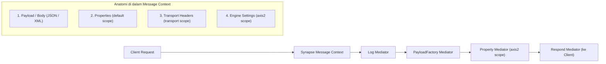
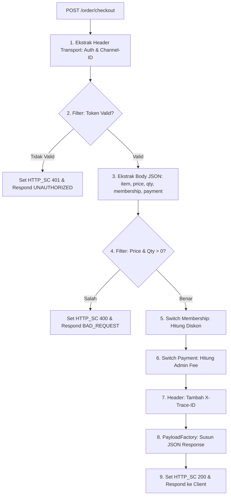

# Modul 2: Core Mediators & Manipulasi Konteks (Context Manipulation)

---

## 1. Konsep Synapse Message Context & Scope

### A. Apa itu Synapse Message Context?
Secara sederhana, **Synapse Message Context (`MessageContext` / `MC`)** adalah **wadah atau amplop data** yang mewakili satu siklus hidup (*lifecycle*) pesan selama diproses di dalam WSO2 Micro Integrator / ESB.

#### Analogi Sederhana: "Baki / Amplop Berjalan"
Bayangkan ketika seorang client mengirim request HTTP ke WSO2 MI:
- WSO2 MI akan membuat sebuah **baki berjalan (Message Context)**.
- Di atas baki tersebut diletakkan:
  1. **Isi Surat (Payload / Body)**: Data JSON atau XML yang dikirim oleh client.
  2. **Catatan Tempel (Properties / Variables)**: Variabel lokal yang Anda buat selama alur integrasi.
  3. **Label Pengiriman (Transport Headers)**: Header HTTP seperti `Authorization`, `Content-Type`, `User-Agent`.
  4. **Instruksi Mesin (Axis2 / Engine Properties)**: HTTP Status Code (`200`, `400`, `500`), timeout koneksi, format serializer data.

Baki ini berjalan melewati mediator satu per satu: `<log>` membaca isinya, `<property>` menempelkan variabel baru, `<payloadFactory>` mengubah isi suratnya, dan `<respond>` mengirimkannya kembali ke client.



---

### B. Studi Kasus Nyata: Bedah Interaksi Message Context pada `HelloAPI.xml`

Mari kita lihat bagaimana `HelloAPI.xml` yang kita buat di Modul 1 memanipulasi Message Context:

```xml
<api xmlns="http://ws.apache.org/ns/synapse" name="HelloAPI" context="/hello">
    <resource methods="GET" uri-template="/{name}">
        <inSequence>
            <!-- 1. Membaca properti URI parameter dari Message Context -->
            <log level="custom">
                <property name="INFO" value="Menerima request Hello API"/>
                <property name="TargetName" expression="get-property('uri.var.name')"/>
            </log>

            <!-- 2. Mengubah Payload/Body di dalam Message Context menjadi JSON baru -->
            <payloadFactory media-type="json">
                <format>
                    {
                        "status": "SUCCESS",
                        "message": "Halo, $1! Selamat datang di WSO2 Micro Integrator.",
                        "server_time": "$2"
                    }
                </format>
                <args>
                    <arg evaluator="xml" expression="get-property('uri.var.name')"/>
                    <arg evaluator="xml" expression="get-property('SYSTEM_DATE', 'yyyy-MM-dd HH:mm:ss')"/>
                </args>
            </payloadFactory>

            <!-- 3. Menyimpan HTTP Status Code ke dalam Axis2 Scope di Message Context -->
            <property name="HTTP_SC" value="200" scope="axis2"/>

            <!-- 4. Mengembalikan seluruh isi Message Context saat ini ke Client -->
            <respond/>
        </inSequence>
    </resource>
</api>
```

#### Alur Manipulasi Data:
1. Saat request `GET /hello/Jovan` masuk, WSO2 otomatis menyimpan nilai `Jovan` ke dalam variabel context berlabel `uri.var.name`.
2. Mediator `<log>` mengambil nilai `uri.var.name` dari context untuk dicetak di terminal.
3. Mediator `<payloadFactory>` **menimpa isi Body/Payload** di dalam Message Context dengan format JSON baru menggunakan argumen yang ditarik dari context (`$1` = `uri.var.name` dan `$2` = `SYSTEM_DATE`).
4. Mediator `<property>` menuliskan `HTTP_SC = 200` pada **scope `axis2`** di Message Context agar transport layer mengirimkan header response `HTTP/1.1 200 OK`.
5. Mediator `<respond/>` menghentikan alur mediasi dan langsung mengirimkan isi Message Context terkini kembali ke pemanggil.

---

### C. Penjelasan Scopes Variabel di Message Context

Data dan variabel dapat disimpan dan diakses pada tingkatan (*scopes*) yang berbeda:

| Scope | Fungsi & Penggunaan | Cara Mengakses (XPath / Synapse Expression) | Prefix Ringkas |
| :--- | :--- | :--- | :--- |
| **`default`** | Variabel lokal selama pemrosesan alur Synapse. Hilang setelah response terkirim. | `get-property('myVar')` | `$ctx:myVar` |
| **`transport`** | HTTP Headers dari request masuk atau yang akan dikirim keluar (misal `Authorization`). | `get-property('transport', 'Authorization')` | `$trp:Authorization` |
| **`axis2`** | Properti engine transport tingkat bawah (misal status HTTP `HTTP_SC`, format output `messageType`). | `get-property('axis2', 'HTTP_SC')` | `$axis2:HTTP_SC` |
| **`axis2-client`** | Konfigurasi koneksi saat memanggil backend eksternal (misal `HTTP_METHOD`, `REST_URL_POSTFIX`). | `get-property('axis2-client', 'HTTP_METHOD')` | - |
| **`registry`** | Mengambil file / konfigurasi statis dari WSO2 Governance Registry. | `get-property('gov:/conf/myConfig.xml')` | - |

---

## 2. Mediators Utama yang Wajib Dikuasai

### 1. Property Mediator
Digunakan untuk membuat, mengubah, atau menghapus variabel dalam konteks pesan.

```xml
<!-- Menyimpan nilai statis -->
<property name="serviceName" value="PaymentService" scope="default" type="STRING"/>

<!-- Mengambil nilai dari JSON body request (menggunakan json-eval) -->
<property name="userId" expression="json-eval($.user.id)" scope="default" type="STRING"/>

<!-- Mengambil nilai dari Query Parameter / Path Parameter -->
<property name="queryCategory" expression="get-property('query.param.category')" scope="default" type="STRING"/>

<!-- Menghapus properti -->
<property name="tempToken" action="remove" scope="default"/>
```

---

### 2. Log Mediator
Digunakan untuk mencetak informasi ke dalam terminal/log file (`wso2carbon.log`).

```xml
<!-- Log Level Custom (Hanya mencetak properti yang didefinisikan) -->
<log level="custom">
    <property name="EVENT" value="INCOMING_TRANSACTION"/>
    <property name="USER_ID" expression="get-property('userId')"/>
    <property name="TOTAL_AMOUNT" expression="json-eval($.amount)"/>
</log>

<!-- Log Level Full (Mencetak seluruh payload dan seluruh header HTTP) -->
<log level="full"/>
```

---

### 3. PayloadFactory Mediator
Mediator terpenting untuk memanipulasi, menyusun, dan mengubah format data request/response.

```xml
<payloadFactory media-type="json">
    <format>
        {
            "transaction_id": "$1",
            "account_number": "$2",
            "details": {
                "amount": $3,
                "currency": "IDR",
                "status": "PENDING"
            }
        }
    </format>
    <args>
        <arg evaluator="xml" expression="get-property('txId')"/>
        <arg evaluator="json" expression="$.accountNo"/>
        <arg evaluator="json" expression="$.totalPay"/>
    </args>
</payloadFactory>
```

> [!TIP]
> Perhatikan tanda kutip pada argumen `$1` (string) dan `$3` (number/numeric). Di JSON, jika nilai berupa angka, jangan gunakan tanda petik ganda (`"$3"` akan menjadi string `"50000"`, sedangkan `$3` akan menjadi angka `50000`).

---

### 4. Header Mediator
Digunakan untuk membaca, menambahkan, atau menghapus HTTP Transport Headers.

```xml
<!-- Menambahkan HTTP Header Authorization ke backend -->
<header name="Authorization" expression="fn:concat('Bearer ', get-property('jwtToken'))" scope="transport"/>

<!-- Menambahkan Custom Header -->
<header name="X-Correlation-ID" expression="get-property('MESSAGE_ID')" scope="transport"/>

<!-- Menghapus HTTP Header tertentu sebelum dikirim -->
<header name="Cookie" action="remove" scope="transport"/>
```

---

### 5. Filter Mediator (Percabangan If-Else)
Mengevaluasi kondisi berdasarkan regex atau ekspresi boolean XPath/JSONPath.

```xml
<!-- Contoh Filter dengan Regex pada Properti -->
<filter source="get-property('userId')" regex="^VIP.*">
    <then>
        <!-- Blok IF: User VIP -->
        <log level="custom">
            <property name="ROUTE" value="Direct to High Priority Queue"/>
        </log>
    </then>
    <else>
        <!-- Blok ELSE: User Regular -->
        <log level="custom">
            <property name="ROUTE" value="Direct to Standard Queue"/>
        </log>
    </else>
</filter>
```

---

### 6. Switch Mediator (Percabangan Multi-Kondisi)
Mirip struktur `switch-case` dalam bahasa pemrograman.

```xml
<switch source="json-eval($.paymentMethod)">
    <case regex="BANK_TRANSFER">
        <property name="fee" value="4000" scope="default"/>
    </case>
    <case regex="E_WALLET">
        <property name="fee" value="1500" scope="default"/>
    </case>
    <case regex="CREDIT_CARD">
        <property name="fee" value="2.5%" scope="default"/>
    </case>
    <default>
        <property name="fee" value="0" scope="default"/>
    </default>
</switch>
```

---

### 7. Call vs Send vs Respond vs Drop

| Mediator | Karakteristik & Perbedaan |
| :--- | :--- |
| `<call>` | **Synchronous / Blocking**: Mengirim pesan ke endpoint dan **menunggu response** di tempat sebelum melanjutkan ke mediator berikutnya dalam urutan yang sama. |
| `<send>` | **Asynchronous / Non-Blocking**: Meneruskan pesan ke endpoint dan mengarahkan response yang kembali ke `outSequence`. |
| `<respond>` | Menghentikan alur mediasi saat itu juga dan **langsung mengembalikan pesan saat ini sebagai HTTP Response** ke client. |
| `<drop>` | Menghentikan alur pemrosesan pesan dan **membuang pesan** (tidak mengembalikan apa-apa ke client). |

---

## 3. Hands-on Komprehensif: Order & Payment Processing API (`/order/checkout`)

Pada bagian ini, kita akan membangun sebuah REST API bisnis nyata bernama **`OrderCheckoutAPI`** yang mengintegrasikan **seluruh materi di Modul 2**:
1. **Message Context Scopes**: `transport` (baca & inject HTTP headers), `default` (variabel lokal JSON/XPath), dan `axis2` (HTTP status code).
2. **Mediators Terlibat**:
   - `<log>`: Mencatat jejak audit pemrosesan request.
   - `<property>`: Ekstraksi data bertipe `DOUBLE`, `INTEGER`, `STRING` serta penanganan scope.
   - `<filter>`: Validasi keamanan (Bearer Token) & validasi bisnis (nilai harga/jumlah > 0).
   - `<switch>`: Penentuan diskon tier membership & perhitungan biaya admin metode pembayaran.
   - `<header>`: Injeksi custom tracing header (`X-Trace-ID`) ke HTTP response.
   - `<payloadFactory>`: Pembuatan JSON response terstruktur dinamis.
   - `<respond>`: Pengembalian response langsung ke client.
   - `<faultSequence>`: Penanganan error sistem tak terduga (*internal server error*).



---

## 4. Panduan Pengerjaan Step-by-Step

Ikuti langkah-langkah di bawah ini untuk mengimplementasikan dan menguji project di Antigravity IDE:

### Langkah 1: Buat File Artefak API
Di Antigravity Explorer, buat file baru bernama `OrderCheckoutAPI.xml` di folder:
`HelloWorldProject/src/main/wso2mi/artifacts/apis/OrderCheckoutAPI.xml`

### Langkah 2: Salin Kode Konfigurasi Synapse XML Lengkap
Masukkan seluruh kode konfigurasi berikut ke dalam file `OrderCheckoutAPI.xml`:

```xml
<?xml version="1.0" encoding="UTF-8"?>
<api xmlns="http://ws.apache.org/ns/synapse" name="OrderCheckoutAPI" context="/order">
    <resource methods="POST" uri-template="/checkout">
        <inSequence>
            <!-- ============================================================ -->
            <!-- 1. LOGGING & PENYIMPANAN DATA DARI TRANSPORT SCOPE (HEADERS)  -->
            <!-- ============================================================ -->
            <property name="authHeader" expression="get-property('transport', 'Authorization')" scope="default"/>
            <property name="channelId" expression="get-property('transport', 'Channel-ID')" scope="default"/>

            <log level="custom">
                <property name="STEP" value="1. Menerima Request Order Checkout"/>
                <property name="Channel-ID" expression="get-property('channelId')"/>
            </log>

            <!-- ============================================================ -->
            <!-- 2. FILTER VALIDASI KEAMANAN (AUTENTIKASI HEADER)             -->
            <!-- ============================================================ -->
            <filter source="get-property('authHeader')" regex="Bearer SECRET123">
                <then>
                    <log level="custom">
                        <property name="AUTH" value="Autentikasi Berhasil"/>
                    </log>
                </then>
                <else>
                    <!-- Return 401 Unauthorized jika token salah/kosong -->
                    <property name="HTTP_SC" value="401" scope="axis2"/>
                    <payloadFactory media-type="json">
                        <format>
                            {
                                "status": "UNAUTHORIZED",
                                "message": "Token otentikasi tidak valid atau header Authorization tidak ditemukan."
                            }
                        </format>
                        <args/>
                    </payloadFactory>
                    <respond/>
                </else>
            </filter>

            <!-- ============================================================ -->
            <!-- 3. EKSTRAKSI PAYLOAD JSON REQUEST KE DEFAULT PROPERTIES      -->
            <!-- ============================================================ -->
            <property name="orderId" expression="json-eval($.order_id)" scope="default"/>
            <property name="customerId" expression="json-eval($.customer_id)" scope="default"/>
            <property name="membership" expression="json-eval($.membership)" scope="default"/>
            <property name="itemName" expression="json-eval($.item)" scope="default"/>
            <property name="itemPrice" expression="json-eval($.price)" scope="default"/>
            <property name="itemQty" expression="json-eval($.quantity)" scope="default"/>
            <property name="paymentMethod" expression="json-eval($.payment_method)" scope="default"/>

            <!-- ============================================================ -->
            <!-- 4. FILTER VALIDASI INPUT BISNIS (PRICE & QUANTITY)           -->
            <!-- ============================================================ -->
            <filter xpath="get-property('itemPrice') &lt;= 0 or get-property('itemQty') &lt;= 0">
                <then>
                    <property name="HTTP_SC" value="400" scope="axis2"/>
                    <payloadFactory media-type="json">
                        <format>
                            {
                                "status": "BAD_REQUEST",
                                "message": "Harga (price) dan jumlah (quantity) harus lebih besar dari 0."
                            }
                        </format>
                        <args/>
                    </payloadFactory>
                    <respond/>
                </then>
                <else/>
            </filter>

            <!-- ============================================================ -->
            <!-- 5. SWITCH MEDIATOR 1: PENENTUAN DISKON BERDASARKAN MEMBERSHIP -->
            <!-- ============================================================ -->
            <switch source="get-property('membership')">
                <case regex="VIP">
                    <property name="discountRate" value="15%" scope="default"/>
                    <property name="tierName" value="VIP Priority Customer" scope="default"/>
                </case>
                <case regex="GOLD">
                    <property name="discountRate" value="10%" scope="default"/>
                    <property name="tierName" value="Gold Member" scope="default"/>
                </case>
                <default>
                    <property name="discountRate" value="0%" scope="default"/>
                    <property name="tierName" value="Regular Member" scope="default"/>
                </default>
            </switch>

            <!-- ============================================================ -->
            <!-- 6. SWITCH MEDIATOR 2: PENENTUAN BIAYA ADMIN PEMBAYARAN        -->
            <!-- ============================================================ -->
            <switch source="get-property('paymentMethod')">
                <case regex="BANK_TRANSFER">
                    <property name="adminFee" value="4000" scope="default"/>
                </case>
                <case regex="E_WALLET">
                    <property name="adminFee" value="1500" scope="default"/>
                </case>
                <case regex="CREDIT_CARD">
                    <property name="adminFee" value="25000" scope="default"/>
                </case>
                <default>
                    <property name="adminFee" value="0" scope="default"/>
                </default>
            </switch>

            <!-- ============================================================ -->
            <!-- 7. HEADER MEDIATOR: MENAMBAHKAN CUSTOM TRACE HEADER          -->
            <!-- ============================================================ -->
            <header name="X-Trace-ID" expression="fn:concat('TRX-', get-property('orderId'))" scope="transport"/>

            <!-- ============================================================ -->
            <!-- 8. PAYLOADFACTORY: MENYUSUN JSON RESPONSE LENGKAP             -->
            <!-- ============================================================ -->
            <payloadFactory media-type="json">
                <format>
                    {
                        "status": "SUCCESS",
                        "data": {
                            "order_id": "$1",
                            "customer_id": "$2",
                            "tier": "$3",
                            "item_name": "$4",
                            "unit_price": $5,
                            "quantity": $6,
                            "discount": "$7",
                            "payment": {
                                "method": "$8",
                                "admin_fee": $9
                            },
                            "channel": "$10",
                            "processed_at": "$11"
                        }
                    }
                </format>
                <args>
                    <arg evaluator="xml" expression="get-property('orderId')"/>
                    <arg evaluator="xml" expression="get-property('customerId')"/>
                    <arg evaluator="xml" expression="get-property('tierName')"/>
                    <arg evaluator="xml" expression="get-property('itemName')"/>
                    <arg evaluator="xml" expression="get-property('itemPrice')"/>
                    <arg evaluator="xml" expression="get-property('itemQty')"/>
                    <arg evaluator="xml" expression="get-property('discountRate')"/>
                    <arg evaluator="xml" expression="get-property('paymentMethod')"/>
                    <arg evaluator="xml" expression="get-property('adminFee')"/>
                    <arg evaluator="xml" expression="get-property('channelId')"/>
                    <arg evaluator="xml" expression="get-property('SYSTEM_DATE', 'yyyy-MM-dd HH:mm:ss')"/>
                </args>
            </payloadFactory>

            <!-- ============================================================ -->
            <!-- 9. SET HTTP STATUS 200 OK & RESPOND KE CLIENT                -->
            <!-- ============================================================ -->
            <property name="HTTP_SC" value="200" scope="axis2"/>
            <respond/>
        </inSequence>

        <!-- ============================================================ -->
        <!-- FAULT SEQUENCE: PENANGANAN JIKA TERJADI ERROR SISTEM          -->
        <!-- ============================================================ -->
        <faultSequence>
            <log level="custom">
                <property name="ERROR" value="Terjadi exception pada alur OrderCheckoutAPI"/>
                <property name="CODE" expression="get-property('ERROR_CODE')"/>
                <property name="MESSAGE" expression="get-property('ERROR_MESSAGE')"/>
            </log>
            <property name="HTTP_SC" value="500" scope="axis2"/>
            <payloadFactory media-type="json">
                <format>
                    {
                        "status": "INTERNAL_SERVER_ERROR",
                        "error_code": "$1",
                        "error_message": "$2"
                    }
                </format>
                <args>
                    <arg evaluator="xml" expression="get-property('ERROR_CODE')"/>
                    <arg evaluator="xml" expression="get-property('ERROR_MESSAGE')"/>
                </args>
            </payloadFactory>
            <respond/>
        </faultSequence>
    </resource>
</api>
```

---

### Bedah Detail Setiap Baris Kode (Line-by-Line Code Breakdown)

Berikut adalah penjelasan teknis mendalam untuk setiap blok dan baris kode pada `OrderCheckoutAPI.xml`:

#### 1. Deklarasi API & Resource (Baris 1 - 4)
```xml
<api xmlns="http://ws.apache.org/ns/synapse" name="OrderCheckoutAPI" context="/order">
    <resource methods="POST" uri-template="/checkout">
        <inSequence>
```
- **`xmlns="http://ws.apache.org/ns/synapse"`**: Mendefinisikan XML namespace standar Apache Synapse engine WSO2.
- **`name="OrderCheckoutAPI"`**: Nama unik internal API pada Micro Integrator runtime.
- **`context="/order"`**: Base path context untuk API ini (`http://localhost:8290/order`).
- **`resource methods="POST" uri-template="/checkout"`**: Menentukan bahwa resource ini hanya menerima metode HTTP `POST` dengan endpoint `/checkout` (URL lengkap: `http://localhost:8290/order/checkout`).
- **`<inSequence>`**: Wadah urutan pemrosesan pesan request yang masuk dari client sebelum diteruskan atau dibalas.

---

#### 2. Ekstraksi Transport Scope (Headers) & Audit Log (Baris 6 - 15)
```xml
<property name="authHeader" expression="get-property('transport', 'Authorization')" scope="default"/>
<property name="channelId" expression="get-property('transport', 'Channel-ID')" scope="default"/>

<log level="custom">
    <property name="STEP" value="1. Menerima Request Order Checkout"/>
    <property name="Channel-ID" expression="get-property('channelId')"/>
</log>
```
- **`get-property('transport', 'Authorization')`**: Mengambil nilai HTTP header `Authorization` dari request client (misal: `Bearer SECRET123`) dan menyimpannya ke variabel context lokal (`authHeader`) di `default scope`.
- **`get-property('transport', 'Channel-ID')`**: Mengambil nilai HTTP header kustom `Channel-ID` (misal: `MOBILE_APP`) dan menyimpannya ke variabel `channelId`.
- **`<log level="custom">`**: Mencetak log terstruktur ke console/terminal runtime WSO2.
  - `value="1. Menerima Request Order Checkout"`: Menulis string statis penanda langkah.
  - `expression="get-property('channelId')"`: Menuliskan nilai dinamis dari variabel `channelId`.

---

#### 3. Security Filter: Validasi Autentikasi Bearer Token (Baris 17 - 39)
```xml
<filter source="get-property('authHeader')" regex="Bearer SECRET123">
    <then>
        <log level="custom">
            <property name="AUTH" value="Autentikasi Berhasil"/>
        </log>
    </then>
    <else>
        <property name="HTTP_SC" value="401" scope="axis2"/>
        <payloadFactory media-type="json">
            <format>
                {
                    "status": "UNAUTHORIZED",
                    "message": "Token otentikasi tidak valid atau header Authorization tidak ditemukan."
                }
            </format>
            <args/>
        </payloadFactory>
        <respond/>
    </else>
</filter>
```
- **`<filter source="..." regex="...">`**: Mengevaluasi apakah isi variabel `authHeader` cocok dengan pola regex `"Bearer SECRET123"`.
- **`<then>` (Kondisi Terpenuhi)**: Jika token cocok, alur mencetak log `"Autentikasi Berhasil"` dan melanjutkan eksekusi ke mediator berikutnya.
- **`<else>` (Kondisi Gagal / Token Salah)**:
  - `<property name="HTTP_SC" value="401" scope="axis2"/>`: Mengubah status response HTTP di level engine transport Axis2 menjadi `401 Unauthorized`.
  - `<payloadFactory>`: Merancang pesan error JSON terstruktur.
  - `<respond/>`: **Langsung menghentikan alur mediasi saat itu juga** dan mengirimkan respons JSON 401 ke client.

---

#### 4. Ekstraksi Payload JSON Request (Baris 41 - 50)
```xml
<property name="orderId" expression="json-eval($.order_id)" scope="default"/>
<property name="customerId" expression="json-eval($.customer_id)" scope="default"/>
<property name="membership" expression="json-eval($.membership)" scope="default"/>
<property name="itemName" expression="json-eval($.item)" scope="default"/>
<property name="itemPrice" expression="json-eval($.price)" scope="default"/>
<property name="itemQty" expression="json-eval($.quantity)" scope="default"/>
<property name="paymentMethod" expression="json-eval($.payment_method)" scope="default"/>
```
- **`expression="json-eval($.order_id)"`**: Menggunakan sintaks JSONPath untuk membaca nilai field `order_id` dari body JSON request dan menyimpannya ke variabel context `orderId`.
- **Fleksibilitas Default Type**: Tidak menyertakan `type="DOUBLE"`/`type="INTEGER"` secara eksplisit agar sistem tidak melempar `NumberFormatException` jika data kosong/belum terisi.

---

#### 5. Filter Validasi Bisnis: Pengecekan Batas Nilai (Baris 52 - 70)
```xml
<filter xpath="get-property('itemPrice') &lt;= 0 or get-property('itemQty') &lt;= 0">
    <then>
        <property name="HTTP_SC" value="400" scope="axis2"/>
        <payloadFactory media-type="json">
            <format>
                {
                    "status": "BAD_REQUEST",
                    "message": "Harga (price) dan jumlah (quantity) harus lebih besar dari 0."
                }
            </format>
            <args/>
        </payloadFactory>
        <respond/>
    </then>
    <else/>
</filter>
```
- **`xpath="... &lt;= 0 or ..."`**: Menggunakan ekspresi XPath boolean. Entitas `&lt;=` adalah XML escaping untuk operator `<=`.
- Jika `price <= 0` ATAU `quantity <= 0`, sistem menyetel status code `HTTP_SC` ke `400 Bad Request`, menyusun payload JSON penolakan, lalu memanggil `<respond/>`.

---

#### 6. Switch Mediator: Penentuan Diskon Membership (Baris 72 - 88)
```xml
<switch source="get-property('membership')">
    <case regex="VIP">
        <property name="discountRate" value="15%" scope="default"/>
        <property name="tierName" value="VIP Priority Customer" scope="default"/>
    </case>
    <case regex="GOLD">
        <property name="discountRate" value="10%" scope="default"/>
        <property name="tierName" value="Gold Member" scope="default"/>
    </case>
    <default>
        <property name="discountRate" value="0%" scope="default"/>
        <property name="tierName" value="Regular Member" scope="default"/>
    </default>
</switch>
```
- **`<switch source="get-property('membership')">`**: Membaca string `membership` (`VIP`, `GOLD`, dll).
- **`<case regex="...">`**: Memilih blok case yang cocok untuk menyetel variabel diskon dan label tier pelanggan.
- **`<default>`**: Dijalankan jika nilai `membership` tidak cocok dengan case mana pun.

---

#### 7. Switch Mediator: Penentuan Biaya Admin Pembayaran (Baris 90 - 106)
```xml
<switch source="get-property('paymentMethod')">
    <case regex="BANK_TRANSFER">
        <property name="adminFee" value="4000" scope="default"/>
    </case>
    <case regex="E_WALLET">
        <property name="adminFee" value="1500" scope="default"/>
    </case>
    <case regex="CREDIT_CARD">
        <property name="adminFee" value="25000" scope="default"/>
    </case>
    <default>
        <property name="adminFee" value="0" scope="default"/>
    </default>
</switch>
```
- Mengkalkulasi biaya transaksi sesuai metode bayar yang dipilih: transfer bank (`4000`), dompet digital (`1500`), kartu kredit (`25000`), atau lainnya (`0`).

---

#### 8. Header Mediator: Injeksi Custom Response Header (Baris 108 - 112)
```xml
<header name="X-Trace-ID" expression="fn:concat('TRX-', get-property('orderId'))" scope="transport"/>
```
- **`scope="transport"`**: Menargetkan HTTP header response.
- **`fn:concat(...)`**: Fungsi XPath standar untuk menggabungkan string `'TRX-'` dengan nilai `orderId`, sehingga client akan menerima header HTTP misalnya `X-Trace-ID: TRX-ORD-9901`.

---

#### 9. PayloadFactory Mediator: Merangkai Response JSON Lengkap (Baris 114 - 150)
```xml
<payloadFactory media-type="json">
    <format>
        {
            "status": "SUCCESS",
            "data": {
                "order_id": "$1",
                "customer_id": "$2",
                "tier": "$3",
                "item_name": "$4",
                "unit_price": $5,
                "quantity": $6,
                "discount": "$7",
                "payment": {
                    "method": "$8",
                    "admin_fee": $9
                },
                "channel": "$10",
                "processed_at": "$11"
            }
        }
    </format>
    <args>
        <arg evaluator="xml" expression="get-property('orderId')"/>
        <arg evaluator="xml" expression="get-property('customerId')"/>
        <arg evaluator="xml" expression="get-property('tierName')"/>
        <arg evaluator="xml" expression="get-property('itemName')"/>
        <arg evaluator="xml" expression="get-property('itemPrice')"/>
        <arg evaluator="xml" expression="get-property('itemQty')"/>
        <arg evaluator="xml" expression="get-property('discountRate')"/>
        <arg evaluator="xml" expression="get-property('paymentMethod')"/>
        <arg evaluator="xml" expression="get-property('adminFee')"/>
        <arg evaluator="xml" expression="get-property('channelId')"/>
        <arg evaluator="xml" expression="get-property('SYSTEM_DATE', 'yyyy-MM-dd HH:mm:ss')"/>
    </args>
</payloadFactory>
```
- **Aturan Kutip JSON Penting**:
  - `"$1"`, `"$2"`, `"$3"`, `"$4"`, `"$7"`, `"$8"`, `"$10"`, `"$11"`: Menggunakan tanda kutip ganda karena bernilai **String**.
  - `$5`, `$6`, `$9`: **Tidak menggunakan tanda kutip ganda** agar di-render sebagai tipe data **Angka / Numeric** (`unit_price: 20000000`, bukan `"20000000"`).
- Argumen `$1` s.d `$11` dipetakan secara berurutan dari daftar `<arg>` di bawahnya.

---

#### 10. Penyelesaian Request & Pengiriman Response (Baris 152 - 157)
```xml
<property name="HTTP_SC" value="200" scope="axis2"/>
<respond/>
```
- Menetapkan HTTP status code `200 OK` ke dalam `axis2 scope`.
- `<respond/>` langsung mengirimkan payload JSON ke pemanggil dan mengakhiri pemrosesan.

---

#### 11. Fault Sequence: Penanganan Error Terpusat (Baris 159 - 184)
```xml
<faultSequence>
    <log level="custom">
        <property name="ERROR" value="Terjadi exception pada alur OrderCheckoutAPI"/>
        <property name="CODE" expression="get-property('ERROR_CODE')"/>
        <property name="MESSAGE" expression="get-property('ERROR_MESSAGE')"/>
    </log>
    <property name="HTTP_SC" value="500" scope="axis2"/>
    <payloadFactory media-type="json">
        <format>
            {
                "status": "INTERNAL_SERVER_ERROR",
                "error_code": "$1",
                "error_message": "$2"
            }
        </format>
        <args>
            <arg evaluator="xml" expression="get-property('ERROR_CODE')"/>
            <arg evaluator="xml" expression="get-property('ERROR_MESSAGE')"/>
        </args>
    </payloadFactory>
    <respond/>
</faultSequence>
```
- **`<faultSequence>`**: Otomatis dipicu jika terjadi exception atau error tak tertangani di dalam `<inSequence>`.
- **`ERROR_CODE` & `ERROR_MESSAGE`**: Variabel bawaan Synapse yang otomatis terisi saat error terjadi.
- Menetapkan status `500 Internal Server Error` dan merespon dalam format JSON standar agar client tidak menerima halaman HTML crash default.

---

### Langkah 3: Menjalankan / Re-deploy di WSO2 Micro Integrator
Pastikan Micro Integrator Server sedang aktif (via extension panel WSO2 Micro Integrator atau `micro-integrator.bat`). Artefak API baru akan otomatis terdeteksi atau dideploy.

---

### Langkah 4: Pengujian & Skenario Test Lengkap

Buka terminal baru di Antigravity IDE atau gunakan Postman untuk menguji skenario berikut:

#### Skenario 1: Test Berhasil / Happy Flow (Status 200 OK)

Menggunakan **`Invoke-RestMethod`** (Paling direkomendasikan di PowerShell):
```powershell
$headers = @{
    "Authorization" = "Bearer SECRET123"
    "Channel-ID"    = "MOBILE_APP"
    "Content-Type"  = "application/json"
}

$body = @{
    order_id       = "ORD-9901"
    customer_id    = "CUST-007"
    membership     = "VIP"
    item           = "Laptop ASUS ROG"
    price          = 20000000
    quantity       = 1
    payment_method = "BANK_TRANSFER"
} | ConvertTo-Json

Invoke-RestMethod -Uri "http://localhost:8290/order/checkout" -Method Post -Headers $headers -Body $body | ConvertTo-Json
```

Atau menggunakan **`curl.exe`**:
```powershell
curl.exe -X POST http://localhost:8290/order/checkout `
  -H "Content-Type: application/json" `
  -H "Authorization: Bearer SECRET123" `
  -H "Channel-ID: MOBILE_APP" `
  -d '{\"order_id\":\"ORD-9901\",\"customer_id\":\"CUST-007\",\"membership\":\"VIP\",\"item\":\"Laptop ASUS ROG\",\"price\":20000000,\"quantity\":1,\"payment_method\":\"BANK_TRANSFER\"}'
```

**Expected Response (200 OK):**
```json
{
  "status": "SUCCESS",
  "data": {
    "order_id": "ORD-9901",
    "customer_id": "CUST-007",
    "tier": "VIP Priority Customer",
    "item_name": "Laptop ASUS ROG",
    "unit_price": 20000000,
    "quantity": 1,
    "discount": "15%",
    "payment": {
      "method": "BANK_TRANSFER",
      "admin_fee": 4000
    },
    "channel": "MOBILE_APP",
    "processed_at": "2026-09-02 10:20:00"
  }
}
```

---

#### Skenario 2: Test Keamanan / Token Salah (Status 401 Unauthorized)
```powershell
curl.exe -X POST http://localhost:8290/order/checkout `
  -H "Content-Type: application/json" `
  -H "Authorization: Bearer WRONG_TOKEN" `
  -d '{\"order_id\":\"ORD-9901\",\"price\":1000,\"quantity\":1}'
```

**Expected Response (401 Unauthorized):**
```json
{
  "status": "UNAUTHORIZED",
  "message": "Token otentikasi tidak valid atau header Authorization tidak ditemukan."
}
```

---

#### Skenario 3: Test Validasi Input Negatif (Status 400 Bad Request)
```powershell
curl.exe -X POST http://localhost:8290/order/checkout `
  -H "Content-Type: application/json" `
  -H "Authorization: Bearer SECRET123" `
  -d '{\"order_id\":\"ORD-9901\",\"item\":\"Buku\",\"price\":-5000,\"quantity\":0,\"membership\":\"REGULAR\",\"payment_method\":\"E_WALLET\"}'
```

**Expected Response (400 Bad Request):**
```json
{
  "status": "BAD_REQUEST",
  "message": "Harga (price) dan jumlah (quantity) harus lebih besar dari 0."
}
```

---

## 5. Panduan Troubleshooting & Catatan Praktis Modul 2

### 1. Error: `Unknown type : DOUBLE for the property mediator`
- **Penyebab**: Menambahkan atribut tipe `type="DOUBLE"` atau `type="INTEGER"` pada `<property>` yang membaca data via `json-eval`. Ketika payload JSON kosong, salah format, atau field tidak ditemukan, WSO2 mencoba mengubah string kosong `""` menjadi angka dan melempar exception `NumberFormatException`.
- **Solusi Best Practice**: Cukup deklarasikan properti tanpa tipe kaku (`<property name="..." expression="json-eval(...)"/>`). Engine Synapse XML akan memperlakukannya secara aman, dan evaluasi numerik di `<filter>` atau `<payloadFactory>` tetap berjalan sempurna.

### 2. Isu Escaping JSON pada Terminal Windows PowerShell (`curl.exe`)
- **Penyebab**: Di PowerShell, tanda petik satu `'{"key":"value"}'` menyebabkan petik ganda di dalamnya hilang saat diteruskan ke program native `curl.exe`, sehingga server menerima JSON yang cacat.
- **Solusi**:
  1. **Gunakan `Invoke-RestMethod`**: Format native PowerShell yang bersih dan mendukung objek hashtable secara langsung.
  2. **Gunakan Escape Backslash `\"`**: Jika tetap menggunakan `curl.exe`, tuliskan `{\"key\":\"value\"}`.

---

## 6. Ringkasan & Checklist Modul 2

- [x] Paham 3 Scope utama: `default` (variabel lokal), `axis2` (HTTP status/engine), dan `transport` (HTTP headers).
- [x] Menguasai `<property>` dengan nilai statis maupun dinamis (`json-eval`, `get-property`, dan fleksibilitas tipe).
- [x] Menguasai perancangan payload JSON dinamis dengan `<payloadFactory>` (perbedaan string `"$1"` vs numeric `$2`).
- [x] Menguasai alur percabangan dengan `<filter>` (if-else) dan `<switch>` (multi-case).
- [x] Menguasai manipulasi HTTP Headers menggunakan `<header>`.
- [x] Memahami kontrol alur dengan `<respond>` dan penanganan error terpusat di `<faultSequence>`.
- [x] Memahami penanganan exception runtime (`faultSequence`, `ERROR_CODE`, `ERROR_MESSAGE`).
- [x] Berhasil mengimplementasikan dan menguji API Order & Payment Processing secara end-to-end.
