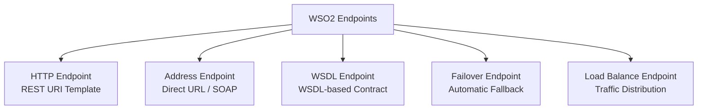

# Modul 3: Transformasi Data & Manajemen Endpoint

---

## 1. Transformasi Format Data

Transformasi data adalah salah satu kemampuan paling esensial dalam integrasi enterprise. Di WSO2 MI, Anda memiliki beberapa metode transformasi:

| Metode | Karakteristik | Kasus Penggunaan Terbaik |
| :--- | :--- | :--- |
| **PayloadFactory** | Cepat, ringan, menggunakan placeholder `$1, $2` dan path evaluator. | Pembuatan struktur JSON/XML sederhana hingga menengah. |
| **DataMapper** | Graphical drag-and-drop visual mapping tool. | Skema data yang sangat kompleks dengan banyak nesting field. |
| **XSLT Mediator** | Standar XML Stylesheet Transformation. | Transformasi XML-to-XML atau XML-to-HTML skala besar. |
| **Script Mediator** | Menggunakan JavaScript (Nashorn/GraalVM) atau Groovy. | Manipulasi array/objek yang membutuhkan komputasi kalkulasi rumit. |

---

## 2. Praktik Transformasi Populer

### A. Transformasi JSON ke XML
Ketika client mengirim JSON, namun backend membutuhkan format XML:

**Input JSON:**
```json
{
  "user": {
    "id": 1001,
    "name": "Budi Santoso",
    "role": "ENGINEER"
  }
}
```

**Synapse Configuration:**
```xml
<payloadFactory media-type="xml">
    <format>
        <UserRegistrationRequest xmlns="http://company.internal/schema">
            <UserId>$1</UserId>
            <FullName>$2</FullName>
            <UserRole>$3</UserRole>
        </UserRegistrationRequest>
    </format>
    <args>
        <arg evaluator="json" expression="$.user.id"/>
        <arg evaluator="json" expression="$.user.name"/>
        <arg evaluator="json" expression="$.user.role"/>
    </args>
</payloadFactory>
```

---

### B. Transformasi SOAP ke REST (Mediasi Lengkap)

Ketika memanggil SOAP Web Service dan mengembalikan response JSON ke aplikasi mobile:

```xml
<!-- 1. Bentuk Request SOAP XML -->
<payloadFactory media-type="xml">
    <format>
        <soapenv:Envelope xmlns:soapenv="http://schemas.xmlsoap.org/soap/envelope/" xmlns:acc="http://bank.com/account">
            <soapenv:Header/>
            <soapenv:Body>
                <acc:InquiryRequest>
                    <acc:AccountNo>$1</acc:AccountNo>
                </acc:InquiryRequest>
            </soapenv:Body>
        </soapenv:Envelope>
    </format>
    <args>
        <arg evaluator="json" expression="$.account_number"/>
    </args>
</payloadFactory>

<!-- 2. Set Transport Header SOAPAction -->
<header name="SOAPAction" value="urn:InquiryAccount" scope="transport"/>

<!-- 3. Panggil Endpoint SOAP -->
<call>
    <endpoint key="CoreBankingSOAPEndpoint"/>
</call>

<!-- 4. Parse Response SOAP XML ke JSON -->
<payloadFactory media-type="json">
    <format>
        {
            "account_number": "$1",
            "account_name": "$2",
            "balance": $3,
            "status": "ACTIVE"
        }
    </format>
    <args>
        <arg evaluator="xml" expression="//acc:InquiryResponse/acc:AccountNo/text()" xmlns:acc="http://bank.com/account"/>
        <arg evaluator="xml" expression="//acc:InquiryResponse/acc:Name/text()" xmlns:acc="http://bank.com/account"/>
        <arg evaluator="xml" expression="//acc:InquiryResponse/acc:Balance/text()" xmlns:acc="http://bank.com/account"/>
    </args>
</payloadFactory>
```

---

## 3. Jenis-Jenis Endpoint di WSO2 MI

Endpoint merepresentasikan target tujuan tempat request akan dikirimkan.



### 1. HTTP Endpoint (RESTful Services)
Mendukung REST URL templating dinamis (`{uri.var.param}`).
```xml
<endpoint name="InventoryServiceEP">
    <http method="get" uri-template="https://inventory.company.internal/api/v1/items/{uri.var.itemId}">
        <timeout>
            <duration>5000</duration>
            <responseAction>fault</responseAction>
        </timeout>
    </http>
</endpoint>
```

---

### 2. Failover Endpoint (High Availability)
Jika Primary Endpoint mengalami kegagalan/timeout, WSO2 otomatis mengalihkan request ke Secondary Endpoint.

```xml
<endpoint name="PaymentFailoverEP">
    <failover>
        <!-- Primary Server -->
        <endpoint>
            <http method="post" uri-template="https://primary-payment.internal/process"/>
        </endpoint>
        <!-- Secondary / Backup Server -->
        <endpoint>
            <http method="post" uri-template="https://backup-payment.internal/process"/>
        </endpoint>
    </failover>
</endpoint>
```

---

### 3. Load Balance Endpoint
Mendistribusikan beban trafik ke beberapa backend instance.

```xml
<endpoint name="WorkerLoadBalanceEP">
    <loadbalance algorithm="org.apache.synapse.endpoints.algorithms.RoundRobin">
        <endpoint>
            <http method="post" uri-template="https://node-1.internal/task"/>
        </endpoint>
        <endpoint>
            <http method="post" uri-template="https://node-2.internal/task"/>
        </endpoint>
        <endpoint>
            <http method="post" uri-template="https://node-3.internal/task"/>
        </endpoint>
    </loadbalance>
</endpoint>
```

---

## 4. Konfigurasi Timeout & Suspend State

WSO2 memiliki mekanisme circuit-breaker otomatis untuk melindungi backend yang sedang bermasalah:

```xml
<endpoint name="ResilientEP">
    <address uri="https://api.thirdparty.com/data">
        <timeout>
            <duration>3000</duration> <!-- 3 detik -->
            <responseAction>fault</responseAction>
        </timeout>
        <suspendOnFailure>
            <errorCodes>101500, 101501, 101506</errorCodes>
            <initialDuration>10000</initialDuration> <!-- Suspend 10 detik -->
            <progressionFactor>2.0</progressionFactor> <!-- Backoff bertahap -->
            <maximumDuration>60000</maximumDuration>
        </suspendOnFailure>
    </address>
</endpoint>
```

- **Active State**: Endpoint normal dan melayani trafik.
- **Timeout State**: Endpoint gagal merespon dalam batas waktu `duration`.
- **Suspended State**: Endpoint ditandai tidak sehat dan tidak akan menerima request selama durasi tertentu (*self-healing cooldown*).

---

## 5. Ringkasan & Checklist Modul 3

- [x] Memahami perbandingan PayloadFactory, DataMapper, XSLT, dan Script Mediator.
- [x] Mampu mengonversi JSON ke XML dan sebaliknya.
- [x] Menguasai alur lengkap REST-to-SOAP mediation.
- [x] Menguasai konfigurasi HTTP Endpoint, Failover Endpoint, dan Load Balance Endpoint.
- [x] Memahami mekanisme Timeout dan Suspend state pada endpoint.
