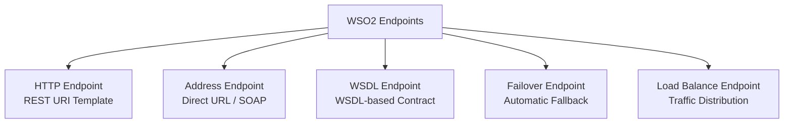
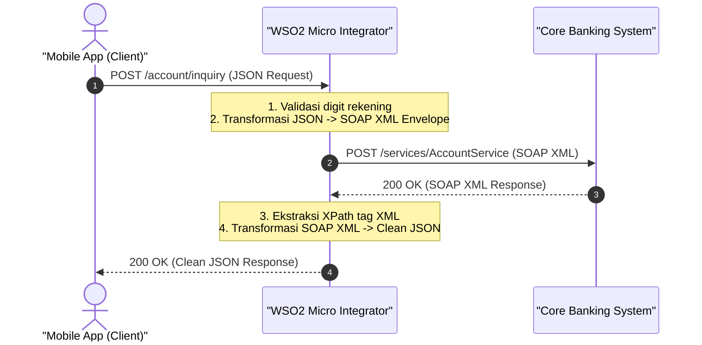

# Modul 3: Transformasi Data & Manajemen Endpoint di WSO2 MI

---

## 1. Transformasi Format Data di Sistem Enterprise

Transformasi data adalah salah satu kemampuan paling esensial dalam integrasi enterprise. Di lingkungan perbankan dan industri besar, aplikasi modern (Mobile/Web) umumnya berbicara menggunakan **REST JSON**, sedangkan sistem inti warisan (*legacy core systems/mainframe*) berkomunikasi menggunakan **SOAP XML** atau format proprietary.

WSO2 Micro Integrator (MI) menyediakan beberapa metode transformasi:

| Metode | Karakteristik | Kasus Penggunaan Terbaik |
| :--- | :--- | :--- |
| **PayloadFactory** | Cepat, ringan, menggunakan placeholder `$1, $2` dan path evaluator. | Pembuatan dan transformasi struktur JSON/XML dua arah. |
| **DataMapper** | Graphical drag-and-drop visual mapping tool. | Skema data yang sangat kompleks dengan banyak nesting field. |
| **XSLT Mediator** | Standar XML Stylesheet Transformation. | Transformasi XML-to-XML atau XML-to-HTML skala besar. |
| **Script Mediator** | Menggunakan JavaScript (GraalVM) atau Groovy. | Manipulasi array/objek yang membutuhkan komputasi kalkulasi rumit. |

---

## 2. Praktik Transformasi Populer

### A. Transformasi JSON ke XML
Ketika client mengirim JSON, namun backend membutuhkan format XML:

**Input JSON:**
```json
{
  "user": {
    "id": 1001,
    "name": "Budi Santoso",
    "role": "ENGINEER"
  }
}
```

**Synapse Configuration:**
```xml
<payloadFactory media-type="xml">
    <format>
        <UserRegistrationRequest xmlns="http://company.internal/schema">
            <UserId>$1</UserId>
            <FullName>$2</FullName>
            <UserRole>$3</UserRole>
        </UserRegistrationRequest>
    </format>
    <args>
        <arg evaluator="json" expression="$.user.id"/>
        <arg evaluator="json" expression="$.user.name"/>
        <arg evaluator="json" expression="$.user.role"/>
    </args>
</payloadFactory>
```

---

### B. Transformasi SOAP ke REST (Mediasi Dua Arah)

Ketika memanggil SOAP Web Service dan mengembalikan response JSON ke aplikasi mobile:

```xml
<!-- 1. Bentuk Request SOAP XML -->
<payloadFactory media-type="xml">
    <format>
        <soapenv:Envelope xmlns:soapenv="http://schemas.xmlsoap.org/soap/envelope/" xmlns:acc="http://bank.com/account">
            <soapenv:Header/>
            <soapenv:Body>
                <acc:InquiryRequest>
                    <acc:AccountNo>$1</acc:AccountNo>
                </acc:InquiryRequest>
            </soapenv:Body>
        </soapenv:Envelope>
    </format>
    <args>
        <arg evaluator="json" expression="$.account_number"/>
    </args>
</payloadFactory>

<!-- 2. Set Transport Header SOAPAction -->
<header name="SOAPAction" value="urn:InquiryAccount" scope="transport"/>

<!-- 3. Panggil Endpoint SOAP -->
<call>
    <endpoint key="CoreBankingSOAPEndpoint"/>
</call>

<!-- 4. Parse Response SOAP XML ke JSON -->
<payloadFactory media-type="json">
    <format>
        {
            "account_number": "$1",
            "account_name": "$2",
            "balance": $3,
            "status": "ACTIVE"
        }
    </format>
    <args>
        <arg evaluator="xml" expression="//acc:InquiryResponse/acc:AccountNo/text()" xmlns:acc="http://bank.com/account"/>
        <arg evaluator="xml" expression="//acc:InquiryResponse/acc:Name/text()" xmlns:acc="http://bank.com/account"/>
        <arg evaluator="xml" expression="//acc:InquiryResponse/acc:Balance/text()" xmlns:acc="http://bank.com/account"/>
    </args>
</payloadFactory>
```

---

## 3. Jenis-Jenis Endpoint di WSO2 MI

Endpoint merepresentasikan target tujuan tempat request akan dikirimkan.



### 1. HTTP Endpoint (RESTful Services)
Mendukung REST URL templating dinamis (`{uri.var.param}`).
```xml
<endpoint name="InventoryServiceEP">
    <http method="get" uri-template="https://inventory.company.internal/api/v1/items/{uri.var.itemId}">
        <timeout>
            <duration>5000</duration>
            <responseAction>fault</responseAction>
        </timeout>
    </http>
</endpoint>
```

---

### 2. Failover Endpoint (High Availability)
Jika Primary Endpoint mengalami kegagalan/timeout, WSO2 otomatis mengalihkan request ke Secondary Endpoint.

```xml
<endpoint name="PaymentFailoverEP">
    <failover>
        <!-- Primary Server -->
        <endpoint>
            <http method="post" uri-template="https://primary-payment.internal/process"/>
        </endpoint>
        <!-- Secondary / Backup Server -->
        <endpoint>
            <http method="post" uri-template="https://backup-payment.internal/process"/>
        </endpoint>
    </failover>
</endpoint>
```

---

### 3. Load Balance Endpoint
Mendistribusikan beban trafik ke beberapa backend instance.

```xml
<endpoint name="WorkerLoadBalanceEP">
    <loadbalance algorithm="org.apache.synapse.endpoints.algorithms.RoundRobin">
        <endpoint>
            <http method="post" uri-template="https://node-1.internal/task"/>
        </endpoint>
        <endpoint>
            <http method="post" uri-template="https://node-2.internal/task"/>
        </endpoint>
        <endpoint>
            <http method="post" uri-template="https://node-3.internal/task"/>
        </endpoint>
    </loadbalance>
</endpoint>
```

---

## 4. Konfigurasi Timeout & Circuit Breaker (Suspend State)

WSO2 memiliki mekanisme circuit-breaker otomatis untuk melindungi backend yang sedang bermasalah:

```xml
<endpoint name="ResilientEP">
    <address uri="https://api.thirdparty.com/data">
        <timeout>
            <duration>3000</duration> <!-- 3 detik -->
            <responseAction>fault</responseAction>
        </timeout>
        <suspendOnFailure>
            <errorCodes>101500, 101501, 101506</errorCodes>
            <initialDuration>10000</initialDuration> <!-- Suspend 10 detik -->
            <progressionFactor>2.0</progressionFactor> <!-- Backoff bertahap -->
            <maximumDuration>60000</maximumDuration>
        </suspendOnFailure>
    </address>
</endpoint>
```

- **Active State**: Endpoint normal dan melayani trafik.
- **Timeout State**: Endpoint gagal merespon dalam batas waktu `duration`.
- **Suspended State**: Endpoint ditandai tidak sehat dan tidak akan menerima request selama durasi tertentu (*self-healing cooldown*).

---

## 5. Hands-on Kasus Nyata: Account Inquiry API (`/account/inquiry`)

### Deskripsi Skenario Bisnis:
1. **Client (Mobile Banking)** mengirim request saldo rekening dalam format **REST JSON**:
   ```json
   {
     "account_number": "1002938475",
     "channel": "MOBILE_APP"
   }
   ```
2. **WSO2 MI** memvalidasi nomor rekening minimal 5 digit.
3. **WSO2 MI** mentransformasikan JSON request menjadi **SOAP XML Envelope** berstandar keamanan perbankan untuk sistem Core Banking.
4. **WSO2 MI** mengekstrak hasil respon SOAP XML dari Core Banking menggunakan **XPath**, lalu mentransformasikannya kembali menjadi **REST JSON** terstruktur yang rapi untuk aplikasi mobile client.



---

## 6. Kode Implementasi Lengkap (`AccountInquiryAPI.xml`)

File ini telah dibuat dan siap dijalankan di project Anda:
`HelloWorldProject/src/main/wso2mi/artifacts/apis/AccountInquiryAPI.xml`

```xml
<?xml version="1.0" encoding="UTF-8"?>
<api xmlns="http://ws.apache.org/ns/synapse" name="AccountInquiryAPI" context="/account">
    <resource methods="POST" uri-template="/inquiry">
        <inSequence>
            <!-- ============================================================ -->
            <!-- 1. LOGGING REQUEST MASUK (FORMAT JSON DARI CLIENT)            -->
            <!-- ============================================================ -->
            <log level="custom">
                <property name="STEP" value="1. Menerima Request JSON dari Client"/>
            </log>

            <!-- ============================================================ -->
            <!-- 2. EKSTRAKSI FIELD JSON DARI BODY MENGGUNAKAN JSONPATH        -->
            <!-- ============================================================ -->
            <property name="accNumber" expression="json-eval($.account_number)" scope="default"/>
            <property name="channelId" expression="json-eval($.channel)" scope="default"/>

            <!-- ============================================================ -->
            <!-- 3. VALIDASI INPUT BISNIS (ACCOUNT NUMBER TIDAK BOLEH KOSONG) -->
            <!-- ============================================================ -->
            <filter xpath="boolean(get-property('accNumber')) = false or string-length(get-property('accNumber')) &lt; 5">
                <then>
                    <property name="HTTP_SC" value="400" scope="axis2"/>
                    <payloadFactory media-type="json">
                        <format>
                            {
                                "status": "BAD_REQUEST",
                                "message": "Nomor rekening (account_number) wajib diisi dan minimal 5 digit."
                            }
                        </format>
                        <args/>
                    </payloadFactory>
                    <respond/>
                </then>
                <else/>
            </filter>

            <!-- ============================================================ -->
            <!-- 4. TRANSFORMASI 1: MENGUBAH PAYLOAD JSON MENJADI SOAP XML     -->
            <!-- ============================================================ -->
            <payloadFactory media-type="xml">
                <format>
                    <soapenv:Envelope xmlns:soapenv="http://schemas.xmlsoap.org/soap/envelope/" xmlns:bank="http://bank.company.internal/account">
                        <soapenv:Header>
                            <bank:SecurityToken>AUTH-TOKEN-SECRET-99</bank:SecurityToken>
                        </soapenv:Header>
                        <soapenv:Body>
                            <bank:InquiryRequest>
                                <bank:AccountNumber>$1</bank:AccountNumber>
                                <bank:Channel>$2</bank:Channel>
                            </bank:InquiryRequest>
                        </soapenv:Body>
                    </soapenv:Envelope>
                </format>
                <args>
                    <arg evaluator="xml" expression="get-property('accNumber')"/>
                    <arg evaluator="xml" expression="get-property('channelId')"/>
                </args>
            </payloadFactory>

            <!-- Set Header SOAPAction dan Content-Type untuk protokol SOAP -->
            <header name="SOAPAction" value="urn:InquiryAccount" scope="transport"/>
            <property name="messageType" value="text/xml" scope="axis2"/>

            <log level="custom">
                <property name="STEP" value="2. Payload Berhasil Ditransformasikan ke SOAP XML"/>
            </log>

            <!-- ============================================================ -->
            <!-- 5. SIMULASI RESPON XML BACKEND CORE BANKING                   -->
            <!-- (Dalam skenario real, bagian ini memanggil <call><endpoint/></call>) -->
            <!-- ============================================================ -->
            <payloadFactory media-type="xml">
                <format>
                    <bank:InquiryResponse xmlns:bank="http://bank.company.internal/account">
                        <bank:AccountNumber>$1</bank:AccountNumber>
                        <bank:AccountName>Budi Pratama Santoso</bank:AccountName>
                        <bank:AccountType>SAVINGS</bank:AccountType>
                        <bank:Currency>IDR</bank:Currency>
                        <bank:Balance>15750000.50</bank:Balance>
                        <bank:AccountStatus>ACTIVE</bank:AccountStatus>
                    </bank:InquiryResponse>
                </format>
                <args>
                    <arg evaluator="xml" expression="get-property('accNumber')"/>
                </args>
            </payloadFactory>

            <!-- ============================================================ -->
            <!-- 6. TRANSFORMASI 2: MENGUBAH RESPON XML BACKEND MENJADI JSON  -->
            <!-- ============================================================ -->
            <payloadFactory media-type="json">
                <format>
                    {
                        "status": "SUCCESS",
                        "data": {
                            "account_number": "$1",
                            "customer_name": "$2",
                            "account_type": "$3",
                            "currency": "$4",
                            "balance": $5,
                            "account_status": "$6"
                        },
                        "channel": "$7",
                        "processed_at": "$8"
                    }
                </format>
                <args>
                    <!-- Ekstraksi nilai tag XML menggunakan ekspresi XPath -->
                    <arg evaluator="xml" expression="//bank:InquiryResponse/bank:AccountNumber/text()" xmlns:bank="http://bank.company.internal/account"/>
                    <arg evaluator="xml" expression="//bank:InquiryResponse/bank:AccountName/text()" xmlns:bank="http://bank.company.internal/account"/>
                    <arg evaluator="xml" expression="//bank:InquiryResponse/bank:AccountType/text()" xmlns:bank="http://bank.company.internal/account"/>
                    <arg evaluator="xml" expression="//bank:InquiryResponse/bank:Currency/text()" xmlns:bank="http://bank.company.internal/account"/>
                    <arg evaluator="xml" expression="//bank:InquiryResponse/bank:Balance/text()" xmlns:bank="http://bank.company.internal/account"/>
                    <arg evaluator="xml" expression="//bank:InquiryResponse/bank:AccountStatus/text()" xmlns:bank="http://bank.company.internal/account"/>
                    <arg evaluator="xml" expression="get-property('channelId')"/>
                    <arg evaluator="xml" expression="get-property('SYSTEM_DATE', 'yyyy-MM-dd HH:mm:ss')"/>
                </args>
            </payloadFactory>

            <!-- ============================================================ -->
            <!-- 7. SET RESPONSE HEADER 200 OK & KEMBALIKAN KE CLIENT         -->
            <!-- ============================================================ -->
            <property name="HTTP_SC" value="200" scope="axis2"/>
            <property name="messageType" value="application/json" scope="axis2"/>
            <respond/>
        </inSequence>

        <!-- ============================================================ -->
        <!-- FAULT SEQUENCE: PENANGANAN JIKA TERJADI TIMEOUT / ERROR      -->
        <!-- ============================================================ -->
        <faultSequence>
            <log level="custom">
                <property name="ERROR" value="Terjadi kesalahan pada AccountInquiryAPI"/>
                <property name="ERROR_CODE" expression="get-property('ERROR_CODE')"/>
                <property name="ERROR_MESSAGE" expression="get-property('ERROR_MESSAGE')"/>
            </log>
            <property name="HTTP_SC" value="500" scope="axis2"/>
            <payloadFactory media-type="json">
                <format>
                    {
                        "status": "ERROR",
                        "error_code": "$1",
                        "error_message": "Gagal menghubungi backend Core Banking."
                    }
                </format>
                <args>
                    <arg evaluator="xml" expression="get-property('ERROR_CODE')"/>
                </args>
            </payloadFactory>
            <respond/>
        </faultSequence>
    </resource>
</api>
```

---

## 7. Bedah Detail Setiap Baris Kode (Line-by-Line Breakdown)

Berikut adalah penjelasan fungsi setiap baris kode pada `AccountInquiryAPI.xml`:

#### 1. Deklarasi API & Resource (Baris 1 - 3)
- `<api xmlns="http://ws.apache.org/ns/synapse" name="AccountInquiryAPI" context="/account">`: Mendefinisikan artefak API bernama `AccountInquiryAPI` yang dapat diakses pada context path `/account`.
- `<resource methods="POST" uri-template="/inquiry">`: Resource hanya menerima HTTP POST pada endpoint `/account/inquiry`.

#### 2. Ekstraksi Nilai JSON Menggunakan JSONPath (Baris 13 - 14)
- `<property name="accNumber" expression="json-eval($.account_number)" scope="default"/>`: Membaca field `account_number` dari JSON body request client dan menyimpannya ke variabel `accNumber`.
- `<property name="channelId" expression="json-eval($.channel)" scope="default"/>`: Membaca field `channel` dan menyimpannya ke variabel `channelId`.

#### 3. Validasi Input Bisnis (Baris 19 - 36)
- `<filter xpath="boolean(...) = false or string-length(...) &lt; 5">`:
  - `boolean(get-property('accNumber')) = false`: Memeriksa apakah nomor rekening kosong atau tidak dikirim.
  - `string-length(...) &lt; 5`: Memeriksa apakah panjang karakter nomor rekening kurang dari 5 digit (`&lt;` adalah escaping XML untuk `<`).
- Jika kondisi terpenuhi: menyetel `HTTP_SC = 400` dan mengembalikan JSON pesan kesalahan `BAD_REQUEST`.

#### 4. Transformasi JSON ke SOAP XML (Baris 41 - 62)
- `<payloadFactory media-type="xml">`: Menimpa payload body di dalam Message Context dengan format XML baru.
- `<soapenv:Envelope ...>`: Membentuk dokumen SOAP Envelope lengkap dengan namespace `soapenv` dan namespace perbankan `bank`.
- `<bank:AccountNumber>$1</bank:AccountNumber>`: Placeholder `$1` yang diisi secara dinamis dari argumen `<arg evaluator="xml" expression="get-property('accNumber')"/>`.

#### 5. Pengaturan Header Transport SOAP (Baris 65 - 66)
- `<header name="SOAPAction" value="urn:InquiryAccount" scope="transport"/>`: Menambahkan header HTTP `SOAPAction` yang wajib ada pada pemanggilan Web Service SOAP 1.1.
- `<property name="messageType" value="text/xml" scope="axis2"/>`: Menginstruksikan engine Axis2 agar mengirimkan payload dengan header `Content-Type: text/xml`.

#### 6. Transformasi Respon XML ke Format JSON (Baris 92 - 123)
- `<payloadFactory media-type="json">`: Mengubah kembali dokumen XML menjadi payload JSON modern.
- `"balance": $5`: Nilai saldo angka ditulis **tanpa tanda kutip ganda** agar menjadi tipe numerik di JSON (`15750000.50`, bukan `"15750000.50"`).
- **Pemetaan Argumen XPath**:
  - `expression="//bank:InquiryResponse/bank:AccountNumber/text()"`: Mengambil teks di dalam tag XML `<bank:AccountNumber>`.
  - `xmlns:bank="http://bank.company.internal/account"`: Deklarasi namespace XML agar engine XPath dapat menemukan elemen bersangkutan secara akurat.

#### 7. Pengembalian Respon Akhir ke Client (Baris 128 - 131)
- `<property name="HTTP_SC" value="200" scope="axis2"/>`: Mengeset status response HTTP `200 OK`.
- `<property name="messageType" value="application/json" scope="axis2"/>`: Memastikan response dikembalikan dengan header `Content-Type: application/json`.
- `<respond/>`: Mengirimkan response kembali ke client dan menghentikan alur mediasi.

#### 8. Penanganan Error Global (Baris 136 - 159)
- `<faultSequence>`: Blok pengaman yang otomatis dijalankan jika terjadi kegagalan jaringan atau parsing XML, menyetel status `500` dan merespon JSON error terstandar.

---

## 8. Panduan Menjalankan & Menguji Step-by-Step

Pastikan WSO2 Micro Integrator sedang aktif (port `8290`), lalu buka terminal PowerShell di Antigravity IDE:

### Skenario 1: Test Berhasil / Happy Flow (Status 200 OK)

Menggunakan **`Invoke-RestMethod`**:
```powershell
$headers = @{
    "Content-Type" = "application/json"
}

$body = @{
    account_number = "1002938475"
    channel        = "MOBILE_APP"
} | ConvertTo-Json

Invoke-RestMethod -Uri "http://localhost:8290/account/inquiry" -Method Post -Headers $headers -Body $body | ConvertTo-Json
```

Atau menggunakan **`curl.exe`**:
```powershell
curl.exe -X POST http://localhost:8290/account/inquiry `
  -H "Content-Type: application/json" `
  -d '{\"account_number\":\"1002938475\",\"channel\":\"MOBILE_APP\"}'
```

**Expected Response (200 OK):**
```json
{
  "status": "SUCCESS",
  "data": {
    "account_number": "1002938475",
    "customer_name": "Budi Pratama Santoso",
    "account_type": "SAVINGS",
    "currency": "IDR",
    "balance": 15750000.5,
    "account_status": "ACTIVE"
  },
  "channel": "MOBILE_APP",
  "processed_at": "2026-09-02 14:10:00"
}
```

---

### Skenario 2: Test Validasi Rekening Kosong / Kurang dari 5 Digit (400 Bad Request)

```powershell
curl.exe -X POST http://localhost:8290/account/inquiry `
  -H "Content-Type: application/json" `
  -d '{\"account_number\":\"123\",\"channel\":\"MOBILE_APP\"}'
```

**Expected Response (400 Bad Request):**
```json
{
  "status": "BAD_REQUEST",
  "message": "Nomor rekening (account_number) wajib diisi dan minimal 5 digit."
}
```

---

## 9. Ringkasan & Checklist Modul 3

- [x] Memahami perbandingan metode transformasi: PayloadFactory, DataMapper, XSLT, dan Script Mediator.
- [x] Mampu mengonversi JSON ke XML dan sebaliknya (REST to SOAP Mediation).
- [x] Memahami cara mengekstrak tag XML menggunakan ekspresi **XPath** ber-namespace (`xmlns:prefix`).
- [x] Menguasai konfigurasi HTTP Endpoint, Failover Endpoint, dan Load Balance Endpoint.
- [x] Memahami mekanisme Timeout dan Circuit Breaker (Active, Timeout, Suspended State).
- [x] Berhasil mengimplementasikan dan menguji API Transformasi Account Inquiry secara end-to-end.
