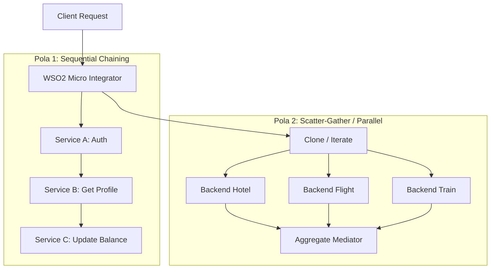

# Modul 4: Service Orchestration & Penanganan Error (Error Handling)

---

## 1. Pola Integrasi Multi-Service (Orchestration Patterns)

Sering kali sebuah proses bisnis memerlukan interaksi dengan lebih dari satu backend service.



---

## 2. Pola 1: Sequential Service Chaining

Memanggil Service A terlebih dahulu, mengambil data hasilnya, kemudian menggunakannya sebagai parameter input untuk memanggil Service B.

```xml
<inSequence>
    <!-- Langkah 1: Panggil Service Autentikasi -->
    <payloadFactory media-type="json">
        <format>{"username": "$1", "secret": "$2"}</format>
        <args>
            <arg evaluator="json" expression="$.client_user"/>
            <arg evaluator="json" expression="$.client_secret"/>
        </args>
    </payloadFactory>
    <call>
        <endpoint key="AuthServiceEP"/>
    </call>

    <!-- Langkah 2: Simpan Token hasil dari Service 1 -->
    <property name="accessToken" expression="json-eval($.token)" scope="default"/>

    <!-- Langkah 3: Panggil Service Data Pelanggan menggunakan Token -->
    <header name="Authorization" expression="fn:concat('Bearer ', get-property('accessToken'))" scope="transport"/>
    <call>
        <endpoint key="CustomerDetailServiceEP"/>
    </call>

    <!-- Langkah 4: Kembalikan data profil ke client -->
    <respond/>
</inSequence>
```

---

## 3. Pola 2: Scatter-Gather (Clone & Aggregate)

Mengirimkan request ke beberapa backend service sekaligus secara paralel, kemudian menyatukan seluruh hasilnya menjadi satu JSON tunggal.

```xml
<inSequence>
    <!-- Simpan payload awal jika diperlukan -->
    <property name="originalPayload" expression="json-eval($)" scope="default"/>

    <!-- 1. Clone: Menduplikasi pesan ke 2 target secara paralel -->
    <clone continueParent="false">
        <!-- Target 1: Panggil Flight Service -->
        <target>
            <sequence>
                <call>
                    <endpoint key="FlightBookingServiceEP"/>
                </call>
            </sequence>
        </target>
        
        <!-- Target 2: Panggil Hotel Service -->
        <target>
            <sequence>
                <call>
                    <endpoint key="HotelBookingServiceEP"/>
                </call>
            </sequence>
        </target>
    </clone>

    <!-- 2. Aggregate: Menunggu kedua response selesai dan menggabungkannya -->
    <aggregate>
        <completeCondition>
            <messageCount min="2" max="2"/>
        </completeCondition>
        <onComplete expression="//Response" xmlns:soapenv="http://schemas.xmlsoap.org/soap/envelope/">
            <log level="custom">
                <property name="INFO" value="Seluruh response paralel telah diterima!"/>
            </log>
            <respond/>
        </onComplete>
    </aggregate>
</inSequence>
```

---

## 4. Penanganan Error (Error Handling & Fault Sequences)

Ketika terjadi kegagalan (misalnya: backend offline, timeout, skema invalid), Synapse akan mengalihkan eksekusi ke **`faultSequence`**.

### Properti Error Bawaan WSO2:
| Properti | Penjelasan | Contoh Nilai |
| :--- | :--- | :--- |
| `ERROR_CODE` | Kode error numerik Synapse. | `101500` (Connection refused), `101504` (Timeout) |
| `ERROR_MESSAGE` | Deskripsi singkat error. | `Error sending message to endpoint` |
| `ERROR_DETAIL` | Detail trace teknis error. | Stack trace / SocketException |
| `ERROR_EXCEPTION` | Objek Java exception. | `java.net.ConnectException` |

---

### Contoh Implementasi Global Fault Handling yang Rapi

```xml
<faultSequence>
    <!-- 1. Log error teknis ke wso2carbon.log -->
    <log level="custom">
        <property name="SEVERITY" value="ERROR"/>
        <property name="Code" expression="get-property('ERROR_CODE')"/>
        <property name="Message" expression="get-property('ERROR_MESSAGE')"/>
        <property name="Detail" expression="get-property('ERROR_DETAIL')"/>
    </log>

    <!-- 2. Pemetaan HTTP Status Code berdasarkan Error Code Synapse -->
    <switch source="get-property('ERROR_CODE')">
        <!-- Kasus Endpoint Timeout (101504 / 101505) -->
        <case regex="101504|101505">
            <property name="HTTP_SC" value="504" scope="axis2"/>
            <property name="userMessage" value="Backend timeout / tidak merespon tepat waktu"/>
        </case>
        <!-- Kasus Connection Refused (101500) -->
        <case regex="101500">
            <property name="HTTP_SC" value="503" scope="axis2"/>
            <property name="userMessage" value="Layanan backend sedang tidak dapat dihubungi"/>
        </case>
        <default>
            <property name="HTTP_SC" value="500" scope="axis2"/>
            <property name="userMessage" value="Terjadi kesalahan internal pada middleware integrator"/>
        </default>
    </switch>

    <!-- 3. Standard Response Format JSON -->
    <payloadFactory media-type="json">
        <format>
            {
                "status": "ERROR",
                "error_code": "$1",
                "error_message": "$2",
                "timestamp": "$3"
            }
        </format>
        <args>
            <arg evaluator="xml" expression="get-property('ERROR_CODE')"/>
            <arg evaluator="xml" expression="get-property('userMessage')"/>
            <arg evaluator="xml" expression="get-property('SYSTEM_DATE', 'yyyy-MM-dd HH:mm:ss')"/>
        </args>
    </payloadFactory>

    <!-- 4. Set Header Content-Type dan Kembalikan ke Client -->
    <property name="messageType" value="application/json" scope="axis2"/>
    <respond/>
</faultSequence>
```

---

## 5. Ringkasan & Checklist Modul 4

- [x] Menguasai pola **Sequential Service Chaining** dengan mediator `<call>`.
- [x] Menguasai pola **Scatter-Gather** dengan `<clone>` dan `<aggregate>`.
- [x] Memahami cara membaca properti error: `ERROR_CODE`, `ERROR_MESSAGE`, dan `ERROR_DETAIL`.
- [x] Mampu memetakan error internal Synapse ke HTTP Status Code (`504 Gateway Timeout`, `503 Service Unavailable`, `500`).
- [x] Mampu membuat format pesan error JSON yang seragam untuk semua API.
