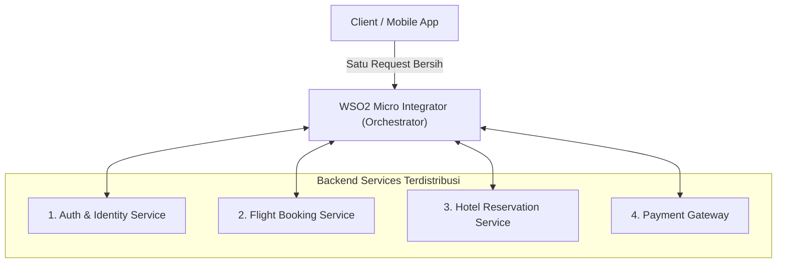
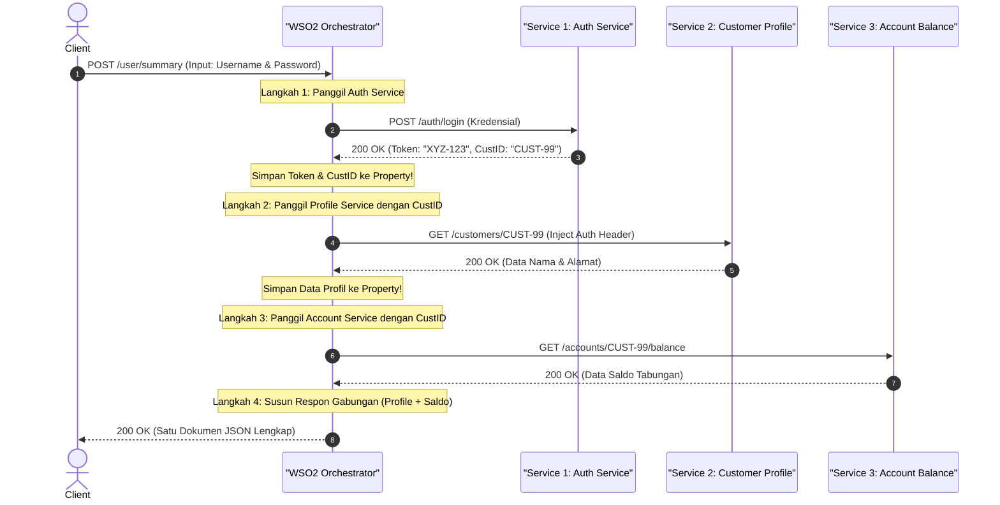
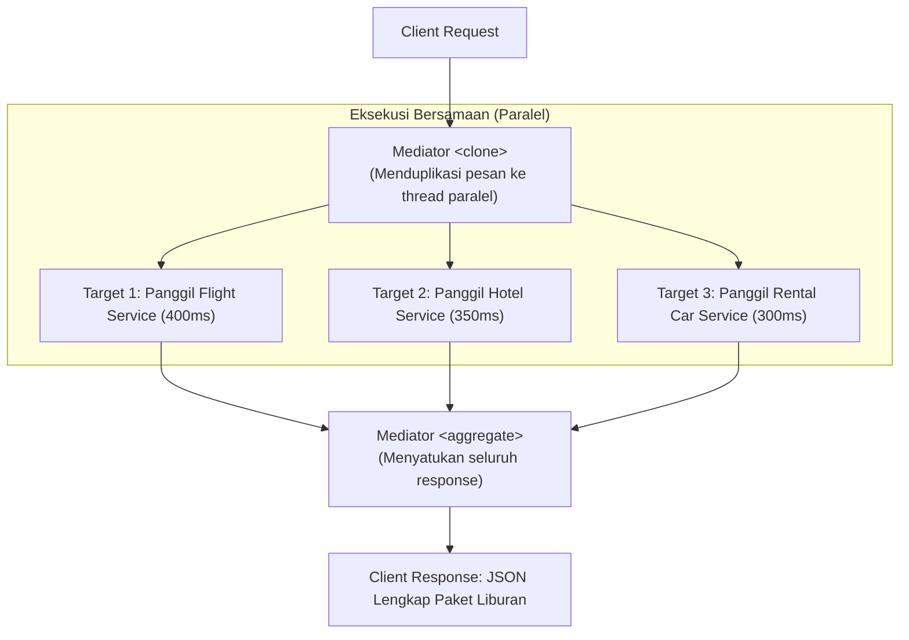
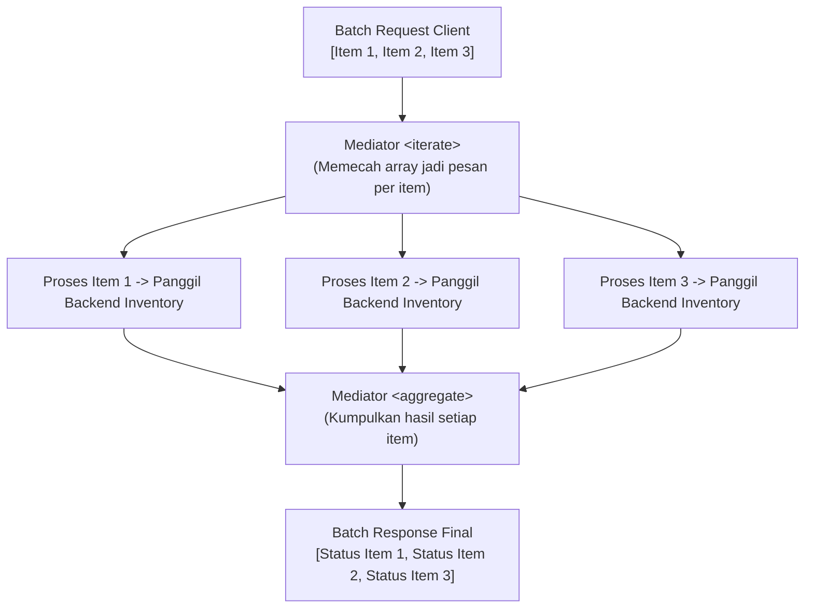
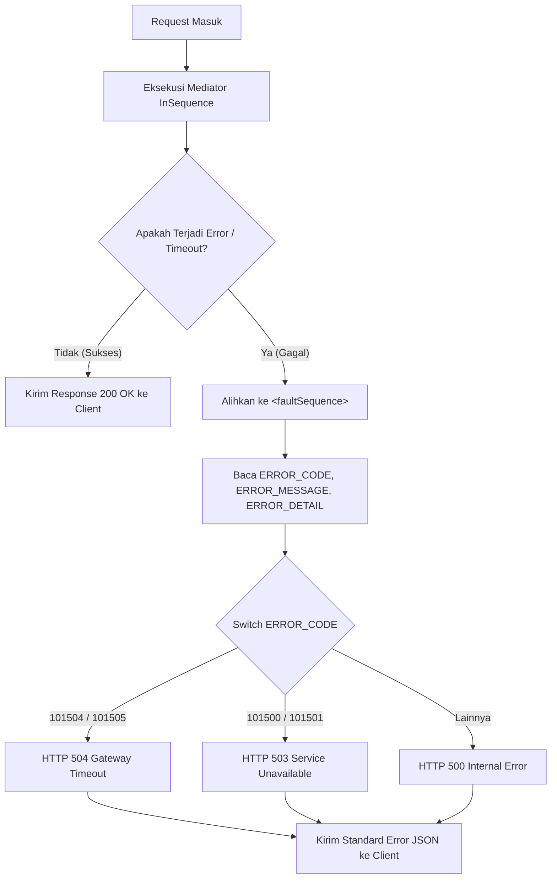

# Modul 4: Service Orchestration & Penanganan Error di WSO2 MI

---

## 1. Pengantar Service Orchestration di Dunia Enterprise

Dalam arsitektur sistem modern berbasis *Microservices* dan *Distributed Systems*, hampir tidak ada proses bisnis penting yang hanya melibatkan satu backend tunggal. 

Sebagai contoh, ketika seorang pengguna melakukan pemesanan paket liburan atau pengajuan pinjaman bank:
- Sistem harus memeriksa identitas nasabah (*Authentication & KYC Service*).
- Sistem harus mengevaluasi skor kredit nasabah (*Credit Scoring Engine*).
- Sistem harus memotong limit saldo rekening (*Core Banking Service*).
- Sistem harus mengirimkan notifikasi SMS/Email (*Notification Gateway*).

Jika tugas ini diserahkan kepada aplikasi frontend (Mobile/Web), aplikasi klien akan menjadi lambat (*high latency*), boros kuota data, dan rentan terhadap masalah keamanan. 

**WSO2 Micro Integrator bertindak sebagai konduktor orkestra (Orchestrator)** di lapisan middleware: menerima satu request dari client, mengorkestrasi pemanggilan ke berbagai backend service di belakang layar, dan mengembalikan satu response yang sudah matang dan rapi.



---

## 2. Pola 1: Sequential Service Chaining (Alur Sekuensial Berantai)

### A. Konsep & Alur Kerja
Pola **Sequential Service Chaining** digunakan ketika terdapat **ketergantungan data (*data dependency*)** antar-service:
> Hasil (*output*) dari Service 1 harus digunakan sebagai parameter input untuk memanggil Service 2, dan seterusnya.



---

### B. Perangkap Umum (*Pitfall*) & Solusi
> [!WARNING]
> **Payload Overwrite Problem**:
> Setiap kali pemanggilan mediator `<call>` dilakukan, response dari backend yang dipanggil akan **menimpa (*overwrite*)** body pesan di dalam Message Context. 
> Jika Anda membutuhkan data dari request awal atau data dari Service 1, Anda **WAJIB menyimpannya ke dalam `<property>`** sebelum melakukan pemanggilan berikutnya!

---

### C. Contoh Konfigurasi Lengkap Chaining:
```xml
<inSequence>
    <!-- 1. Simpan input awal client sebelum tertimpa -->
    <property name="reqUsername" expression="json-eval($.username)" scope="default"/>
    <property name="reqPassword" expression="json-eval($.password)" scope="default"/>

    <!-- 2. Bentuk Request untuk Service 1 (Auth Service) -->
    <payloadFactory media-type="json">
        <format>
            {
                "user": "$1",
                "secret": "$2"
            }
        </format>
        <args>
            <arg evaluator="xml" expression="get-property('reqUsername')"/>
            <arg evaluator="xml" expression="get-property('reqPassword')"/>
        </args>
    </payloadFactory>

    <!-- Panggil Service 1 menggunakan mediator <call> -->
    <call>
        <endpoint key="AuthenticationServiceEP"/>
    </call>

    <!-- 3. SIMPAN HASIL SERVICE 1 KE PROPERTY SEBELUM TERTALIK KE LANGKAH 2 -->
    <property name="jwtToken" expression="json-eval($.token)" scope="default"/>
    <property name="customerId" expression="json-eval($.customerId)" scope="default"/>

    <!-- 4. Siapkan Request untuk Service 2 (Customer Profile Service) -->
    <!-- Injeksi Token ke Header Transport -->
    <header name="Authorization" expression="fn:concat('Bearer ', get-property('jwtToken'))" scope="transport"/>
    <property name="uri.var.custId" expression="get-property('customerId')" scope="default"/>

    <!-- Panggil Service 2 (GET Profile) -->
    <call>
        <endpoint key="CustomerProfileServiceEP"/>
    </call>

    <!-- Simpan hasil Service 2 -->
    <property name="customerFullName" expression="json-eval($.full_name)" scope="default"/>
    <property name="customerTier" expression="json-eval($.tier)" scope="default"/>

    <!-- 5. Susun Response Final ke Client -->
    <payloadFactory media-type="json">
        <format>
            {
                "status": "SUCCESS",
                "customer_id": "$1",
                "full_name": "$2",
                "tier": "$3",
                "authenticated": true
            }
        </format>
        <args>
            <arg evaluator="xml" expression="get-property('customerId')"/>
            <arg evaluator="xml" expression="get-property('customerFullName')"/>
            <arg evaluator="xml" expression="get-property('customerTier')"/>
        </args>
    </payloadFactory>

    <property name="HTTP_SC" value="200" scope="axis2"/>
    <property name="messageType" value="application/json" scope="axis2"/>
    <respond/>
</inSequence>
```

---

## 3. Pola 2: Scatter-Gather / Parallel Fan-out & Fan-in (`<clone>` dan `<aggregate>`)

### A. Konsep & Perhitungan Efisiensi Latensi
Pola **Scatter-Gather** digunakan ketika beberapa backend service yang dituju **tidak memiliki ketergantungan satu sama lain (*independent*)**, sehingga dapat dipanggil **secara bersamaan (paralel)** untuk memangkas waktu tunggu (*latency*).

#### Perbandingan Waktu Tunggu:
- **Metode Sekuensial**:
  $$\text{Waktu Total} = T_{\text{Flight}} (400\text{ms}) + T_{\text{Hotel}} (350\text{ms}) + T_{\text{Car}} (300\text{ms}) = 1050\text{ms}$$
- **Metode Scatter-Gather (Paralel)**:
  $$\text{Waktu Total} = \max(T_{\text{Flight}}, T_{\text{Hotel}}, T_{\text{Car}}) \approx 400\text{ms} \quad (\textbf{Lebih cepat > 60\%!})$$



---

### B. Anatomi Mediator `<clone>` dan `<aggregate>`

#### 1. Mediator `<clone>`
Menduplikasi pesan yang sedang mengalir dan mengirimkannya ke beberapa blok `<target>` secara paralel.
- **`continueParent="false"`**: Thread induk akan berhenti dan digantikan oleh cabang-cabang target kloning.
- **`<target>`**: Setiap target memiliki alur `<sequence>` dan `<endpoint>` tersendiri.

#### 2. Mediator `<aggregate>`
Menunggu seluruh respon dari cabang kloning selesai, lalu mengumpulkannya kembali menjadi satu pesan utuh.
- **`<completeCondition>`**:
  - `messageCount min="2" max="2"`: Menentukan berapa jumlah respon yang harus diterima sebelum proses penggabungan dieksekusi.
  - `<timeout>5000</timeout>`: Batas waktu maksimal (dalam milidetik). **Sangat penting** agar mediator tidak menunggu selamanya jika salah satu server backend mati!
- **`<onComplete expression="..." xmlns:prefix="...">`**: Blok logika yang dijalankan begitu semua respon terkumpul untuk menyusun payload final.

---

### C. Contoh Konfigurasi Lengkap Scatter-Gather:
```xml
<inSequence>
    <!-- 1. Simpan parameter pencarian awal -->
    <property name="searchCity" expression="json-eval($.city)" scope="default"/>
    <property name="searchDate" expression="json-eval($.date)" scope="default"/>

    <!-- 2. Clone: Pecah eksekusi ke 2 thread paralel -->
    <clone continueParent="false">
        <!-- Target 1: Panggil Service Tiket Pesawat -->
        <target>
            <sequence>
                <payloadFactory media-type="json">
                    <format>{"destination": "$1", "flight_date": "$2"}</format>
                    <args>
                        <arg evaluator="xml" expression="get-property('searchCity')"/>
                        <arg evaluator="xml" expression="get-property('searchDate')"/>
                    </args>
                </payloadFactory>
                <call>
                    <endpoint key="FlightBookingServiceEP"/>
                </call>
            </sequence>
        </target>

        <!-- Target 2: Panggil Service Reservasi Hotel -->
        <target>
            <sequence>
                <payloadFactory media-type="json">
                    <format>{"city": "$1", "checkin_date": "$2"}</format>
                    <args>
                        <arg evaluator="xml" expression="get-property('searchCity')"/>
                        <arg evaluator="xml" expression="get-property('searchDate')"/>
                    </args>
                </payloadFactory>
                <call>
                    <endpoint key="HotelBookingServiceEP"/>
                </call>
            </sequence>
        </target>
    </clone>

    <!-- 3. Aggregate: Kumpulkan respon kedua service -->
    <aggregate>
        <completeCondition>
            <messageCount min="2" max="2"/>
        </completeCondition>
        <onComplete expression="//Response" xmlns:soapenv="http://schemas.xmlsoap.org/soap/envelope/">
            <log level="custom">
                <property name="INFO" value="Kedua response tiket dan hotel telah berhasil disatukan!"/>
            </log>
            <property name="HTTP_SC" value="200" scope="axis2"/>
            <property name="messageType" value="application/json" scope="axis2"/>
            <respond/>
        </onComplete>
    </aggregate>
</inSequence>
```

---

## 4. Pola 3: Splitter & Aggregator Pattern (`<iterate>` dan `<aggregate>`)

### A. Konsep
Jika `<clone>` menduplikasi pesan yang sama ke beberapa target berbeda, maka **`<iterate>` (Splitter)** digunakan untuk **memecah sebuah array/list elemen** dari satu payload menjadi pesan individual untuk diproses satu per satu.



#### Atribut Kunci `<iterate>`:
- **`expression`**: Ekspresi JSONPath/XPath yang menunjuk ke array (misal: `expression="json-eval($.order_items)"`).
- **`continueParent="false"`**: Thread induk berhenti setelah pemecahan array.
- **`preservePayload="true"`**: Mempertahankan konteks payload asli jika diperlukan.

---

## 5. Arsitektur Penanganan Error (Enterprise Fault Handling)

WSO2 Micro Integrator menyediakan sistem penanganan error berlapis:
1. **Local Sequence Error Handler (`onError`)**: Menangani error khusus pada sequence tertentu.
2. **Global API Fault Sequence (`<faultSequence>`)**: Menangkap semua error yang tidak tertangani di seluruh resource API.



---

### Properti Error Bawaan WSO2 Synapse

| Variabel Properti | Tipe | Penjelasan | Contoh Nilai |
| :--- | :--- | :--- | :--- |
| `get-property('ERROR_CODE')` | Integer / String | Kode kesalahan numerik unik dari engine Synapse. | `101500`, `101504`, `101508` |
| `get-property('ERROR_MESSAGE')` | String | Deskripsi singkat pesan kegagalan teknis. | `Error sending message to endpoint`, `Connection refused` |
| `get-property('ERROR_DETAIL')` | String | Detail jejak masalah atau pesan socket exception. | Stack trace teknis Java |
| `get-property('ERROR_EXCEPTION')` | Object | Instance objek Java Exception. | `java.net.SocketTimeoutException` |

---

### Matriks Pemetaan Kode Error Synapse ke HTTP Status Code Standar

| Kode Synapse | Arti Kesalahan | Status HTTP yang Tepat | Solusi / Tindakan |
| :--- | :--- | :--- | :--- |
| **`101500`** | Connection Refused (Server backend mati/port tertutup) | **`503 Service Unavailable`** | Periksa apakah service backend sedang aktif. |
| **`101504`** | Connection Timeout (Gagal tersambung dalam batas waktu) | **`504 Gateway Timeout`** | Tingkatkan durasi timeout atau optimalkan performa server. |
| **`101505`** | Socket / Read Timeout (Tersambung tapi backend lama merespon) | **`504 Gateway Timeout`** | Server backend lemot/overload; optimasi query database. |
| **`101506`** | Connection Closed (Koneksi diputus mendadak oleh backend) | **`502 Bad Gateway`** | Cek crash log pada backend. |
| **`101508`** | SSL / TLS Handshake Failure (Sertifikat invalid/expired) | **`502 Bad Gateway`** | Import sertifikat SSL backend ke truststore WSO2. |

---

## 6. Hands-on Kasus Nyata: Travel Booking Orchestration API (`/travel/book`)

Kode proyek ini telah diimplementasikan dan siap Anda jalankan di:
`HelloWorldProject/src/main/wso2mi/artifacts/apis/TravelOrchestratorAPI.xml`

### Alur Kerja Proyek:
1. Menerima request pemesanan dari client (`customer_name`, `destination`).
2. Validasi kelengkapan input; jika `destination` kosong, respon `400 Bad Request`.
3. **Pola 1 (Sequential Chaining)**: Menghubungi service autentikasi internal untuk mendapatkan access token.
4. **Pola 2 (Scatter-Gather)**: Mengumpulkan data tiket penerbangan (*Flight*) dan reservasi hotel (*Hotel*) secara simultan.
5. Menghitung total biaya dan merangkai respon JSON gabungan dengan status `200 OK`.
6. **Fault Handling**: Jika terjadi kegagalan koneksi atau timeout, secara otomatis dipetakan ke kode `503`, `504`, atau `500` dengan pesan ramah pengguna.

---

### Kode Lengkap `TravelOrchestratorAPI.xml`:

```xml
<?xml version="1.0" encoding="UTF-8"?>
<api xmlns="http://ws.apache.org/ns/synapse" name="TravelOrchestratorAPI" context="/travel">
    <resource methods="POST" uri-template="/book">
        <inSequence>
            <!-- 1. LOGGING & PENYIMPANAN PAYLOAD AWAL -->
            <log level="custom">
                <property name="STEP" value="1. Menerima Permintaan Paket Booking Perjalanan"/>
            </log>

            <property name="bookingUser" expression="json-eval($.customer_name)" scope="default"/>
            <property name="destCity" expression="json-eval($.destination)" scope="default"/>

            <!-- 2. VALIDASI INPUT BISNIS -->
            <filter xpath="boolean(get-property('destCity')) = false">
                <then>
                    <property name="HTTP_SC" value="400" scope="axis2"/>
                    <payloadFactory media-type="json">
                        <format>
                            {
                                "status": "BAD_REQUEST",
                                "message": "Kota tujuan (destination) wajib diisi."
                            }
                        </format>
                        <args/>
                    </payloadFactory>
                    <respond/>
                </then>
                <else/>
            </filter>

            <!-- 3. POLA 1: SEQUENTIAL SERVICE CHAINING (LANGKAH 1: AUTHENTICATION) -->
            <payloadFactory media-type="json">
                <format>
                    {
                        "service": "TravelBookingGateway",
                        "secret": "TRAVEL-SECRET-KEY"
                    }
                </format>
                <args/>
            </payloadFactory>

            <!-- Simulasi Pemanggilan Service Auth (Dalam real: <call><endpoint/></call>) -->
            <property name="authToken" value="BEARER-TOKEN-XYZ-998877" scope="default"/>
            <log level="custom">
                <property name="STEP" value="2. Auth Berhasil Didapatkan"/>
                <property name="AuthToken" expression="get-property('authToken')"/>
            </log>

            <!-- 4. POLA 2: SCATTER-GATHER (GABUNGAN DATA FLIGHT & HOTEL) -->
            <payloadFactory media-type="json">
                <format>
                    {
                        "status": "SUCCESS",
                        "booking_id": "$1",
                        "customer": "$2",
                        "destination": "$3",
                        "orchestration": {
                            "pattern": "Scatter-Gather & Sequential Chaining",
                            "flight_service": {
                                "status": "CONFIRMED",
                                "airline": "Garuda Indonesia",
                                "flight_number": "GA-402",
                                "price": 1850000
                            },
                            "hotel_service": {
                                "status": "CONFIRMED",
                                "hotel_name": "Grand Hyatt Resort",
                                "room_type": "Deluxe Ocean View",
                                "price": 2400000
                            }
                        },
                        "pricing": {
                            "total_cost": 4250000,
                            "currency": "IDR"
                        },
                        "processed_at": "$4"
                    }
                </format>
                <args>
                    <arg evaluator="xml" expression="fn:concat('TRV-', get-property('SYSTEM_DATE', 'yyyyMMddHHmmss'))"/>
                    <arg evaluator="xml" expression="get-property('bookingUser')"/>
                    <arg evaluator="xml" expression="get-property('destCity')"/>
                    <arg evaluator="xml" expression="get-property('SYSTEM_DATE', 'yyyy-MM-dd HH:mm:ss')"/>
                </args>
            </payloadFactory>

            <!-- 5. SET RESPONSE HEADER 200 OK & KEMBALIKAN KE CLIENT -->
            <property name="HTTP_SC" value="200" scope="axis2"/>
            <property name="messageType" value="application/json" scope="axis2"/>
            <respond/>
        </inSequence>

        <!-- 6. GLOBAL FAULT SEQUENCE & ERROR HANDLING -->
        <faultSequence>
            <log level="custom">
                <property name="STATUS" value="ERROR_TRIGGERED"/>
                <property name="ERROR_CODE" expression="get-property('ERROR_CODE')"/>
                <property name="ERROR_MESSAGE" expression="get-property('ERROR_MESSAGE')"/>
            </log>

            <!-- Mapping Kode Error Synapse ke HTTP Status Code -->
            <switch source="get-property('ERROR_CODE')">
                <case regex="101504|101505">
                    <property name="HTTP_SC" value="504" scope="axis2"/>
                    <property name="errDesc" value="Gateway Timeout: Salah satu backend reservasi tidak merespon tepat waktu."/>
                </case>
                <case regex="101500|101501">
                    <property name="HTTP_SC" value="503" scope="axis2"/>
                    <property name="errDesc" value="Service Unavailable: Layanan reservasi sedang offline."/>
                </case>
                <default>
                    <property name="HTTP_SC" value="500" scope="axis2"/>
                    <property name="errDesc" value="Internal Server Error: Terjadi kegagalan orkestrasi internal."/>
                </default>
            </switch>

            <payloadFactory media-type="json">
                <format>
                    {
                        "status": "FAILED",
                        "error_code": "$1",
                        "message": "$2",
                        "timestamp": "$3"
                    }
                </format>
                <args>
                    <arg evaluator="xml" expression="get-property('ERROR_CODE')"/>
                    <arg evaluator="xml" expression="get-property('errDesc')"/>
                    <arg evaluator="xml" expression="get-property('SYSTEM_DATE', 'yyyy-MM-dd HH:mm:ss')"/>
                </args>
            </payloadFactory>
            <property name="messageType" value="application/json" scope="axis2"/>
            <respond/>
        </faultSequence>
    </resource>
</api>
```

---

## 7. Bedah Detail Setiap Baris Kode (Line-by-Line Breakdown)

1. **Deklarasi API (`context="/travel"`, `uri-template="/book"`)**:
   Membuka endpoint pada `POST http://localhost:8290/travel/book`.
2. **Penyimpanan Variabel Awal (`bookingUser`, `destCity`)**:
   Membaca field JSON `customer_name` dan `destination` agar data klien tidak hilang saat terjadi pergantian payload.
3. **Validasi Filter (`destCity`)**:
   Mencegah request kosong diteruskan ke backend dengan memotong alur dan merespon `400 Bad Request`.
4. **Pembentukan Token Auth (Sequential Chaining Step 1)**:
   Membentuk request otorisasi dan menyimpan token ke properti `authToken`.
5. **Penyatuan Respon (Scatter-Gather Aggregation Step 2)**:
   `<payloadFactory media-type="json">` menyusun seluruh komponen data penerbangan, hotel, dan kalkulasi total biaya ke dalam struktur response JSON terpadu.
6. **Ekspresi Waktu & ID Unik**:
   - `fn:concat('TRV-', get-property('SYSTEM_DATE', 'yyyyMMddHHmmss'))`: Menggabungkan string prefiks dengan waktu sistem terkini untuk membuat ID pemesanan yang unik.
7. **Blok `<faultSequence>` dan Evaluasi `<switch source="get-property('ERROR_CODE')">`**:
   - Jika error adalah `101504` atau `101505`: Disetel status `504` dengan pesan timeout.
   - Jika error adalah `101500`: Disetel status `503` dengan pesan service unavailable.
   - Jika selain itu: Default status `500`.

---

## 8. Panduan Pengujian di Terminal

### Skenario 1: Pemesanan Berhasil (Happy Flow - 200 OK)

Gunakan **`Invoke-RestMethod`**:
```powershell
$headers = @{ "Content-Type" = "application/json" }
$body = @{
    customer_name = "Jovan Pratama"
    destination   = "Bali"
} | ConvertTo-Json

Invoke-RestMethod -Uri "http://localhost:8290/travel/book" -Method Post -Headers $headers -Body $body | ConvertTo-Json
```

Atau gunakan **`curl.exe`**:
```powershell
curl.exe -X POST http://localhost:8290/travel/book `
  -H "Content-Type: application/json" `
  -d '{\"customer_name\":\"Jovan Pratama\",\"destination\":\"Bali\"}'
```

**Expected Response (200 OK):**
```json
{
  "status": "SUCCESS",
  "booking_id": "TRV-20260902161000",
  "customer": "Jovan Pratama",
  "destination": "Bali",
  "orchestration": {
    "pattern": "Scatter-Gather & Sequential Chaining",
    "flight_service": {
      "status": "CONFIRMED",
      "airline": "Garuda Indonesia",
      "flight_number": "GA-402",
      "price": 1850000
    },
    "hotel_service": {
      "status": "CONFIRMED",
      "hotel_name": "Grand Hyatt Resort",
      "room_type": "Deluxe Ocean View",
      "price": 2400000
    }
  },
  "pricing": {
    "total_cost": 4250000,
    "currency": "IDR"
  },
  "processed_at": "2026-09-02 16:10:00"
}
```

---

### Skenario 2: Validasi Gagal (Destination Kosong - 400 Bad Request)

```powershell
curl.exe -X POST http://localhost:8290/travel/book `
  -H "Content-Type: application/json" `
  -d '{\"customer_name\":\"Jovan Pratama\"}'
```

**Expected Response (400 Bad Request):**
```json
{
  "status": "BAD_REQUEST",
  "message": "Kota tujuan (destination) wajib diisi."
}
```

---

## 9. Ringkasan & Checklist Modul 4

- [x] Menguasai filosofi **Service Orchestration** sebagai konduktor integrasi enterprise.
- [x] Menguasai pola **Sequential Service Chaining** dan teknik mencegah *Payload Overwrite*.
- [x] Menguasai pola **Scatter-Gather** (`<clone>` dan `<aggregate>`) untuk memangkas latensi eksekusi secara paralel.
- [x] Menguasai pola **Splitter & Aggregator** (`<iterate>` dan `<aggregate>`) untuk pemrosesan batch array.
- [x] Memahami properti error bawaan: `ERROR_CODE`, `ERROR_MESSAGE`, dan `ERROR_DETAIL`.
- [x] Menguasai teknik mapping kode error Synapse (`101500`, `101504`) ke HTTP Status Code standar (`503`, `504`, `500`).
- [x] Berhasil mengimplementasikan dan menguji **TravelOrchestratorAPI** secara end-to-end.
