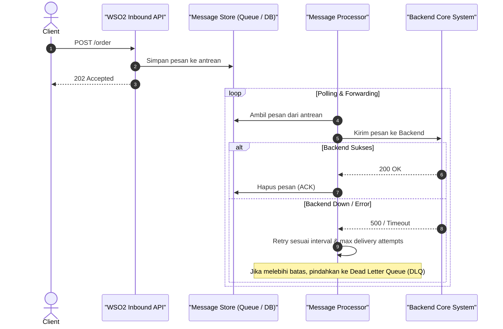

# Modul 5: Asynchronous Messaging & Reliability (Store-and-Forward)

---

## 1. Mengapa Perlu Asynchronous Messaging?

Dalam sistem enterprise, ketergantungan synchronous (request-response langsung) memiliki kelemahan: jika backend sedang mati, request transaksi client akan langsung gagal (*lost transaction*).

Untuk mengatasi masalah ini, WSO2 MI menyediakan pola **Guaranteed Delivery (Store-and-Forward)**:



---

## 2. Komponen Utama: Message Store & Message Processor

1. **Message Store**: Tempat penyimpanan pesan sementara.
   - **In-Memory Message Store**: Disimpan di RAM WSO2 (cepat, namun hilang jika server restart).
   - **JMS Message Store**: Disimpan di broker JMS seperti Apache ActiveMQ atau Artemis.
   - **RabbitMQ Message Store**: Disimpan di queue RabbitMQ (sangat populer & reliable).
   - **JDBC Message Store**: Disimpan di tabel database relasional (PostgreSQL, MySQL, Oracle).

2. **Message Processor**: Worker background yang secara periodik mengambil pesan dari Message Store dan mengeksekusi sequence target / endpoint.

---

## 3. Hands-on Konfigurasi: Store-and-Forward

### Langkah 1: Buat Message Store (In-Memory / RabbitMQ)

**Contoh In-Memory Store:**
```xml
<?xml version="1.0" encoding="UTF-8"?>
<messageStore xmlns="http://ws.apache.org/ns/synapse" name="OrderPendingQueue"/>
```

**Contoh RabbitMQ Message Store:**
```xml
<?xml version="1.0" encoding="UTF-8"?>
<messageStore xmlns="http://ws.apache.org/ns/synapse" 
              name="RabbitMQOrderStore" 
              class="org.apache.synapse.message.store.impl.rabbitmq.RabbitMQStore">
    <parameter name="rabbitmq.server.host.name">localhost</parameter>
    <parameter name="rabbitmq.server.port">5672</parameter>
    <parameter name="rabbitmq.server.user.name">guest</parameter>
    <parameter name="rabbitmq.server.password">guest</parameter>
    <parameter name="rabbitmq.queue.name">order_incoming_queue</parameter>
    <parameter name="rabbitmq.exchange.name">order_exchange</parameter>
</messageStore>
```

---

### Langkah 2: Buat API yang Menerima dan Menyimpan Pesan (Store)

```xml
<?xml version="1.0" encoding="UTF-8"?>
<api xmlns="http://ws.apache.org/ns/synapse" name="OrderAsyncAPI" context="/async-order">
    <resource methods="POST" uri-template="/submit">
        <inSequence>
            <log level="custom">
                <property name="STATUS" value="Menerima Order Baru - Menyimpan ke antrean"/>
            </log>

            <!-- Simpan pesan saat ini ke dalam Message Store -->
            <store messageStore="OrderPendingQueue"/>

            <!-- Berikan respon cepat 202 Accepted ke pemanggil -->
            <property name="HTTP_SC" value="202" scope="axis2"/>
            <payloadFactory media-type="json">
                <format>
                    {
                        "status": "ACCEPTED",
                        "message": "Pesanan Anda berhasil diterima dan sedang dalam antrean pemrosesan."
                    }
                </format>
                <args/>
            </payloadFactory>
            <respond/>
        </inSequence>
    </resource>
</api>
```

---

### Langkah 3: Buat Target Endpoint & Sequence Pemroses

```xml
<endpoint name="OrderBackendEP">
    <http method="post" uri-template="https://order-engine.internal/api/orders"/>
</endpoint>
```

---

### Langkah 4: Buat Message Forwarding Processor (Forward & Retry)

```xml
<?xml version="1.0" encoding="UTF-8"?>
<messageProcessor xmlns="http://ws.apache.org/ns/synapse"
                  class="org.apache.synapse.message.processor.impl.forwarder.ScheduledMessageForwardingProcessor"
                  name="OrderForwarderProcessor"
                  targetEndpoint="OrderBackendEP"
                  messageStore="OrderPendingQueue">
    <parameter name="interval">2000</parameter> <!-- Interval polling 2 detik -->
    <parameter name="max.delivery.attempts">4</parameter> <!-- Coba kirim ulang maks 4 kali -->
    <parameter name="client.retry.interval">5000</parameter> <!-- Jeda antar retry 5 detik -->
    <parameter name="message.processor.reply.sequence">OrderSuccessReplySeq</parameter>
    <parameter name="message.processor.fault.sequence">OrderFailureDLQSeq</parameter>
    <parameter name="is.active">true</parameter>
</messageProcessor>
```

---

## 4. Dead Letter Queue (DLQ)

Ketika sebuah pesan gagal diproses setelah mencapai batas `max.delivery.attempts`:
- Pesan tidak boleh hilang begitu saja.
- Processor akan memanggil `fault.sequence` (contoh: `OrderFailureDLQSeq`).
- Pada sequence ini, kita dapat memindahkan pesan ke database audit, mengirim alert email/Slack, atau menyimpannya ke antrean DLQ khusus untuk diinvestigasi manual.

---

## 5. Ringkasan & Checklist Modul 5

- [x] Memahami konsep Asynchronous vs Synchronous messaging.
- [x] Menguasai pola **Store and Forward (Guaranteed Delivery)**.
- [x] Memahami perbedaan tipe Message Store (In-Memory, JMS, RabbitMQ, JDBC).
- [x] Mengonfigurasi Message Forwarding Processor lengkap dengan retry policy.
- [x] Menerapkan strategi Dead Letter Queue (DLQ) untuk audit pesan gagal.
