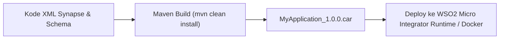
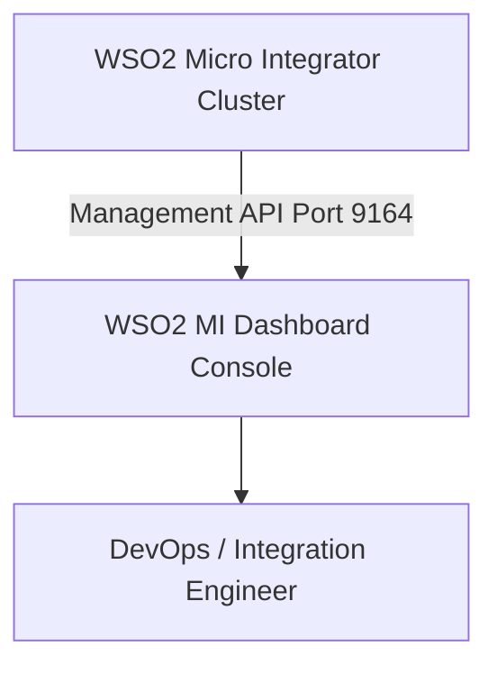

# Modul 6: Deployment, Testing & Monitoring

---

## 1. Packaging: Carbon Application Archive (.CAR)

Seluruh konfigurasi API, sequence, endpoint, dan mediator di WSO2 dibungkus menjadi satu file terkompilasi bernama **`.car`** (**Carbon Application**).



### Cara Build CAR File:
1. Melalui terminal project root:
   ```bash
   mvn clean install
   ```
2. File hasil build akan berada di folder:
   `MyProjectCompositeExporter/target/MyProjectCompositeExporter_1.0.0.car`

---

## 2. Pilihan Deployment WSO2 MI

### Opsi A: Standalone Runtime (Bare-metal / VM)
1. Letakkan file `.car` ke dalam folder:
   `<MI_HOME>/repository/deployment/server/carbonapps/`
2. Jalankan server runtime:
   - **Windows**: `<MI_HOME>\bin\micro-integrator.bat`
   - **Linux/Mac**: `<MI_HOME>/bin/micro-integrator.sh`
3. WSO2 MI akan otomatis mendeteksi (*hot-deploy*) file `.car` tersebut.

---

### Opsi B: Containerization (Docker)
WSO2 Micro Integrator dirancang cloud-native dan sangat ringan untuk container.

**Contoh `Dockerfile`:**
```dockerfile
FROM wso2/wso2mi:4.2.0

# Copy file .car aplikasi ke direktori deployment MI
COPY target/MyProjectCompositeExporter_1.0.0.car ${WSO2_SERVER_HOME}/repository/deployment/server/carbonapps/

# Expose HTTP & HTTPS port
EXPOSE 8290 8253 9164

# Jalankan server
CMD ["micro-integrator"]
```

**Build & Run Docker Image:**
```bash
docker build -t my-integration-app:1.0.0 .
docker run -d -p 8290:8290 -p 9164:9164 --name wso2-app my-integration-app:1.0.0
```

---

### Opsi C: Kubernetes & OpenShift
WSO2 menyediakan **WSO2 Kubernetes Operator** dan **Helm Charts** untuk mengelola replikasi, auto-scaling (HPA), rolling update, dan health check probe (`/healthz` dan `/readyz`).

---

## 3. Unit Testing di WSO2 Micro Integrator

WSO2 menyediakan **Synapse Unit Testing Framework** untuk menguji alur integrasi tanpa harus menyalakan backend sungguhan (menggunakan *Mock Services*).

```text
MyTestProject/
└── src/
    └── test/
        └── resources/
            ├── unit-test-suites/
            │   └── HelloAPITestSuite.xml
            └── mock-services/
                └── MockCustomerService.xml
```

### Menjalankan Unit Test:
- Melalui panel **Unit Test** pada VS Code Extension.
- Atau via Maven command saat proses CI/CD pipeline:
  ```bash
  mvn clean test -DsynapseTest
  ```

---

## 4. Monitoring & Observability

### 1. Micro Integrator Dashboard
Dashboard web visual untuk memantau status aplikasi secara real-time.
- **Port Default**: `http://localhost:9743/dashboard`
- **Fitur**:
  - Melihat daftar API, Endpoints, Message Stores, dan Tasks yang aktif.
  - Mengubah Log Level secara dinamis saat runtime (*Loggers view* tanpa perlu restart).
  - Melacak status failover / suspended endpoint.



---

### 2. Metrik & Tracing (Prometheus & Grafana / OpenTelemetry)
- WSO2 MI mendukung ekspor metrik Prometheus secara native pada endpoint `/metric-service/metrics`.
- Mendukung distributed tracing via Jaeger atau Zipkin menggunakan OpenTelemetry standard.

---

## 5. Ringkasan & Checklist Modul 6

- [x] Memahami cara membungkus artefak ke dalam format **.CAR (Carbon Application Archive)**.
- [x] Menguasai deployment standalone dan containerisasi dengan **Docker**.
- [x] Mengenal konsep **Synapse Unit Testing** dan Mock Services untuk CI/CD.
- [x] Mengoperasikan **WSO2 MI Dashboard** untuk monitoring dan dynamic log tuning.
