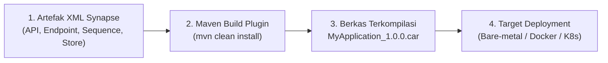
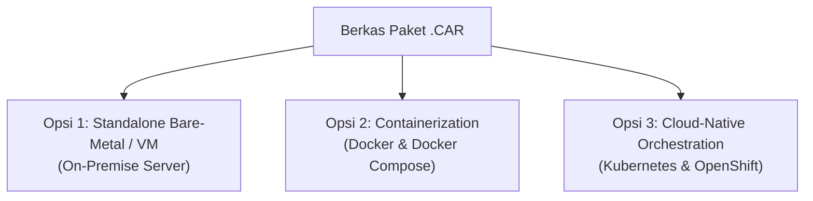
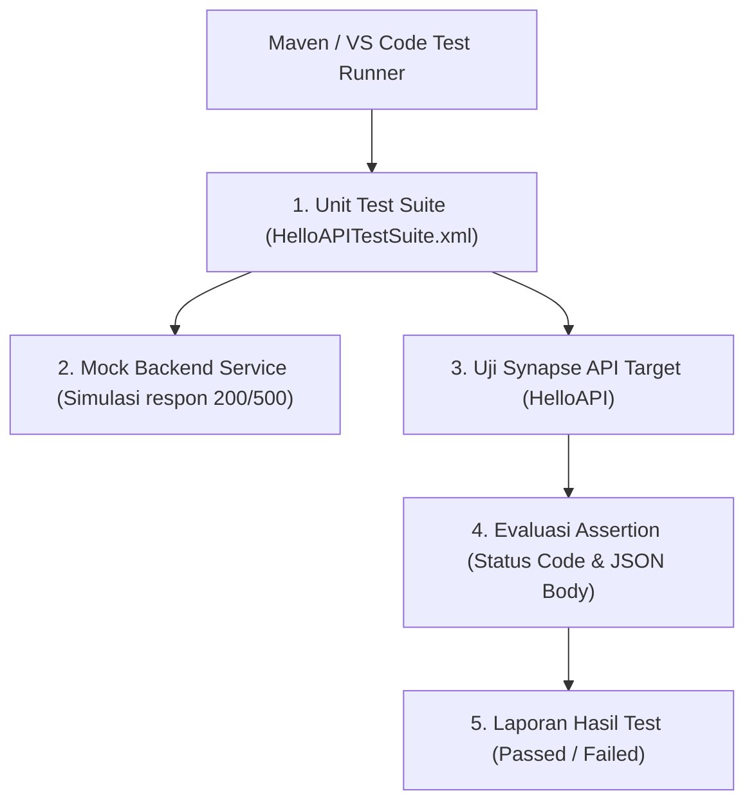
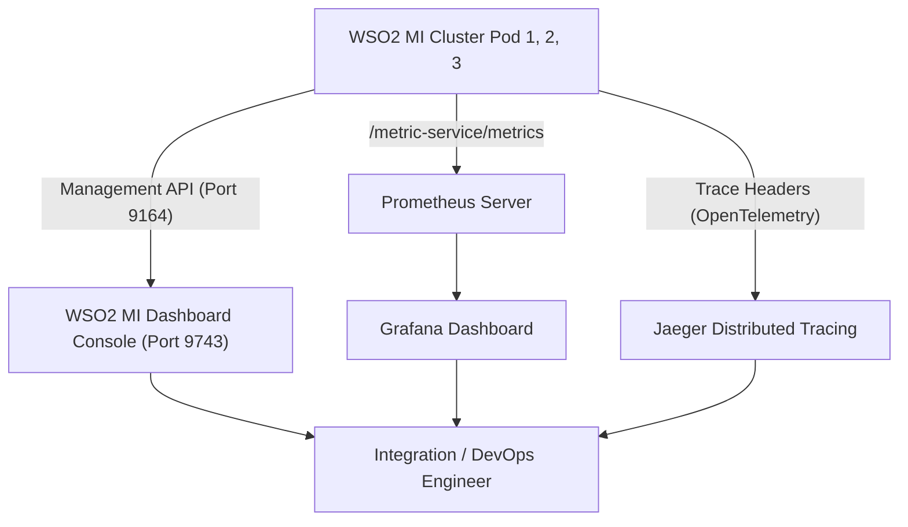

# Modul 6: Deployment, Testing, & Monitoring di WSO2 MI

---

## 1. Siklus Hidup & Pengemasan: Carbon Application Archive (.CAR)

Di WSO2 Micro Integrator (MI), semua artefak integrasi yang telah Anda rancang (seperti REST API, Endpoint, Sequence, Message Store, dan Message Processor) tidak didistribusikan secara terpisah satu per satu. 

Seluruh artefak tersebut dikompilasi, divalidasi dependensinya, dan dibungkus ke dalam satu arsip terpadu bernama **`.car` (Carbon Application Archive)**.



### Bedah Detail Diagram 1: Siklus Hidup & Pengemasan .CAR
* **Isi Komponen Diagram:**
  1. **`1. Artefak XML Synapse`**: File kode sumber deklaratif yang dibuat developer (seperti `HelloAPI.xml`, `AccountInquiryAPI.xml`, endpoint HTTP/Address, sequence error handling, dan konektor).
  2. **`2. Maven Build Plugin`**: Tool otomasi build (`wso2-mi-synapse-plugin` / `composite-application-plugin`) yang membaca konfigurasi proyek (`pom.xml`) dan menyusun manifes dependensi `artifacts.xml`.
  3. **`3. Berkas Terkompilasi (.CAR)`**: Paket biner terkompresi tunggal (misal `HelloWorldProjectCompositeExporter_1.0.0.car`) yang berisi seluruh artefak dan metadata versi.
  4. **`4. Target Deployment`**: Lingkungan runtime tempat aplikasi dieksekusi (server fisik, VM, container Docker, atau pod Kubernetes).
* **Bagaimana Cara Kerjanya (Flow):**
  1. Developer menulis logika integrasi berbasis XML di IDE (VS Code WSO2 Extension).
  2. Developer atau CI/CD pipeline mengeksekusi perintah build: `mvn clean install`.
  3. Plugin Maven memvalidasi sintaks XML, memetakan dependensi mediator, membuat file manifes `artifacts.xml`, lalu mengompres semuanya menjadi satu berkas biner `.car`.
  4. Berkas `.car` yang telah teruji didistribusikan ke target deployment tanpa perlu menyalin kode sumber XML secara manual satu per satu.
* **Tujuan & Manfaat:**
  * **Atomic Deployment:** Menjamin semua komponen API, endpoint, dan sequence terdeploy secara bersamaan. Mencegah kondisi inkonsisten di mana API sudah live namun sequence atau endpoint dependensinya belum siap.
  * **Immutability & Versioning:** Memastikan integritas versi rilis (misal versi `1.0.0` tidak tercampur dengan versi `1.1.0`).
  * **Decoupling Source vs Binary:** Memisahkan kode sumber di repository Git dari berkas artefak siap rilis di Artifact Registry (Nexus/Artifactory).

---

### A. Struktur Internal Berkas `.car`
File `.car` sebenarnya adalah berkas terkompresi (format ZIP/JAR) yang memiliki struktur direktori internal:
* **`artifacts.xml`**: Berkas manifes utama yang mencatat seluruh metadata artefak (nama API, versi, tipe artefak, dan dependensi antar-mediator).
* **Sub-folder Artefak**: Masing-masing artefak XML dibungkus rapi beserta dependensi library Java (JAR) pihak ketiga jika ada.

---

### B. Cara Build Berkas `.car` Menggunakan Maven CLI
Buka terminal pada direktori root proyek (`HelloWorldProject`):
```powershell
cd C:\Users\eksad\OneDrive\Documents\assa\selfLearning\HelloWorldProject

# Build seluruh artefak menjadi file .car
mvn clean install
```
Hasil build akan tersimpan di dalam direktori `target/`:
`HelloWorldProject/target/HelloWorldProjectCompositeExporter_1.0.0.car`

---

## 2. Pilihan Deployment di Lingkungan Industri

WSO2 Micro Integrator dirancang sangat fleksibel untuk mendukung transformasi arsitektur infrastruktur dari on-premise konvensional hingga cloud-native modern:



### Bedah Detail Diagram 2: Pilihan Deployment Industri
* **Isi Komponen Diagram:**
  * **`Berkas Paket .CAR`**: Entitas biner output dari proses build Maven (*single source of truth for deployment*).
  * **`Opsi 1 (Bare-Metal / VM)`**: Pendekatan deployment konvensional berbasis OS host langsung (Windows Server / Linux).
  * **`Opsi 2 (Docker & Docker Compose)`**: Pendekatan deployment berbasis container tunggal atau multi-service lokal/on-prem.
  * **`Opsi 3 (Kubernetes & OpenShift)`**: Pendekatan deployment berbasis orkestrasi cluster skala enterprise dengan autoscaling.
* **Bagaimana Cara Kerjanya (Flow):**
  Diagram ini merefleksikan prinsip **"Build Once, Deploy Anywhere"**:
  1. Berkas `.car` yang sama dihasilkan satu kali pada pipeline CI/CD.
  2. Berkas biner tersebut dapat didistribusikan langsung ke direktori folder `carbonapps/` di OS VM, **ATAU** disalin ke dalam layer Docker Image via instruksi `COPY` di `Dockerfile`, **ATAU** diinjeksikan ke dalam Kubernetes Pod via image registry.
* **Tujuan & Manfaat:**
  * Memberikan fleksibilitas migrasi bagi korporasi: aplikasi integrasi yang dibangun hari ini di VM dapat langsung dipindahkan ke Docker atau Kubernetes di kemudian hari tanpa perlu menulis ulang (*rewrite*) kode logika integrasi sama sekali.

---

### Analisis & Pertimbangan Setiap Opsi Deployment

#### Opsi 1: Standalone Server (Bare-Metal / Virtual Machine On-Premise)
Sangat umum digunakan pada infrastruktur *On-Premise* perbankan dan instansi pemerintah dengan regulasi ketat.

* **Cara Kerja Deployment:**
  1. Salin berkas `.car` ke direktori deployment runtime WSO2:
     `<MI_HOME>/repository/deployment/server/carbonapps/`
  2. **Hot Deployment:** Jika server WSO2 MI sedang berjalan, engine secara otomatis mendeteksi file baru dan mengaktifkannya tanpa perlu me-restart server.
  3. Menjalankan server runtime:
     * **Windows**: `<MI_HOME>\bin\micro-integrator.bat`
     * **Linux / MacOS**: `<MI_HOME>/bin/micro-integrator.sh`
* **Pertimbangan (Trade-Offs):**
  * **Kelebihan:** 
    * Sederhana, tidak membutuhkan keahlian container atau networking K8s.
    * Akses perangkat keras langsung tanpa layer abstraksi container.
    * Kompatibel dengan kebijakan audit keamanan korporasi lama yang belum mengizinkan container di jaringan intranet inti.
  * **Kekurangan:**
    * Skalabilitas lambat (butuh provisioning VM baru dalam hitungan menit/jam saat trafik melonjak).
    * Potensi perbedaan lingkungan (*environment drift*) seperti versi Java runtime atau locale OS.
    * Di Windows Server, file `.car` yang sedang berjalan sering terkunci (*locked*) oleh JVM sehingga sulit ditimpa secara hot-deploy.
* **Kapan Tepat Digunakan:**
  * Beban transaksi stabil dan terprediksi, sistem integrasi batch harian internal, atau organisasi yang belum memiliki infrastruktur container.

---

#### Opsi 2: Containerization (Docker Production-Ready)
WSO2 MI memiliki ukuran image yang sangat ramping (*lightweight*) dengan konsumsi memori dasar hanya ~256MB dan waktu *cold-start* di bawah 3 detik.

* **File `Dockerfile` Resmi:**
  Tersedia di dalam project: `HelloWorldProject/deployment/docker/Dockerfile`

```dockerfile
# 1. Base Image WSO2 Micro Integrator resmi
ARG BASE_IMAGE=wso2/wso2mi:4.2.0
FROM ${BASE_IMAGE}

# 2. Salin file Carbon Application (.car) ke folder deployment container
COPY CompositeApps/*.car ${WSO2_SERVER_HOME}/repository/deployment/server/carbonapps/

# 3. Salin keystore SSL/TLS dan sertifikat client truststore
COPY resources/wso2carbon.jks ${WSO2_SERVER_HOME}/repository/resources/security/wso2carbon.jks
COPY resources/client-truststore.jks ${WSO2_SERVER_HOME}/repository/resources/security/client-truststore.jks

# 4. Buka port lalu lintas data dan port management
EXPOSE 8290 8253 9164

# 5. Eksekusi server saat container menyala
CMD ["micro-integrator"]
```

* **Orkestrasi Multi-Container (`docker-compose.yml`):**
  Menjalankan WSO2 MI bersama broker RabbitMQ secara terpadu:

```yaml
version: '3.8'

services:
  rabbitmq:
    image: rabbitmq:3-management
    container_name: enterprise-rabbitmq
    ports:
      - "5672:5672"
      - "15672:15672"

  wso2-mi:
    build:
      context: ./deployment/docker
    container_name: wso2-micro-integrator
    ports:
      - "8290:8290"   # HTTP Inbound Gateway
      - "8253:8253"   # HTTPS Inbound Gateway
      - "9164:9164"   # Management API & Health Probe
    depends_on:
      - rabbitmq
```

* **Pertimbangan (Trade-Offs):**
  * **Kelebihan:**
    * *Immutable Infrastructure*: Lingkungan pengujian di laptop developer identik 100% dengan staging dan production.
    * Ekosistem lengkap (WSO2 + RabbitMQ + DB) dapat dihidupkan dengan satu perintah (`docker compose up -d`).
    * Sangat mudah diintegrasikan ke dalam CI/CD pipeline modern (GitHub Actions, GitLab CI, Jenkins).
  * **Kekurangan:**
    * Tanpa orchestrator (seperti Swarm atau K8s), tidak ada mekanisme *auto-scaling* atau *self-healing* otomatis jika container mati.
* **Kapan Tepat Digunakan:**
  * Lingkungan Development lokal, UAT, PoC (Proof of Concept), atau deployment produksi skala kecil-menengah dengan beban server yang sudah dipatok.

---

#### Opsi 3: Cloud-Native Orchestration (Kubernetes & OpenShift)
Di Kubernetes, WSO2 MI berjalan sebagai kumpulan pod *stateless* di balik Kubernetes Service dan Ingress Controller.

* **Konfigurasi Health Checks (Liveness & Readiness Probes):**
  WSO2 MI menyediakan endpoint bawaan pada port **`9164`** untuk memonitor siklus hidup pod secara native:

```yaml
apiVersion: apps/v1
kind: Deployment
metadata:
  name: wso2mi-deployment
spec:
  replicas: 3
  template:
    spec:
      containers:
      - name: wso2mi
        image: my-registry/wso2mi-app:1.0.0
        ports:
        - containerPort: 8290
        - containerPort: 9164
        # Liveness Probe: Restart pod secara otomatis jika engine mengalami deadlock / hang
        livenessProbe:
          httpGet:
            path: /healthz
            port: 9164
          initialDelaySeconds: 15
          periodSeconds: 10
        # Readiness Probe: Arahkan lalu lintas request hanya jika pod telah selesai inisialisasi
        readinessProbe:
          httpGet:
            path: /readyz
            port: 9164
          initialDelaySeconds: 10
          periodSeconds: 5
```

* **Pertimbangan (Trade-Offs):**
  * **Kelebihan:**
    * **High Availability & Auto-Healing:** Pod yang crash akan langsung digantikan dalam 3 detik tanpa mengganggu user lain.
    * **Elastisitas (HPA):** Pod bertambah dan berkurang secara otomatis sesuai lonjakan CPU atau request per second.
    * **Zero-Downtime Rolling Update:** Deploy versi API baru tanpa downtime (trafik dialihkan bertahap).
  * **Kekurangan:**
    * Membutuhkan keahlian DevOps tingkat lanjut dan biaya operasional kluster.
* **Kapan Tepat Digunakan:**
  * Lingkungan **Production Enterprise Skala Besar**, sistem perbankan/e-commerce dengan lonjakan trafik dinamis, dan organisasi yang mengadopsi prinsip Cloud-Native & Microservices.

---

### Matriks Keputusan Pemilihan Opsi Deployment

| Kriteria Evaluasi | Opsi 1: Standalone VM | Opsi 2: Docker Single-Host | Opsi 3: Kubernetes / OpenShift |
| :--- | :--- | :--- | :--- |
| **Kecepatan Scaling** | Lambat (Menit/Jam) | Manual (Menit) | **Otomatis (Detik via HPA)** |
| **Penyelarasan CI/CD** | Cukup repot (SSH / SCP) | Baik (Docker Registry) | **Sangat Baik (GitOps / ArgoCD)** |
| **High Availability** | Bergantung pada Load Balancer VM | Terbatas pada host tunggal | **Enterprise Grade (Multi-AZ)** |
| **Konsumsi Resource** | Tinggi (Overhead OS per VM) | Rendah (Resource sharing) | Terukur (Resource limits/requests) |
| **Tingkat Kompleksitas** | Rendah | Sedang | Tinggi |

### Rekomendasi Arsitek: Mana yang Harus Dipilih?

> [!IMPORTANT]
> **Rekomendasi Utama (Production Enterprise): OPSI 3 (Kubernetes / OpenShift)**
> WSO2 MI 4.x dirancang secara fundamental sebagai runtime integrasi *cloud-native*. Karakteristiknya yang *stateless*, konsumsi RAM hemat (~256MB), *cold-start* di bawah 3 detik, serta endpoint kesehatan native (`/healthz` dan `/readyz`) menjadikannya pilihan standar industri terbaik untuk menjamin uptime **99.99%** dan zero-downtime deployment.

> [!TIP]
> **Rekomendasi untuk Tahap Development & Testing: OPSI 2 (Docker Compose)**
> Sangat direkomendasikan bagi developer agar dapat mensimulasikan seluruh ekosistem integrasi (WSO2 MI + RabbitMQ Broker + Database) di laptop masing-masing secara konsisten tanpa konflik konfigurasi.

---

## 3. Unit Testing Otomatis (Synapse Unit Test Framework)

Untuk mendukung pipeline **CI/CD** yang andal, WSO2 menyediakan framework pengujian otomatis tanpa memerlukan backend sungguhan melalui simulasi **Mock Services**.



### Bedah Detail Diagram 3: Synapse Unit Test Framework
* **Isi Komponen Diagram:**
  * **`TestRunner`**: Eksekutor pengujian otomatis (dijalankan via CLI `mvn clean test -DsynapseTest` atau plugin test runner IDE).
  * **`1. Unit Test Suite`**: File XML skenario uji (misal `HelloAPITestSuite.xml`) yang mendefinisikan input data, parameter protokol, dan artefak target.
  * **`2. Mock Backend Service`**: Server tiruan internal bawaan WSO2 yang membalas request tanpa memanggil backend sungguhan (misal menyimulasikan respon 200 OK atau timeout 504).
  * **`3. Synapse API Target`**: Logika API WSO2 yang sedang diuji (contoh: `HelloAPI`).
  * **`4. Evaluasi Assertion`**: Mesin pencocok logika validasi (apakah HTTP status = 200, apakah nilai payload JSON field `status` sesuai harapan).
  * **`5. Laporan Hasil Test`**: Output laporan pengujian (Passed / Failed) yang menentukan apakah pipeline CI/CD boleh lanjut atau dibatalkan.
* **Bagaimana Cara Kerjanya (Flow):**
  1. Pipeline CI/CD atau developer mengeksekusi test runner.
  2. Test runner membaca skenario pengujian dari file XML test suite.
  3. Framework mengaktifkan server tiruan (*Mock Service*) pada port lokal sementara untuk menyimulasikan backend asli.
  4. Input payload dan parameter disuntikkan ke dalam API target (`HelloAPI`).
  5. API memproses transformasi data mediator, memanggil endpoint mock, dan menerima balasan.
  6. Respons akhir dari API dievaluasi terhadap aturan *assertion*.
  7. Jika semua kondisi terpenuhi, test dinyatakan **Passed**; jika ada deviasi nilai atau status code salah, test dinyatakan **Failed** dan memblokir rilis.
* **Tujuan & Manfaat:**
  * **Shift-Left Testing:** Menemukan cacat transformasi data di tahap awal sebelum aplikasi masuk ke server staging/production.
  * **Isolasi Penuh (Zero External Dependency):** Memungkinkan pengujian menyeluruh tanpa perlu server backend riil aktif (sangat krusial jika backend pihak ketiga belum siap atau sering down).
  * **Quality Gate CI/CD:** Menjadi pagar pengaman kualitas otomatis pada pipeline build sebelum pembuatan berkas `.car` dan Docker image.

---

### Contoh Definisi Test Suite (`HelloAPITestSuite.xml`):
```xml
<unit-test-suite>
    <artifact>
        <test-artifact>
            <artifact-type>synapse-api</artifact-type>
            <artifact-name>HelloAPI</artifact-name>
        </test-artifact>
    </artifact>
    <test-cases>
        <test-case name="TestCase_Greeting_Success">
            <input>
                <path-params>
                    <param name="name">Jovan</param>
                </path-params>
                <protocol>http</protocol>
                <request-method>GET</request-method>
            </input>
            <assertions>
                <!-- 1. Validasi HTTP Status harus 200 -->
                <assert-equals>
                    <actual>$statusCode</actual>
                    <expected>200</expected>
                    <message>Status code harus bernilai 200 OK</message>
                </assert-equals>
                <!-- 2. Validasi field JSON status bernilai SUCCESS -->
                <assert-equals>
                    <actual>json-eval($.status)</actual>
                    <expected>SUCCESS</expected>
                    <message>Payload status harus bernilai SUCCESS</message>
                </assert-equals>
            </assertions>
        </test-case>
    </test-cases>
</unit-test-suite>
```

#### Menjalankan Unit Test via Terminal:
```powershell
mvn clean test -DsynapseTest
```

---

## 4. Monitoring, Observability & Dynamic Diagnostics

Arsitektur observabilitas WSO2 MI dirancang untuk memberikan transparansi penuh terhadap kesehatan sistem, performa transaksi, dan penanganan insiden:



### Bedah Detail Diagram 4: Monitoring, Observability & Dynamic Diagnostics
* **Isi Komponen Diagram:**
  * **`WSO2 MI Cluster Pod 1, 2, 3`**: Kumpulan node runtime WSO2 yang melayani beban transaksi integrasi.
  * **`Port 9164 (Management API)`**: Port administratif internal yang mengekspos REST API untuk inspeksi status, log level tuning, dan eksposur metrik.
  * **`WSO2 MI Dashboard Console (Port 9743)`**: Web UI resmi WSO2 untuk manajemen artefak dan diagnostik runtime.
  * **`Prometheus Server`**: Database time-series yang secara periodik menarik (*pull/scrape*) data metrik dari port 9164 WSO2 MI.
  * **`Grafana Dashboard`**: Visualisasi grafik interaktif untuk memantau metrik performa secara real-time.
  * **`Jaeger Distributed Tracing`**: Platform penampung trace distributed context untuk menganalisis jalur perjalanan request antar microservices.
  * **`Integration / DevOps Engineer`**: Tim teknis yang memonitor, menganalisis, dan menyelesaikan insiden operasional.
* **Bagaimana Cara Kerjanya (Flow):**
  1. **Jalur Manajemen:** Dashboard WSO2 berkomunikasi dengan node WSO2 MI melalui **Port 9164** untuk mengambil status artefak dan mengirim instruksi perubahan konfigurasi runtime (*Dynamic Log Tuning*).
  2. **Jalur Metrik:** Prometheus melakukan scraping secara berkala (misal tiap 15 detik) ke endpoint `http://<MI-HOST>:9164/metric-service/metrics`. Data metrik disimpan, lalu divisualisasikan oleh Grafana dalam bentuk grafik utilisasi CPU, throughput, dan error rate.
  3. **Jalur Tracing:** Ketika request masuk dari klien, WSO2 MI membaca/menghasilkan W3C trace context (`traceparent`), mencatat durasi setiap mediator, dan mengekspor span data ke Jaeger via protokol OpenTelemetry.
  4. **Jalur Engineer:** Engineer memantau Grafana untuk gambaran makro performa, meneliti Jaeger untuk menemukan titik lambat (*bottleneck*), dan mengakses Dashboard WSO2 jika ingin memeriksa detail payload error atau menaikkan level log.
* **Tujuan & Manfaat:**
  * Menerapkan **The Three Pillars of Observability**:
    * **Metrics** (Prometheus/Grafana): Mendeteksi **"Kapan dan seberapa besar masalah terjadi"**.
    * **Traces** (Jaeger): Menemukan **"Di microservice atau hop mana latensi/kegagalan terjadi"**.
    * **Logs & Management** (Dashboard): Mengetahui **"Mengapa masalah itu terjadi dan mengubah log level secara live untuk investigasi tanpa restart server"**.
  * Menurunkan secara drastis **MTTR (Mean Time to Resolution)** saat terjadi insiden produksi.

---

### A. WSO2 Micro Integrator Dashboard
* **Web Console**: `http://localhost:9743/dashboard`
* **Fitur Utama:**
  * Memantau daftar seluruh API, Endpoint, Message Store, dan Tasks yang sedang aktif.
  * **Dynamic Log Tuning (Zero-Downtime):** Anda dapat mengubah log level mediator dari `INFO` menjadi `DEBUG` atau `TRACE` secara instan pada runtime tanpa perlu mematikan atau me-restart server!

---

### B. Metrik Prometheus & Grafana
WSO2 MI mengekspor metrik kinerja sistem secara native pada endpoint HTTP:
`http://localhost:9164/metric-service/metrics`

#### Metrik Kunci yang Wajib Dipantau:
1. **`wso2_integration_request_count_total`**: Jumlah total request yang masuk ke API.
2. **`wso2_integration_latency_seconds`**: Latensi respons (P95 dan P99) untuk mendeteksi bottleneck backend.
3. **`wso2_integration_fault_count_total`**: Jumlah transaksi yang mengalami kegagalan/error.
4. **`jvm_memory_used_bytes`**: Konsumsi memori heap JVM untuk mencegah *Out-of-Memory (OOM)*.

---

### C. Distributed Tracing (OpenTelemetry / Jaeger)
Di dunia microservices terdistribusi, satu transaksi klien dapat melewati 5 hingga 10 layanan berbeda. 
WSO2 MI secara otomatis menyisipkan header trace standar W3C (`traceparent` dan `tracestate`), memungkinkan visualisasi alur hop-by-hop dari request klien hingga selesai di konsol Jaeger.

---

### Rekomendasi Strategi Monitoring Terpadu
> [!TIP]
> Terapkan **strategi kombinasi**:
> 1. Gunakan **Prometheus + Grafana** untuk pengawasan kesehatan infrastruktur 24/7 dan setup alarm otomatis (Alertmanager ke Slack/Email).
> 2. Pasang **Jaeger (OpenTelemetry)** untuk menelusuri transaksi yang mengalami degradasi performa atau timeout.
> 3. Akses **WSO2 MI Dashboard** secara insidentil saat tim support butuh melakukan inspeksi artefak atau mengaktifkan log `DEBUG` sementara untuk melacak root cause masalah produksi.

---

## 5. Panduan Praktik Menguji Port Management & Health Probe di Windows

Buka terminal PowerShell dan jalankan perintah berikut untuk memverifikasi status kesehatan server:

### 1. Cek Endpoint Liveness Probe (`/healthz`):
```powershell
Invoke-RestMethod -Uri "http://localhost:9164/healthz" -Method Get
```
**Expected Response:**
```json
{
  "status": "healthy"
}
```

---

### 2. Cek Daftar API yang Sedang Aktif via Management API:
```powershell
Invoke-RestMethod -Uri "http://localhost:9164/management/apis" -Method Get | ConvertTo-Json
```

---

### 3. Cek Metrik Prometheus:
```powershell
(Invoke-WebRequest -Uri "http://localhost:9164/metric-service/metrics").Content | Select-String "wso2" | Select-Object -First 10
```

---

## 6. Troubleshooting Deployment di Lingkungan Windows

| Masalah / Gejala | Penyebab Umum | Solusi Cepat |
| :--- | :--- | :--- |
| **Port Conflict: Address already in use: 8290 / 9164** | Ada instance WSO2 MI atau service lain yang masih berjalan di latar belakang. | Buka PowerShell sebagai admin, cari PID port bersangkutan: `netstat -ano \| findstr :8290`, lalu hentikan prosesnya: `taskkill /F /PID <PID>`. |
| **UnsupportedClassVersionError: class file version 61.0** | WSO2 MI dijalankan dengan versi Java yang tidak kompatibel (misal Java 21). | Pastikan menggunakan **OpenJDK 11** atau **OpenJDK 17** yang didukung resmi. Periksa dengan `java -version`. |
| **File Lock Error saat menimpa file `.car`** | File sistem Windows mengunci file `.car` yang sedang dibaca oleh JVM. | Hapus file `.car` lama terlebih dahulu atau gunakan Management API untuk me-redeploy aplikasi. |

---

## 7. Ringkasan & Checklist Modul 6

- [x] Menguasai konsep packaging artefak integrasi ke dalam berkas **.CAR (Carbon Application Archive)**.
- [x] Memahami detail alur build, verifikasi, dan distribusi berkas `.car` (Diagram 1).
- [x] Mengevaluasi kelebihan, kekurangan, dan pertimbangan 3 opsi deployment industri: Bare-Metal, Docker, dan Kubernetes (Diagram 2).
- [x] Memahami arsitektur container WSO2 MI (`Dockerfile` resmi dan `docker-compose.yml`).
- [x] Menguasai konfigurasi Liveness (`/healthz`) dan Readiness (`/readyz`) Probes di Kubernetes.
- [x] Menguasai alur kerja **Synapse Unit Test Framework** dan isolasi mock service untuk CI/CD (Diagram 3).
- [x] Memahami arsitektur monitoring terpadu 3 pilar: WSO2 Dashboard, Prometheus/Grafana, dan Jaeger Tracing (Diagram 4).
- [x] Menguasai pengujian port management (9164) dan teknik troubleshooting operasional di lingkungan Windows.
