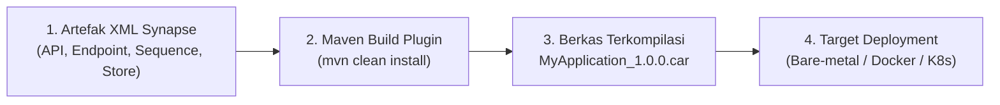
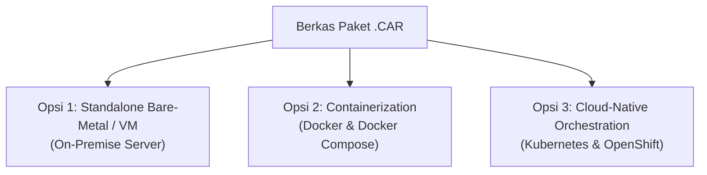
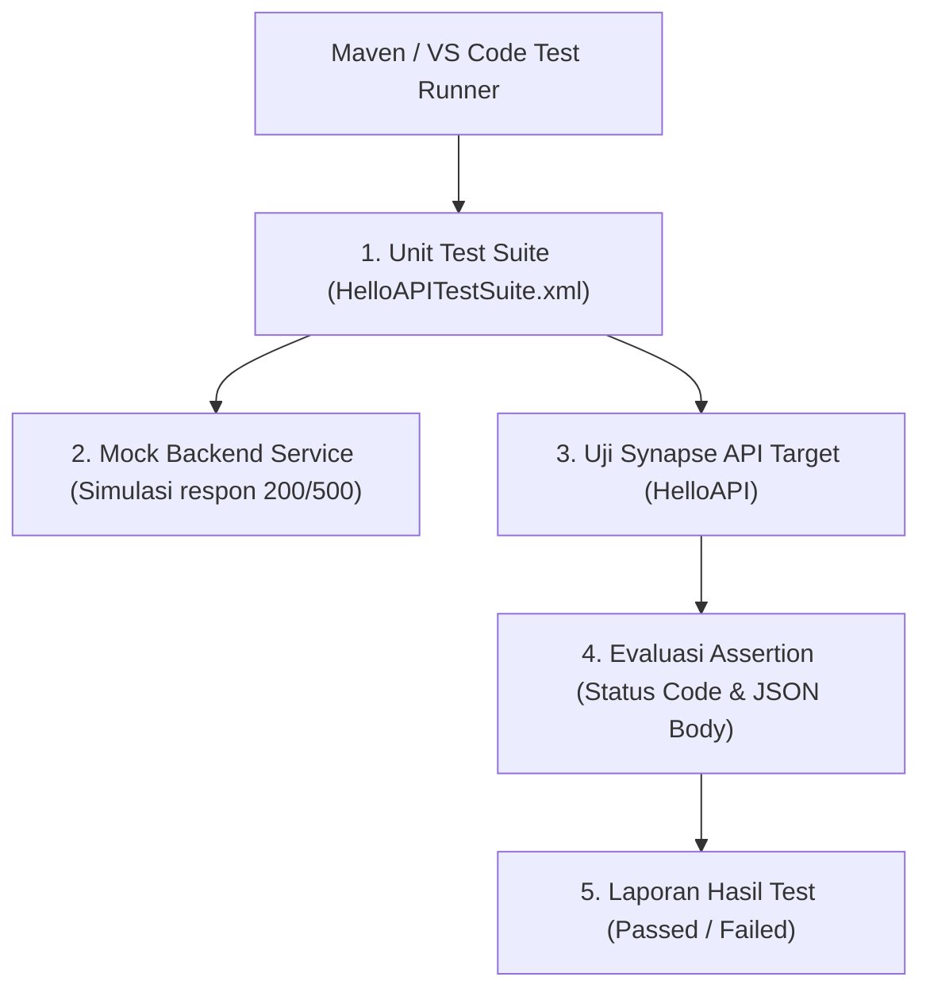
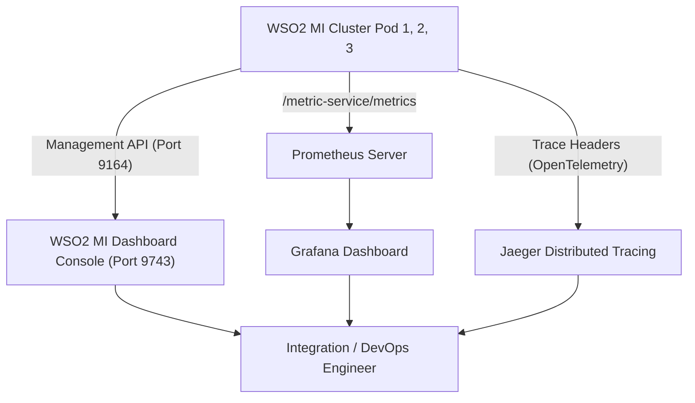

# Modul 6: Deployment, Testing, & Monitoring di WSO2 MI

---

## 1. Siklus Hidup & Pengemasan: Carbon Application Archive (.CAR)

Di WSO2 Micro Integrator, semua artefak integrasi yang telah Anda buat (REST API, Endpoint, Sequence, Message Store, dan Message Processor) tidak disebarkan (*deploy*) secara terpisah satu per satu. 

Seluruh artefak tersebut dikompilasi dan dibungkus ke dalam satu arsip terpadu bernama **`.car` (Carbon Application Archive)**.



### A. Struktur Internal Berkas `.car`
File `.car` sebenarnya adalah berkas terkompresi (mirip format `.jar` / `.zip`) yang memiliki struktur internal:
- **`artifacts.xml`**: Berkas manifes yang mencatat seluruh metadata artefak (nama API, versi, dependensi antar-mediator).
- **Sub-folder Artefak**: Masing-masing artefak XML dibungkus rapi beserta dependensi library Java jika ada.

---

### B. Cara Build Berkas `.car` Menggunakan Maven CLI
Buka terminal pada direktori root proyek (`HelloWorldProject`):
```powershell
cd C:\Users\eksad\OneDrive\Documents\assa\selfLearning\HelloWorldProject

# Build seluruh artefak menjadi file .car
mvn clean install
```
Hasil build akan tersimpan di dalam direktori `target/`:
`HelloWorldProject/target/HelloWorldProjectCompositeExporter_1.0.0.car`

---

## 2. Pilihan Deployment di Lingkungan Industri

WSO2 Micro Integrator dirancang fleksibel untuk mendukung berbagai arsitektur infrastruktur:



---

### Opsi 1: Standalone Server (Bare-Metal / Virtual Machine)
Sangat umum digunakan pada infrastruktur *On-Premise* perbankan dan instansi pemerintah:
1. Salin berkas `.car` ke folder deployment runtime WSO2:
   `<MI_HOME>/repository/deployment/server/carbonapps/`
2. **Hot Deployment**: Jika WSO2 MI sedang berjalan, engine secara otomatis mendeteksi dan mengaktifkan file `.car` tanpa perlu me-restart server.
3. Menjalankan server runtime:
   - **Windows**: `<MI_HOME>\bin\micro-integrator.bat`
   - **Linux / MacOS**: `<MI_HOME>/bin/micro-integrator.sh`

---

### Opsi 2: Containerization (Docker Production-Ready)
WSO2 MI memiliki ukuran image yang sangat ramping (*lightweight*) dengan konsumsi memori hanya ~256MB dan waktu *cold-start* di bawah 3 detik.

File `Dockerfile` telah tersedia di dalam project Anda pada path:
`HelloWorldProject/deployment/docker/Dockerfile`

```dockerfile
# 1. Base Image WSO2 Micro Integrator resmi
ARG BASE_IMAGE=wso2/wso2mi:4.2.0
FROM ${BASE_IMAGE}

# 2. Salin file Carbon Application (.car) ke folder deployment container
COPY CompositeApps/*.car ${WSO2_SERVER_HOME}/repository/deployment/server/carbonapps/

# 3. Salin keystore SSL/TLS dan sertifikat client truststore
COPY resources/wso2carbon.jks ${WSO2_SERVER_HOME}/repository/resources/security/wso2carbon.jks
COPY resources/client-truststore.jks ${WSO2_SERVER_HOME}/repository/resources/security/client-truststore.jks

# 4. Buka port lalu lintas data dan port management
EXPOSE 8290 8253 9164

# 5. Eksekusi server saat container menyala
CMD ["micro-integrator"]
```

#### Orkestrasi Multi-Container (`docker-compose.yml`):
Menjalankan WSO2 MI bersama broker RabbitMQ dan Web Dashboard:
```yaml
version: '3.8'

services:
  rabbitmq:
    image: rabbitmq:3-management
    container_name: enterprise-rabbitmq
    ports:
      - "5672:5672"
      - "15672:15672"

  wso2-mi:
    build:
      context: ./deployment/docker
    container_name: wso2-micro-integrator
    ports:
      - "8290:8290"   # HTTP Inbound Gateway
      - "8253:8253"   # HTTPS Inbound Gateway
      - "9164:9164"   # Management API & Health Probe
    depends_on:
      - rabbitmq
```

---

### Opsi 3: Kubernetes & Cloud-Native Deployment
Di Kubernetes, WSO2 MI berjalan sebagai pod stateless dengan replikasi horizontal otomatis (*Horizontal Pod Autoscaler* / HPA).

#### Konfigurasi Health Checks (Liveness & Readiness Probes):
WSO2 MI menyediakan endpoint bawaan pada port **`9164`** untuk memonitor kesehatan pod secara otomatis:
```yaml
apiVersion: apps/v1
kind: Deployment
metadata:
  name: wso2mi-deployment
spec:
  replicas: 3
  template:
    spec:
      containers:
      - name: wso2mi
        image: my-registry/wso2mi-app:1.0.0
        ports:
        - containerPort: 8290
        - containerPort: 9164
        # Liveness Probe: Restart pod jika engine mengalami deadlock
        livenessProbe:
          httpGet:
            path: /healthz
            port: 9164
          initialDelaySeconds: 15
          periodSeconds: 10
        # Readiness Probe: Arahkan trafik hanya jika pod sudah siap melayani request
        readinessProbe:
          httpGet:
            path: /readyz
            port: 9164
          initialDelaySeconds: 10
          periodSeconds: 5
```

---

## 3. Unit Testing Otomatis (Synapse Unit Test Framework)

Untuk mendukung pipeline **CI/CD** yang andal, WSO2 menyediakan framework pengujian otomatis tanpa memerlukan backend sungguhan melalui simulasi **Mock Services**.



### Contoh Definisi Test Suite (`HelloAPITestSuite.xml`):
```xml
<unit-test-suite>
    <artifact>
        <test-artifact>
            <artifact-type>synapse-api</artifact-type>
            <artifact-name>HelloAPI</artifact-name>
        </test-artifact>
    </artifact>
    <test-cases>
        <test-case name="TestCase_Greeting_Success">
            <input>
                <path-params>
                    <param name="name">Jovan</param>
                </path-params>
                <protocol>http</protocol>
                <request-method>GET</request-method>
            </input>
            <assertions>
                <!-- 1. Validasi HTTP Status harus 200 -->
                <assert-equals>
                    <actual>$statusCode</actual>
                    <expected>200</expected>
                    <message>Status code harus bernilai 200 OK</message>
                </assert-equals>
                <!-- 2. Validasi field JSON status bernilai SUCCESS -->
                <assert-equals>
                    <actual>json-eval($.status)</actual>
                    <expected>SUCCESS</expected>
                    <message>Payload status harus bernilai SUCCESS</message>
                </assert-equals>
            </assertions>
        </test-case>
    </test-cases>
</unit-test-suite>
```

#### Menjalankan Unit Test via Terminal:
```powershell
mvn clean test -DsynapseTest
```

---

## 4. Monitoring, Observability & Dynamic Diagnostics



### A. WSO2 Micro Integrator Dashboard
- **Web Console**: `http://localhost:9743/dashboard`
- **Fitur Andalan**:
  - Melihat daftar seluruh API, Endpoint, Message Store, dan Tasks yang sedang aktif.
  - **Dynamic Log Tuning (Zero-Downtime)**: Anda dapat mengubah log level mediator dari `INFO` menjadi `DEBUG` atau `TRACE` secara langsung pada runtime untuk melacak masalah tanpa perlu mematikan atau me-restart server!

---

### B. Metrik Prometheus & Grafana
WSO2 MI mengekspor metrik kinerja sistem secara native pada endpoint HTTP:
`http://localhost:9164/metric-service/metrics`

#### Metrik Kunci yang Wajib Dipantau:
1. **`wso2_integration_request_count_total`**: Jumlah total request yang masuk ke API.
2. **`wso2_integration_latency_seconds`**: Latensi respons (P95 dan P99) untuk mendeteksi bottleneck backend.
3. **`wso2_integration_fault_count_total`**: Jumlah transaksi yang mengalami kegagalan/error.
4. **`jvm_memory_used_bytes`**: Konsumsi memori heap JVM untuk mencegah *Out-of-Memory (OOM)*.

---

### C. Distributed Tracing (OpenTelemetry / Jaeger)
Di dunia microservices terdistribusi, satu transaksi dapat melewati 5 hingga 10 layanan berbeda. 
WSO2 MI secara otomatis menyisipkan header trace standar W3C (`traceparent` dan `tracestate`), memungkinkan Anda melihat visualisasi alur hop-by-hop dari request klien hingga selesai di console Jaeger.

---

## 5. Panduan Praktik Menguji Port Management & Health Probe di Windows

Buka terminal PowerShell dan jalankan perintah berikut untuk menguji status kesehatan server:

### 1. Cek Endpoint Liveness Probe (`/healthz`):
```powershell
Invoke-RestMethod -Uri "http://localhost:9164/healthz" -Method Get
```
**Expected Response:**
```json
{
  "status": "healthy"
}
```

---

### 2. Cek Daftar API yang Sedang Aktif via Management API:
```powershell
Invoke-RestMethod -Uri "http://localhost:9164/management/apis" -Method Get | ConvertTo-Json
```

---

### 3. Cek Metrik Prometheus:
```powershell
(Invoke-WebRequest -Uri "http://localhost:9164/metric-service/metrics").Content | Select-String "wso2" | Select-Object -First 10
```

---

## 6. Troubleshooting Deployment di Lingkungan Windows

| Masalah / Gejala | Penyebab Umum | Solusi Cepat |
| :--- | :--- | :--- |
| **Port Conflict: Address already in use: 8290 / 9164** | Ada instance WSO2 MI atau service lain yang masih berjalan di latar belakang. | Buka PowerShell sebagai admin, cari PID port bersangkutan: `netstat -ano \| findstr :8290`, lalu hentikan prosesnya: `taskkill /F /PID <PID>`. |
| **UnsupportedClassVersionError: class file version 61.0** | WSO2 MI dijalankan dengan versi Java yang tidak kompatibel (misal Java 21). | Pastikan menggunakan **OpenJDK 11** atau **OpenJDK 17** yang didukung resmi. Periksa dengan `java -version`. |
| **File Lock Error saat menimpa file `.car`** | File sistem Windows mengunci file `.car` yang sedang dibaca oleh JVM. | Hapus file `.car` lama terlebih dahulu atau gunakan Management API untuk me-redeploy aplikasi. |

---

## 7. Ringkasan & Checklist Modul 6

- [x] Menguasai konsep packaging artefak integrasi ke dalam berkas **.CAR (Carbon Application Archive)**.
- [x] Memahami 3 opsi deployment industri: Bare-Metal, Docker Containerization, dan Kubernetes.
- [x] Memahami struktur `Dockerfile` resmi WSO2 MI dan orkestrasi `docker-compose.yml`.
- [x] Menguasai konfigurasi Liveness (`/healthz`) dan Readiness (`/readyz`) Probes di Kubernetes.
- [x] Mengenal **Synapse Unit Test Framework** dan mock services untuk otomatisasi CI/CD pipeline.
- [x] Mampu memanfaatkan **WSO2 MI Dashboard** dan melakukan *Dynamic Log Tuning*.
- [x] Menguasai integrasi metrik dengan Prometheus & Grafana serta distributed tracing OpenTelemetry.
