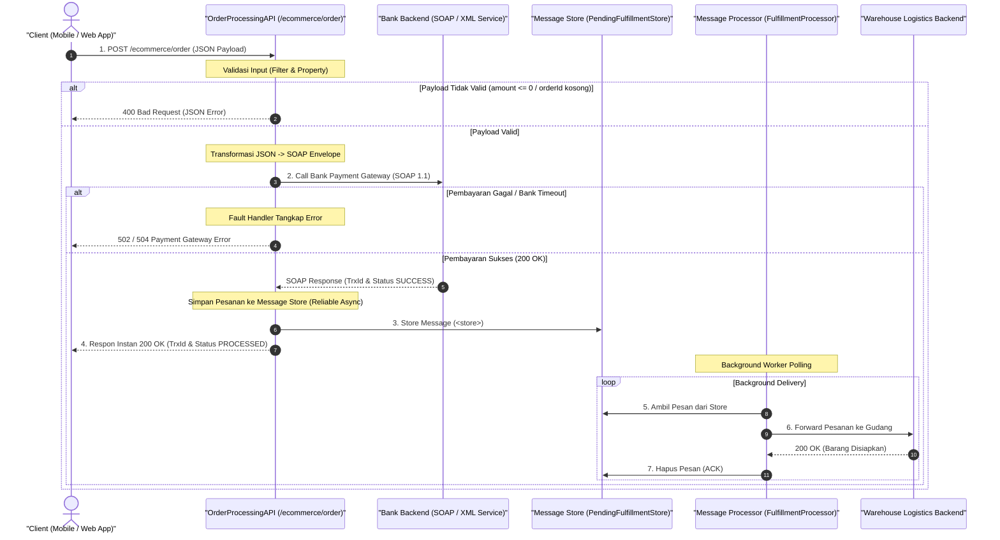

# Modul 7: Proyek Akhir Integrasi (Spesifikasi & Panduan Tugas)

---

## 1. Latar Belakang & Skenario Bisnis

Sebuah platform E-Commerce dan FinTech berskala nasional sedang membangun **Gateway Integrasi Pemrosesan Pesanan (Order & Payment Fulfillment Hub)**. Sistem ini bertugas menghubungkan aplikasi mobile/web pelanggan dengan berbagai sistem backend perbankan (legacy SOAP) dan sistem gudang logistik (asynchronous).

Sebagai **Integration / Middleware Engineer**, Anda ditugaskan untuk merancang dan mengimplementasikan solusi integrasi ini secara utuh di **WSO2 Micro Integrator (MI)**. Proyek ini mencakup seluruh materi yang telah Anda pelajari dari **Modul 1 sampai Modul 6**.

---

## 2. Arsitektur Solusi & Diagram Alur

Integrasi ini menerapkan pola komunikasi **Hybrid (Synchronous Orchestration + Asynchronous Guaranteed Delivery)**:



---

## 3. Persyaratan Fungsional per Modul

### A. Modul 1 & 2: Inbound API, Mediators & Validasi
1. **API Definition**:
   * Context: `/ecommerce`
   * Resource: `/order` dengan HTTP Method `POST`.
2. **Logging**:
   * Catat setiap request yang masuk dengan format custom: `[ORDER-INBOUND] Menerima pesanan OrderID: ... dari Customer: ...`.
3. **Ekstraksi Property**:
   * Simpan field `orderId`, `customerName`, `paymentMethod`, dan `amount` ke dalam property context (`scope="default"`).
4. **Validasi Bisnis (`<filter>`)**:
   * `orderId` tidak boleh kosong.
   * `amount` harus bernilai lebih besar dari `0`.
   * Jika tidak valid: kembalikan HTTP status **400 Bad Request** dengan format JSON standar.
5. **Switch Mediator (`<switch>`)**:
   * Periksa `paymentMethod`.
   * Jika `"VA_BANK"`: lanjutkan ke proses pembayaran bank.
   * Jika nilai lain: kembalikan HTTP status **400 Bad Request** dengan pesan `"Metode pembayaran belum didukung"`.

---

### B. Modul 3: Transformasi Data & Konfigurasi Endpoint
1. **Transformasi JSON ke SOAP XML (`<payloadFactory media-type="xml">`)**:
   * Backend Bank mengharuskan payload dalam bentuk **SOAP 1.1 Envelope**:
     ```xml
     <soapenv:Envelope xmlns:soapenv="http://schemas.xmlsoap.org/soap/envelope/" xmlns:bank="http://bank.payment.internal/va">
         <soapenv:Header/>
         <soapenv:Body>
             <bank:PaymentRequest>
                 <bank:OrderID>{orderId}</bank:OrderID>
                 <bank:Amount>{amount}</bank:Amount>
                 <bank:Customer>{customerName}</bank:Customer>
             </bank:PaymentRequest>
         </soapenv:Body>
     </soapenv:Envelope>
     ```
2. **Endpoint Bank (`BankPaymentEP`)**:
   * Format: HTTP Endpoint ke mock service / address target.
   * Konfigurasi **Timeout**: Batas waktu respons 5 detik (5000 ms).
   * Konfigurasi **Suspend on Failure**: Jika gagal, suspend endpoint selama 10 detik.

---

### C. Modul 4: Orkestrasi & Error Handling
1. **Pemanggilan Layanan (`<call>`)**:
   * Panggil `BankPaymentEP` secara synchronous non-blocking.
2. **Error Handling Sequence (`OrderErrorHandlerSequence`)**:
   * Pasang sequence penanganan error pada atribut `onError` di inSequence atau via `faultSequence`.
   * Tangkap kode error `ERROR_CODE` dan pesan `ERROR_MESSAGE`.
   * Bentuk response JSON yang seragam jika terjadi timeout atau koneksi putus (HTTP 500 / 504):
     ```json
     {
       "status": "FAILED",
       "errorCode": "504",
       "errorMessage": "Koneksi ke Payment Gateway Bank mengalami batas waktu (Timeout)."
     }
     ```

---

### D. Modul 5: Asynchronous Messaging & Guaranteed Delivery
Setelah pembayaran sukses dari backend bank:
1. **Message Store (`PendingFulfillmentStore`)**:
   * Buat Message Store bertipe **In-Memory Store** (atau RabbitMQ jika Docker broker Anda aktif) bernama `PendingFulfillmentStore`.
2. **Penyimpanan Pesan (`<store>`)**:
   * Di dalam API, sebelum merespons ke client, simpan payload pemrosesan gudang ke dalam `PendingFulfillmentStore` menggunakan mediator `<store>`.
3. **Respon Instan ke Klien**:
   * Kembalikan respons sukses **200 OK** ke pelanggan dengan format:
     ```json
     {
       "status": "SUCCESS",
       "orderId": "ORD-9901",
       "message": "Pembayaran berhasil diverifikasi. Pesanan sedang diproses ke gudang logistik."
     }
     ```
4. **Message Forwarding Processor (`FulfillmentForwardingProcessor`)**:
   * Buat Message Forwarding Processor yang bertugas mengambil pesan dari `PendingFulfillmentStore`.
   * Teruskan pesan tersebut ke endpoint gudang (`WarehouseEP`).
   * Konfigurasikan retry otomatis (`max.delivery.attempts = 3`) dan interval pengiriman `1000 ms`.

---

### E. Modul 6: Unit Testing, Deployment & Monitoring
1. **Synapse Unit Test Suite**:
   * Buat file unit test XML: `OrderProcessingAPITestSuite.xml`.
   * Sertakan minimal 1 test case: Pengujian validasi `400 Bad Request` jika order amount bernilai `0`.
2. **Packaging Carbon Application (.CAR)**:
   * Daftarkan seluruh artefak baru ke dalam `pom.xml` / `artifact.xml`.
   * Jalankan kompilasi proyek via Maven CLI:
     ```powershell
     mvn clean install
     ```
3. **Pengujian Port Management & Health Probe**:
   * Pastikan server WSO2 MI berjalan normal.
   * Uji kesehatan server via PowerShell menggunakan `Invoke-RestMethod` pada port `9164` (`/healthz`).

---

## 4. Daftar Artefak yang Harus Anda Buat

> [!IMPORTANT]
> **Kerjakan secara mandiri di dalam proyek integrasi Anda (`HelloWorldProject`)!**  
> Jangan membuat file di luar proyek. Berikut adalah daftar berkas yang wajib Anda buat:

| Kategori | Path Berkas yang Harus Dibuat | Fungsi / Peran |
| :--- | :--- | :--- |
| **API** | `src/main/wso2mi/artifacts/apis/OrderProcessingAPI.xml` | Inbound REST API utama (`/ecommerce/order`). |
| **Endpoint** | `src/main/wso2mi/artifacts/endpoints/BankPaymentEP.xml` | Endpoint penghubung ke backend Bank (Timeout 5s). |
| **Endpoint** | `src/main/wso2mi/artifacts/endpoints/WarehouseEP.xml` | Target endpoint pengiriman pesanan ke gudang logistik. |
| **Sequence** | `src/main/wso2mi/artifacts/sequences/OrderErrorHandlerSequence.xml` | Reusable sequence untuk menangani kegagalan backend. |
| **Message Store** | `src/main/wso2mi/artifacts/message-stores/PendingFulfillmentStore.xml` | Tempat penampungan pesan asynchronous. |
| **Message Processor** | `src/main/wso2mi/artifacts/message-processors/FulfillmentForwardingProcessor.xml` | Background processor penerus pesan ke gudang. |

---

## 5. Skenario Uji Coba Mandiri (Test Cases)

Jalankan pengujian menggunakan **PowerShell** (`Invoke-RestMethod` atau `curl.exe`):

### Test Case 1: Validasi Input (Negative Test - Amount 0)
* **Request:**
  ```powershell
  $body = @{
      orderId = "ORD-001"
      customerName = "Budi Santoso"
      paymentMethod = "VA_BANK"
      amount = 0
  } | ConvertTo-Json

  Invoke-RestMethod -Uri "http://localhost:8290/ecommerce/order" -Method Post -Body $body -ContentType "application/json"
  ```
* **Kriteria Keberhasilan:**
  * HTTP Status: `400 Bad Request`.
  * Response body berisi pesan error: `"Nilai amount harus lebih besar dari 0"`.

---

### Test Case 2: Alur Normal Transaksi Sukses (Positive Test)
* **Request:**
  ```powershell
  $body = @{
      orderId = "ORD-9901"
      customerName = "Budi Santoso"
      paymentMethod = "VA_BANK"
      amount = 250000
  } | ConvertTo-Json

  Invoke-RestMethod -Uri "http://localhost:8290/ecommerce/order" -Method Post -Body $body -ContentType "application/json"
  ```
* **Kriteria Keberhasilan:**
  * HTTP Status: `200 OK`.
  * Response body berisi status `"SUCCESS"`.
  * Log server WSO2 MI menampilkan proses forwarding ke `WarehouseEP` melalui Message Processor.

---

### Test Case 3: Health Probe Server (Modul 6)
* **Request:**
  ```powershell
  Invoke-RestMethod -Uri "http://localhost:9164/healthz" -Method Get
  ```
* **Kriteria Keberhasilan:**
  * Response: `{"status": "healthy"}`.

---

## 6. Kriteria Kelulusan (Checklist Mandiri)

- [ ] Seluruh artefak XML berhasil dibuat di direktori yang benar.
- [ ] API mampu menyaring request tidak valid dengan HTTP 400.
- [ ] Terjadi transformasi data dari JSON ke format SOAP XML.
- [ ] Error handling menangkap exception saat endpoint bank down/timeout.
- [ ] Pesan berhasil disimpan ke Message Store dan diteruskan oleh Message Processor.
- [ ] Berkas `.car` berhasil di-build tanpa error (`BUILD SUCCESS`).
- [ ] Port management `9164` merespon dengan status healthy.

---

> [!TIP]
> Jika Anda mengalami kebuntuan atau ingin memeriksa template sintaks XML yang benar, silakan buka berkas panduan solusi terpisah:  
> 👉 [08_project_akhir_cheatsheet_solusi.md](file:///c:/Users/eksad/OneDrive/Documents/assa/selfLearning/materi/wso2/08_project_akhir_cheatsheet_solusi.md)
