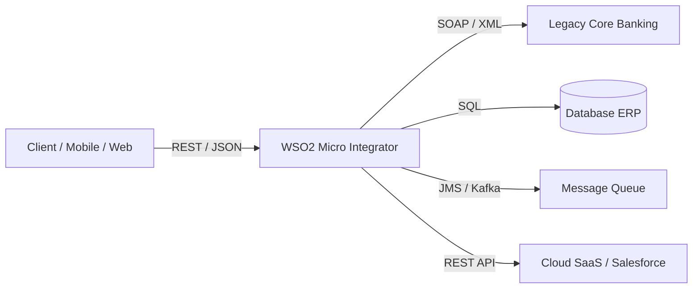
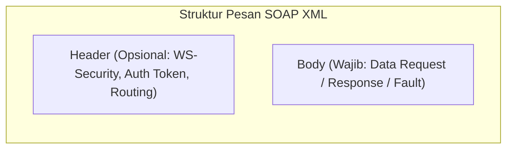
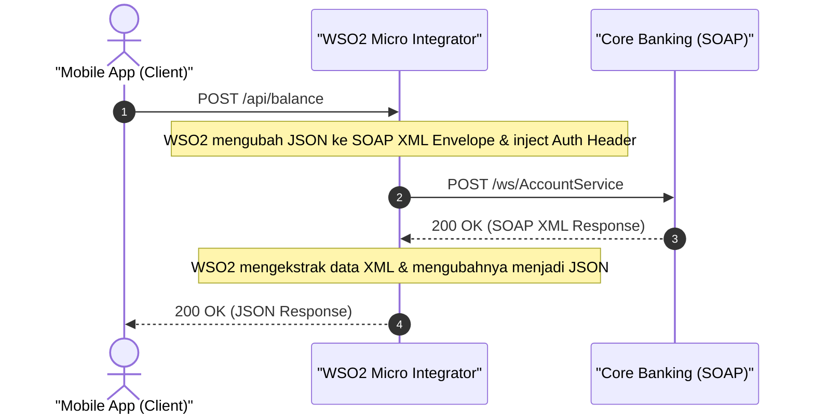
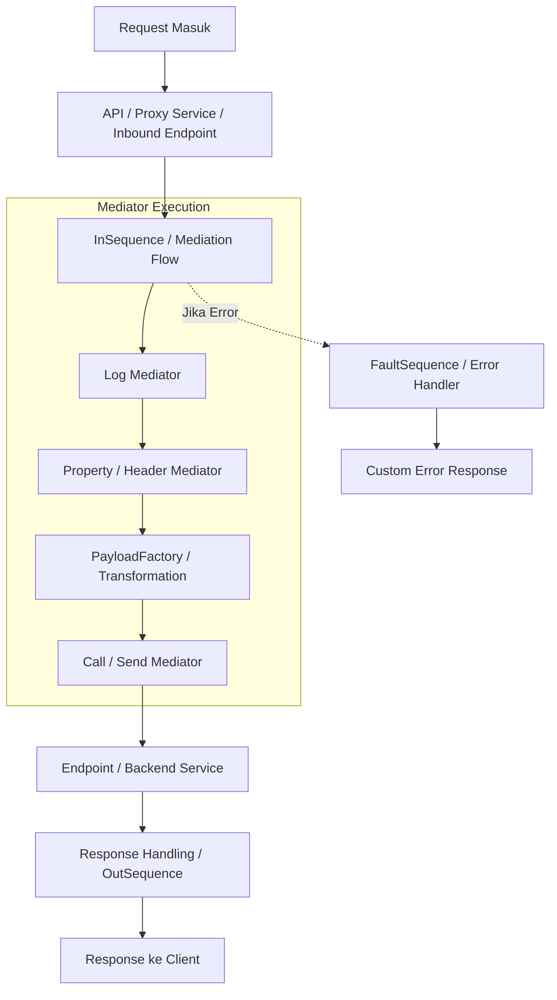
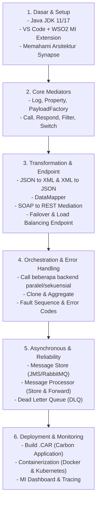

# Panduan & Materi Pengenalan: WSO2 Integrator (Micro Integrator)

---

## 1. Apa itu WSO2 Integrator?

**WSO2 Enterprise Integrator (WSO2 EI)** atau versi modernnya **WSO2 Micro Integrator (WSO2 MI)** adalah platform integrasi *open-source* berbasis Java yang dirancang untuk menghubungkan berbagai sistem, aplikasi, API, protokol, dan format data yang berbeda dalam sebuah ekosistem perusahaan.

WSO2 Integrator bertindak sebagai **Enterprise Service Bus (ESB)** dan **Integration Engine**, menjadi jembatan penghubung (middleware) antara aplikasi frontend/client dengan berbagai sistem backend (database, legacy systems, microservices, cloud SaaS, message broker).



### Mengapa Membutuhkan Integrasi Middleware?
- **Menghindari Point-to-Point Spaghetti Architecture**: Tanpa middleware, integrasi antar 10 aplikasi memerlukan 45 koneksi langsung. Dengan WSO2, setiap aplikasi cukup terhubung ke integrator.
- **Protokol & Format Agnostik**: Frontend menggunakan REST/JSON, backend lama menggunakan SOAP/XML atau ISO8583, database menggunakan JDBC — WSO2 menangani konversinya tanpa mengubah backend asli.
- **Reliability & Resilience**: Menyediakan mekanisme retry, failover, circuit breaker, dan asynchronous messaging (Message Store & Processor).

---

## 2. Evolusi WSO2 Integrator

| Generasi | Nama Produk | Karakteristik Utama |
| :--- | :--- | :--- |
| **Generasi 1** | **WSO2 ESB** (v4.x - v5.x) | Fokus murni pada ESB mediation, heavy monolithic runtime. |
| **Generasi 2** | **WSO2 Enterprise Integrator** (EI 6.x) | Menggabungkan ESB + Data Services (DSS) + Business Process (BPS) + Message Broker. |
| **Generasi 3 (Modern)** | **WSO2 Micro Integrator** (MI 7.x & MI 4.x+) | **Cloud-native, lightweight, container-ready (Docker/K8s)**, startup super cepat (dalam hitungan detik), integrasi dengan VS Code extension. |

---

## 3. Fitur & Kemampuan Utama

1. **Protocol Mediation (Mediasi Protokol)**
   - Mendukung HTTP/HTTPS, JMS, Kafka, MQTT, FTP/SFTP/VFS, WebSocket, TCP, gRPC, Mail (SMTP/POP3/IMAP).
2. **Message Transformation (Transformasi Data)**
   - Konversi antar format: `JSON <-> XML`, `CSV <-> JSON`, `SOAP <-> REST`, `EDI/Fixed-length`.
   - Tool transformasi: **PayloadFactory**, **DataMapper (Visual Mapping)**, **XSLT**, **Script Mediator (JavaScript/Groovy)**.
3. **Routing & Filtering**
   - **Content-Based Routing**: Mengarahkan pesan ke backend A atau B berdasarkan isi payload.
   - **Header-Based Routing**: Routing berdasarkan HTTP Header atau Metadata.
4. **Service Orchestration (Agregasi & Scatter-Gather)**
   - Memanggil beberapa API backend secara paralel atau sekuensial, kemudian menggabungkan (*aggregate*) hasilnya menjadi satu response.
5. **Asynchronous Messaging & Transaction Management**
   - Store and Forward pattern menggunakan Message Store (RabbitMQ, ActiveMQ, JMS, JDBC) dan Message Processor.
   - Dead Letter Queue (DLQ) untuk penanganan pesan gagal.
6. **Connectors (SaaS Ecosystem)**
   - Ratusan konektor siap pakai: Salesforce, SAP, Google Drive, AWS S3, ServiceNow, Jira, dll.

---

## 4. Mengenal SOAP & Perannya dalam Integrasi

### Apa itu SOAP?
**SOAP (Simple Object Access Protocol)** adalah protokol komunikasi standar berbasis **XML** yang digunakan untuk bertukar data terstruktur antar aplikasi (Web Services) melalui jaringan. 

SOAP sangat populer pada era 2000-an dan hingga kini masih menjadi tulang punggung di sistem enterprise besar seperti **Perbankan (*Core Banking*)**, **Telekomunikasi**, **Asuransi**, dan sistem **Pemerintahan / ERP**.



### Karakteristik Utama SOAP:
1. **Wajib Berformat XML**: SOAP tidak mendukung format JSON atau plain text secara native.
2. **Kontrak Sangat Ketat (WSDL)**: Menggunakan **WSDL** (*Web Services Description Language*), yaitu file XML yang mendefinisikan secara spesifik nama fungsi (*operation*), tipe data parameter (*XSD Schema*), dan URL endpoint.
3. **Transport Agnostic**: Meskipun paling sering menggunakan HTTP/HTTPS, SOAP juga dapat berjalan di atas protokol lain seperti JMS (Queue), SMTP (Email), atau TCP.
4. **Standar Keamanan Enterprise (WS-*)**: Mendukung enkripsi dan digital signature tingkat pesan (*WS-Security*), transaksi terdistribusi (*WS-AtomicTransaction*), dan jaminan pengiriman (*WS-ReliableMessaging*).

---

### Struktur Anatomi Pesan SOAP

Sebuah pesan SOAP selalu dibungkus dalam elemen-elemen berikut:
- `<soapenv:Envelope>`: Elemen akar (root) pembungkus seluruh pesan.
- `<soapenv:Header>` *(Opsional)*: Menyimpan informasi kontrol seperti autentikasi (token), sesi, atau header keamanan.
- `<soapenv:Body>` *(Wajib)*: Berisi data payload sesungguhnya yang dikirimkan.
- `<soapenv:Fault>` *(Opsional, ada di dalam Body)*: Format standar jika terjadi error (*faultcode*, *faultstring*, *detail*).

**Contoh Pesan SOAP Request (Cek Saldo):**
```xml
<soapenv:Envelope xmlns:soapenv="http://schemas.xmlsoap.org/soap/envelope/" 
                  xmlns:bank="http://bank.example.com/accountservice">
   <soapenv:Header>
      <bank:AuthToken>TOKEN-XYZ-12345</bank:AuthToken>
   </soapenv:Header>
   <soapenv:Body>
      <bank:GetBalanceRequest>
         <bank:AccountNumber>1234567890</bank:AccountNumber>
      </bank:GetBalanceRequest>
   </soapenv:Body>
</soapenv:Envelope>
```

---

### Perbandingan SOAP vs REST

| Kriteria | SOAP | REST (Representational State Transfer) |
| :--- | :--- | :--- |
| **Bentuk Dasar** | **Protokol standar resmi** (aturan ketat oleh W3C). | **Gaya Arsitektur** (*Architectural Style* yang fleksibel). |
| **Format Data** | **Hanya XML**. | Mendukung **JSON**, XML, HTML, Plain Text (paling umum JSON). |
| **Kontrak Layanan** | **WSDL** (Definisi skema sangat kaku dan terikat). | **OpenAPI / Swagger** (Dokumentasi fleksibel). |
| **Ukuran & Kecepatan** | **Lebih berat** (*overhead* tinggi karena struktur tag XML & envelope). | **Sangat ringan & cepat**, ramah perangkat mobile/web. |
| **Keamanan** | **WS-Security** (enkripsi per-field level), SSL/TLS. | HTTPS/TLS, OAuth2, JWT, API Key. |
| **Penggunaan Umum** | Sistem legacy perbankan, finansial, B2B payment gateway. | Aplikasi Mobile, Web modern, Microservices, Public API. |

---

### Mengapa Memahami SOAP Sangat Penting di WSO2 Integrator?

Di dunia industri nyata:
1. **Aplikasi Client Modern** (Mobile App Android/iOS, Web SPA React/Vue) hanya ingin berkomunikasi menggunakan **REST API (JSON)** karena ringan dan mudah di-parse.
2. **Sistem Inti Perusahaan (Legacy/Backend)** yang sudah berjalan puluhan tahun masih menggunakan **SOAP Web Services (XML)** dan sangat berisiko/mahal jika harus dirombak ulang.

**Peran WSO2 Integrator sebagai Jembatan (REST to SOAP Mediation):**


---

## 5. Konsep & Komponen Dasar (Synapse Artifacts)

WSO2 Integrator menggunakan arsitektur berbasis engine **Apache Synapse**. Berikut komponen-komponen inti yang wajib dipahami:



### Penjelasan Komponen:

| Komponen | Penjelasan & Fungsi |
| :--- | :--- |
| **REST API** | Pintu masuk request HTTP/REST dengan path uri-template (misal: `/customer/{id}`). |
| **Proxy Service** | Virtual service yang menerima pesan (biasanya SOAP atau Inbound transport lain) dan meneruskannya ke backend. |
| **Mediator** | Blok pemroses pesan terkecil. Contoh: <br>• `Log`: mencetak log pesan.<br>• `Property`: menyimpan/mengambil variabel konteks.<br>• `PayloadFactory`: membuat/memodifikasi struktur body request/response.<br>• `Filter / Switch`: percabangan kondisi (*if-else*).<br>• `Call / Send`: memanggil service eksternal.<br>• `Respond`: mengembalikan pesan langsung ke client. |
| **Sequence** | Kumpulan mediator yang dirangkai secara berurutan. Ada *InSequence* (alur masuk), *OutSequence* (alur keluar), dan *FaultSequence* (penanganan error). |
| **Endpoint** | Representasi alamat tujuan backend (Address Endpoint, HTTP Endpoint, WSDL Endpoint, Failover/LoadBalance Endpoint). |
| **Local Entry / Registry** | Tempat penyimpanan konfigurasi statis, schema XSD, template XSLT, file WSDL, atau static JSON/XML. |
| **Task (Scheduled Task)** | Job terjadwal yang berjalan secara periodik (misal: mengambil data tiap 5 menit dengan cron expression). |

---

## 6. Contoh Kode Alur Integrasi: Transformasi REST ke SOAP (Synapse XML)

Berikut adalah contoh skenario nyata di mana WSO2 menerima request **REST/JSON** dari client, lalu mentransformasikannya menjadi request **SOAP/XML** ke backend legacy, dan mengembalikan hasilnya kembali sebagai **JSON**:

```xml
<?xml version="1.0" encoding="UTF-8"?>
<api xmlns="http://ws.apache.org/ns/synapse" name="AccountAPI" context="/account">
    <resource methods="POST" uri-template="/check-balance">
        <inSequence>
            <!-- 1. Ambil nomor rekening dari JSON request -->
            <property name="accNo" expression="json-eval($.accountNumber)" scope="default" type="STRING"/>

            <!-- 2. Log request masuk -->
            <log level="custom">
                <property name="Message" value="Memproses cek saldo untuk rekening"/>
                <property name="Account" expression="get-property('accNo')"/>
            </log>

            <!-- 3. Bentuk Payload SOAP XML dengan PayloadFactory -->
            <payloadFactory media-type="xml">
                <format>
                    <soapenv:Envelope xmlns:soapenv="http://schemas.xmlsoap.org/soap/envelope/" 
                                      xmlns:bank="http://bank.example.com/accountservice">
                        <soapenv:Header/>
                        <soapenv:Body>
                            <bank:GetBalanceRequest>
                                <bank:AccountNumber>$1</bank:AccountNumber>
                            </bank:GetBalanceRequest>
                        </soapenv:Body>
                    </soapenv:Envelope>
                </format>
                <args>
                    <arg evaluator="xml" expression="get-property('accNo')"/>
                </args>
            </payloadFactory>

            <!-- 4. Set Header SOAPAction yang dibutuhkan oleh service SOAP -->
            <header name="SOAPAction" value="urn:GetBalance" scope="transport"/>

            <!-- 5. Panggil Backend SOAP Service -->
            <call>
                <endpoint>
                    <address uri="https://corebanking.internal.bank/ws/AccountService" format="soap11"/>
                </endpoint>
            </call>

            <!-- 6. Ubah Response SOAP XML dari backend kembali menjadi JSON untuk Mobile App -->
            <payloadFactory media-type="json">
                <format>
                    {
                        "status": "SUCCESS",
                        "accountNumber": "$1",
                        "balance": "$2",
                        "currency": "$3"
                    }
                </format>
                <args>
                    <arg evaluator="xml" expression="//bank:GetBalanceResponse/bank:AccountNumber/text()" xmlns:bank="http://bank.example.com/accountservice"/>
                    <arg evaluator="xml" expression="//bank:GetBalanceResponse/bank:Balance/text()" xmlns:bank="http://bank.example.com/accountservice"/>
                    <arg evaluator="xml" expression="//bank:GetBalanceResponse/bank:Currency/text()" xmlns:bank="http://bank.example.com/accountservice"/>
                </args>
            </payloadFactory>

            <!-- 7. Kembalikan JSON ke client -->
            <respond/>
        </inSequence>

        <!-- Penanganan jika backend error / SOAP Fault -->
        <faultSequence>
            <log level="custom">
                <property name="Error" value="Gagal menghubungi SOAP Backend!"/>
                <property name="Detail" expression="get-property('ERROR_MESSAGE')"/>
            </log>
            <payloadFactory media-type="json">
                <format>
                    {
                        "status": "ERROR",
                        "message": "Layanan perbankan sedang tidak tersedia"
                    }
                </format>
                <args/>
            </payloadFactory>
            <respond/>
        </faultSequence>
    </resource>
</api>
```

---

## 7. Tools & Lingkungan Pengembangan (Development Environment)

Untuk mengembangkan dan menjalankan proyek WSO2 Micro Integrator:

1. **WSO2 Micro Integrator for VS Code (Rekomendasi Utama)**:
   - Ekstensi resmi di Visual Studio Code untuk mendesain integrasi baik secara graphical (drag-and-drop) maupun code (XML).
   - Menggantikan WSO2 Integration Studio (Eclipse-based) yang lebih berat.
2. **WSO2 Micro Integrator Runtime**:
   - Server engine yang menjalankan aplikasi integrasi (CAR / Carbon Application file).
3. **Micro Integrator Dashboard**:
   - Web console untuk memonitor artefak yang sedang berjalan, log level, endpoint state, dan tracing transaksi.
4. **WSO2 Integration Control Plane (ICP)**:
   - Panel monitoring terpusat untuk mengelola cluster WSO2 MI di production / multi-environment.

---

## 8. Roadmap & Langkah Belajar (Learning Path)



---

## 9. Rangkuman Singkat (Key Takeaways)

- **WSO2 Integrator** adalah solusi integrasi enterprise untuk menghubungkan sistem lama (*legacy*) dan modern (*microservices/cloud*).
- **SOAP & REST Mediation**: WSO2 menjadi jembatan penting untuk mengubah data dari format modern (REST/JSON) ke sistem enterprise legacy (SOAP/XML) dan sebaliknya.
- **Core Concept**: Menggunakan konsep **Mediator Pipeline** yang berada di dalam **Sequence**, diakses melalui **REST API** atau **Proxy Service**, menuju **Endpoints**.
- **Versi Saat Ini**: Fokuslah belajar **WSO2 Micro Integrator (MI)** menggunakan **VS Code Extension** karena merupakan standar industri modern yang ramah kontainer/cloud.
